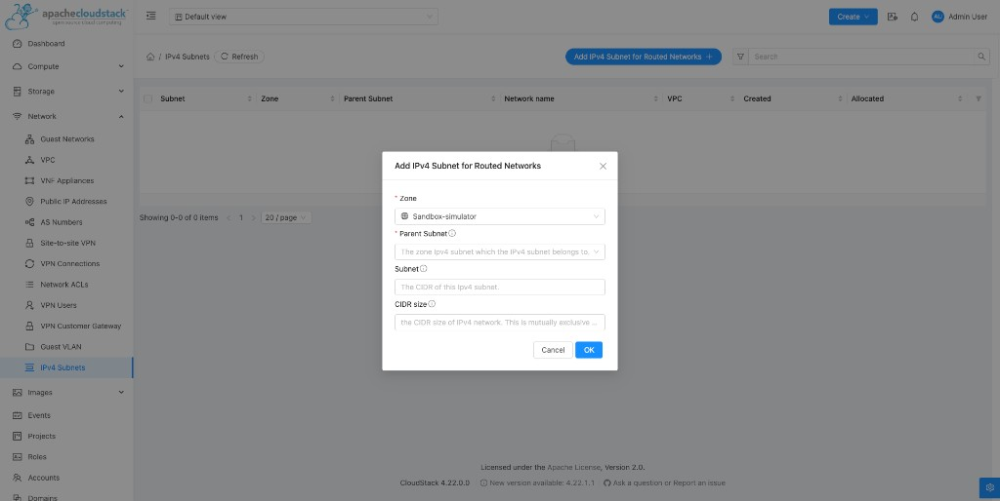
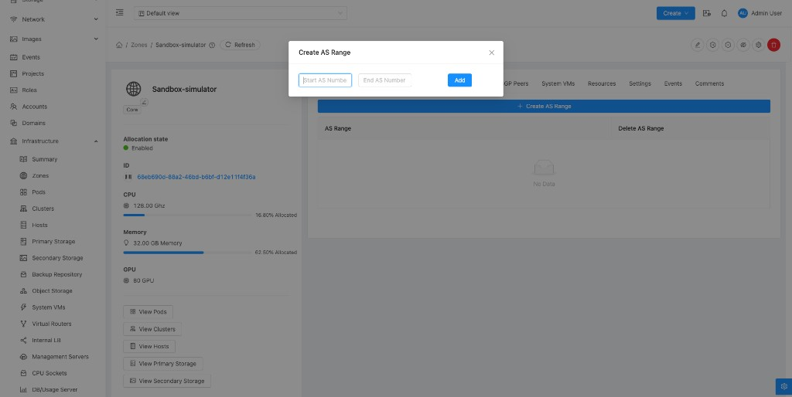
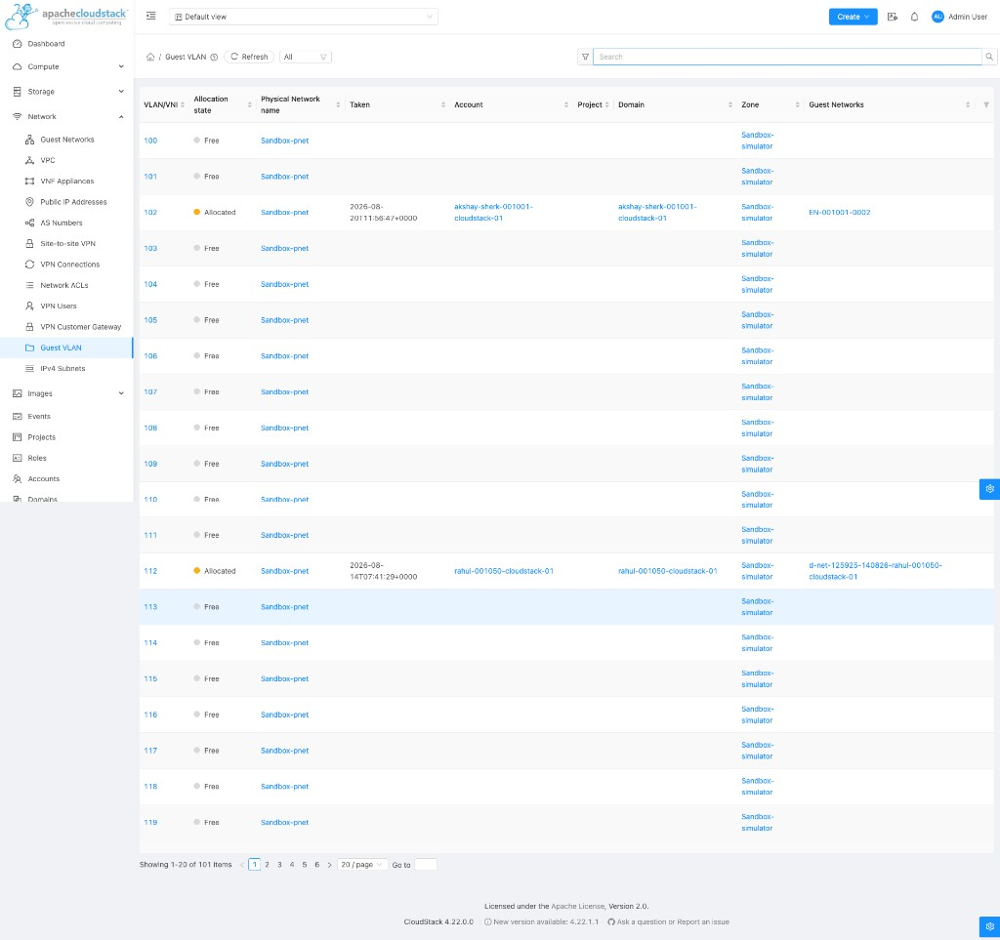
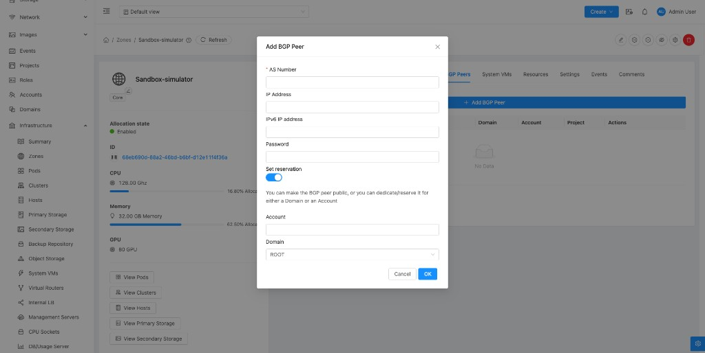
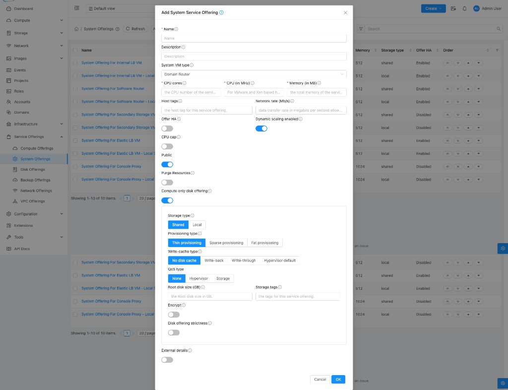
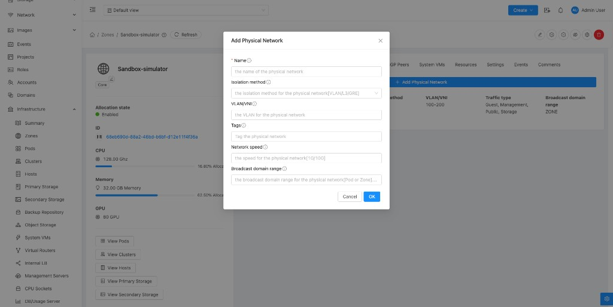
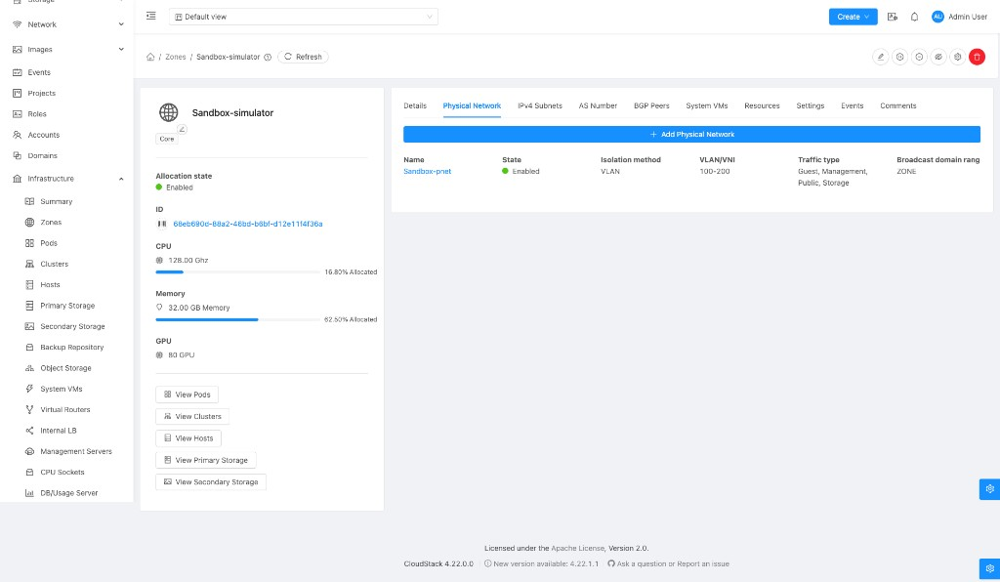

# Admin workflow — provider-level setup

Everything here is configured by the **StackConsole admin only** — none of it is customer-facing. This one-time (and ongoing) infrastructure setup makes the [customer provisioning phases](https://stackconsole.atlassian.net/wiki/spaces/DataMount/pages/396132360) possible as a thin, safe self-service layer.

**CMP posture:** **Partial** / **Custom** — orchestrator registration patterns exist for some platforms; Panorama wizard, VSYS profiles, BGP profile defaults, and IPAM pool policy are **Custom**.

**Prev:** [Confirmed architecture](https://stackconsole.atlassian.net/wiki/spaces/DataMount/pages/396394503) · **Next:** [CloudStack reference patterns](https://stackconsole.atlassian.net/wiki/spaces/DataMount/pages/396525575)

> [!NOTE]
> **Reference pattern — CloudStack**
>
> Apache CloudStack solves a structurally similar problem (ASN pools, BGP peering, hierarchical CIDR reservation, VLAN lifecycle, router service profiles, physical network definition) **natively**, because it owns its whole stack end-to-end. DataMount does not — VCD, NSX-T, and Panorama are three separate vendor systems CMP must synchronize (see [ownership model](https://stackconsole.atlassian.net/wiki/spaces/DataMount/pages/396394503#provisioning-ownership) and [Phase 8 — Reconciliation](https://stackconsole.atlassian.net/wiki/spaces/DataMount/pages/396787742)). CloudStack's **object model and admin UX shape** is still the right template for each screen below. Full mapping table and screenshots: [CloudStack reference patterns](https://stackconsole.atlassian.net/wiki/spaces/DataMount/pages/396525575).
>

---

## 2.1 Platform integration setup

| # | Action | Detail | CMP posture |
|---|---|---|---|
| 1 | Register VCD API endpoint | OAuth 2.0 credentials; org admin service account | **Custom** |
| 2 | Register NSX-T Manager API | **Direct** provider-level connection — separate from VCD's own NSX-T linkage | **Custom** |
| 3 | Register Panorama API | REST **and** XML endpoints; confirm Device Group(s)/Template(s) that map to CMP-managed customers | **Custom** |
| 4 | Register F5 BIG-IP iControl REST | Pending [F5 architecture questions](https://stackconsole.atlassian.net/wiki/spaces/DataMount/pages/396394503#f5--open-architecture-questions) | **Custom** |

---

## 2.2 CMP IPAM — pool configuration

| Pool type | Example | Notes |
|---|---|---|
| Public IP pool | `203.10.0.0/20` | Sourced from provider's allocated public ranges |
| Private prefix pool | `10.0.0.0/8` | Per-VRF allocation — **not** globally overlap-checked (see [§2.3](#23-vrf-aware-overlap-validation)) |
| ASN pool | `65000–65100` | Allocated **in pairs** — one customer = 2 ASNs for Active-Active BGP |
| VLAN pool | Provider-defined range | Lower priority; later rollout phase |

Admin configures allocation policy per pool:

- Allowed CIDR sizes (`/30`, `/29`, `/28`… for public; `/24`, `/23`, `/22`… for private)
- CMP allocates **contiguous** blocks only — fragmented free IPs are never combined into a synthetic larger block

| Topic | DataMount target | CMP today |
|---|---|---|
| Platform | StackConsole Internal IP Manager | **Custom** — no full IPAM module in product today |
| Public IP | Allocate / reserve / release | **Custom** |
| Private subnet | Allocate for segments | **Custom** |
| Atomic reservation | Single transaction across pools | **Custom** |

### CloudStack parity — IPv4 Subnet screen

CloudStack's **Add IPv4 Subnet for Routed Networks** dialog (Zone → IPv4 Subnets) is a near-exact template for this admin screen:

- Requires **Parent Subnet** selection before a child **Subnet** / **CIDR size** can be entered — enforces Aggregate → Prefix → Sub-prefix hierarchy, not flat CIDR entry
- **Set reservation** toggle optionally binds the subnet to an Account or Domain at creation — same UX for reserving a private prefix to a customer VRF before or during onboarding
- List view columns (Subnet, Zone, Parent Subnet, Network name, VPC, Created, **Allocated**) show allocation state at a glance

../../static/img/screenshots/datamount/cloudstack-ipv4-subnet-add.png

### CloudStack parity — AS Range screen

The **Create AS Range** dialog (Zone → AS Number: Start AS Number / End AS Number → Add) is the direct template for the ASN pool admin screen — a **zone-scoped range**, not a flat global list.

../../static/img/screenshots/datamount/cloudstack-as-range-create.png

---

## 2.3 VRF-aware overlap validation

Because customers get dedicated VRFs, private-subnet overlap validation must be **VRF-scoped, not global**.

| VRF-A | VRF-B | Valid? |
|---|---|---|
| `10.10.0.0/24` | `10.10.0.0/24` | **Yes** — different VRFs |
| Same VRF, overlapping CIDR | — | **No** |

Configure this exception explicitly — a naive global-CIDR overlap check will incorrectly block valid allocations.

### CloudStack parity — Guest VLAN screen

CloudStack's **Guest VLAN** list (Network → Guest VLAN) shows scoped allocation at scale — the same VLAN/VNI recurs across physical networks, with **Allocation state** (Free/Allocated), **Taken** timestamp, and **Account** / **Project** / **Domain** columns making owner and scope visible per row. Replicate this pattern for VRF-scoped subnet/ASN inventory — state and scope in the list, not buried in detail pages.

../../static/img/screenshots/datamount/cloudstack-guest-vlan.png

---

## 2.4 Palo Alto — admin configuration wizard

One-time discovery and baseline setup via Panorama (physical devices — **not** VM-Series):

| Step | Action |
|---|---|
| 1 | Discover/register physical Palo Alto device(s) in Panorama |
| 2 | Define the **Internet VSYS** — pre-configured shared VSYS that customer VSYS instances bind to for internet connectivity. Admin-owned; CMP only manages assignment |
| 3 | Define **Default VSYS Configuration** — baseline auto-attached to every customer VSYS at creation (self-registration) or admin-selectable per customer (admin-onboarding) |
| 4 | Define **VSYS Profiles** (commercial tiers — see [§2.6](#26-rate-card--service-catalog-mapping)): zones, interfaces, NAT limits, security profile tier, IPS/AV/URL filtering/VPN toggles, log retention |
| 5 | Define **Virtual Router packages** independently of VSYS (static route count, BGP enabled/peer count/prefix count, OSPF, PBF, ECMP, BFD, default route) |
| 6 | Define the **BGP Profile** (provider-side defaults) — makes BGP mandatory infrastructure |

### BGP profile (provider defaults)

| Admin setting | Example |
|---|---|
| BGP enabled | Yes (always, for onboarded customers on this architecture) |
| Provider ASN | `65010` |
| Customer ASN allocation | Automatic (from ASN pool) |
| BGP mode | Active-Active |
| BGP peer count | 2 |
| Route limit | 100 |
| BGP timers / authentication | Provider default |

### CloudStack parity — Add BGP Peer screen

CloudStack's **Add BGP Peer** dialog (Zone → BGP Peers) is a strong template for the CMP-internal BGP Peer object created in [Phases 3–4](https://stackconsole.atlassian.net/wiki/spaces/DataMount/pages/396755006):

- **AS Number**, **IP Address**, **IPv6 IP Address**, **Password** (BGP auth as first-class field)
- Same **Set reservation** → Account/Domain pattern as IPv4 Subnet

Recommend the CMP BGP Peer object (representing the NSX-T↔Palo Alto session) carry this same field set.

../../static/img/screenshots/datamount/cloudstack-bgp-peer-add.png

### CloudStack parity — System Service Offering screen

CloudStack's **Add System Service Offering** (System Offerings → System Offerings, System VM type = **Domain Router**) is the template for **Virtual Router package** admin screens — one named, selectable profile bundling CPU, memory, HA, scaling, storage, and network rate with a simple Cancel/OK footer. VSYS Profiles and VR packages (static routes, BGP peers/prefixes, OSPF, ECMP, BFD) map onto the same "customer picks the name, technical parameters underneath" shape.

../../static/img/screenshots/datamount/cloudstack-system-service-offering.png

> [!WARNING]
> **Commit serialization**
>
> Panorama commits are global. CMP must queue commit-and-push across workflow instances (Service ID aware) so parallel onboardings do not collide.
>

---

## 2.5 NSX-T — provider infrastructure setup

| Step | Action |
|---|---|
| 1 | Configure **T0 Gateway** physical uplink connectivity (above per-customer VRFs) |
| 2 | Define T0 VRF provisioning template each customer VRF is created from |
| 3 | Define default BGP timers/policy templates used when CMP creates a customer's T0 VRF and configures BGP toward Palo Alto |

Stack reference: NSX-T **4.2.0** (DataMount v1.4).

### CloudStack parity — Physical Network screen

CloudStack's **Add Physical Network** dialog (Zone → Physical Network) — Name, Isolation method (VLAN/L3/GRE), VLAN/VNI range, Tags, Network speed, Broadcast domain range, with Traffic type (Guest/Management/Public/Storage) on the list — is the template for capturing T0 Gateway physical uplink/broadcast-domain config as an admin object, separate from per-customer VRFs.

../../static/img/screenshots/datamount/cloudstack-physical-network-add.png

### CloudStack parity — Dedicate Zone

The Zone detail page's **Dedicated: No/Yes** state plus **Dedicate Zone** action, alongside the zone's **AS Range** field, is a useful precedent for **Enterprise Secure / Enterprise Plus** tiers that need a **dedicated VRF and dedicated ASN range** per customer — infrastructure dedicated to one tenant as a first-class toggle, not a side effect of allocation.

../../static/img/screenshots/datamount/cloudstack-zone-dedicate.png

---

## 2.6 Rate card / service catalog mapping

Map technical profiles to sellable packages (customer sees these in [Phase 0](https://stackconsole.atlassian.net/wiki/spaces/DataMount/pages/396132360)):

| Profile | Typical customer | Key features |
|---|---|---|
| Basic Internet | Small business | Internet, NAT, basic policies |
| Standard Security | SMB / enterprise | + firewall policies, IPS / threat prevention |
| Advanced Security | Enterprise | + URL filtering, VPN |
| Enterprise Secure | Large enterprise | Dedicated VSYS + routing + BGP + IPSec VPN |
| Enterprise Plus | Critical workloads | + advanced threat protection, enhanced logging, higher throughput; consider [Dedicate Zone–style](https://stackconsole.atlassian.net/wiki/spaces/DataMount/pages/396525575#dedicate-zone--enterprise-tier-precedent) dedicated VRF/ASN |
| Managed Security | Managed-service customers | + StackConsole-operated monitoring / policy management |

---

## 2.7 F5 BIG-IP — base configuration

> [!NOTE]
> **Pending open questions**
>
> Placeholder until [F5 architecture](https://stackconsole.atlassian.net/wiki/spaces/DataMount/pages/396394503#f5--open-architecture-questions) is confirmed: base pool/WAF/SSL policy templates, partition-per-tenant vs dedicated-appliance model, and whether F5 provisioning is gated behind the [BGP validation gate](https://stackconsole.atlassian.net/wiki/spaces/DataMount/pages/396558343) or independent.
>
> **Recommend:** F5 fires only after Phase 5 passes — network ready before load balancer provisioning.
>

