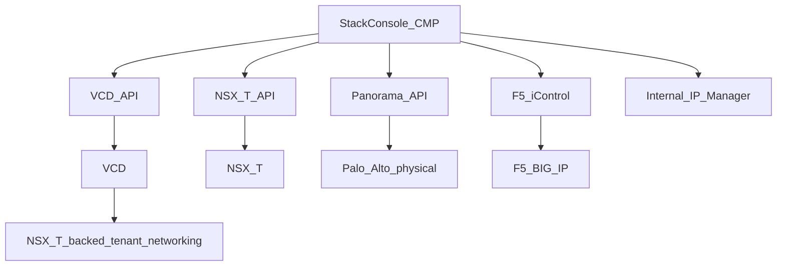

# Confirmed architecture — VCD + NSX-T + Palo Alto + F5

**Status:** Consolidated from Technical Workflow (Beta), DataMount Q&A, and IPAM design discussion.

**Hub:** [DataMount Integration Review](https://stackconsole.atlassian.net/wiki/spaces/DataMount/pages/396722177) · **Next:** [Admin setup](https://stackconsole.atlassian.net/wiki/spaces/DataMount/pages/396296195)

This page is the **single source of truth** for the DataMount engagement. All workflow phases assume the decisions below.

---

## Architecture decisions

| Decision point | Confirmed answer |
|---|---|
| Palo Alto deployment model | **Physical firewall**, managed via **Panorama** — perimeter layer; **no** VM-Series; **no** NSX-T service insertion |
| Direct NSX-T Manager API required? | **Yes** — for provider-level operations VCD does not expose (T0 VRF, BGP, route validation) |
| IPAM system of record | **No external IPAM (Infoblox/NetBox)** — **StackConsole Internal IP Manager** is system of record |
| BGP between NSX-T and Palo Alto | **Mandatory backend automation**, not customer-optional — the VRF↔BGP↔Virtual Router path is provider infrastructure regardless of whether the customer purchases a "BGP service" |
| Ownership model | CMP IPAM owns allocation. VCD, NSX-T, and Palo Alto are **consumers/implementers** of CMP allocation decisions — never independent sources of truth |

---

## API integration map

| Platform | Integration | Owns / used for |
|---|---|---|
| VMware VCD 10.6 | VCD API (OAuth 2.0) | Organization, VDC, NSX-T-backed Edge Gateway, VDC Networks, VM lifecycle, Catalog |
| NSX-T 4.2 | Direct NSX-T Manager API | T0 VRF, T1 Gateway, BGP config, segment management, NAT rules, route-table queries for BGP gate |
| Palo Alto Panorama | Panorama API (**REST + XML** — REST alone is partial) | Per-customer VSYS, zones, virtual router, BGP peering to T0 VRF, NAT, security policies, IPSec/SSL VPN, commit-and-push |
| F5 BIG-IP | iControl REST API | Virtual servers, pools, pool members, WAF policies, SSL policies |
| StackConsole IPAM | Internal CMP module | Public IP pools, private subnets, ASN pairs, VRF mapping, atomic reservation/release |

> [!NOTE]
> **VCD and NSX-T**
>
> VCD manages tenant-facing Org/VDC/Edge objects. CMP also calls **NSX-T Manager directly** for T0 VRF, BGP, and route validation that VCD does not expose at provider level.
>

---

## Provisioning ownership

CMP IPAM is the **only** allocator for customer-facing public IPs, private subnets, and ASN pairs. Downstream systems implement what CMP reserves:

| Resource | CMP IPAM | VCD | NSX-T | Panorama |
|---|---|---|---|---|
| Public IP | Allocate / release | IP Space (implementation) | SNAT/DNAT targets | Address objects, NAT |
| Private subnet | Allocate / release | Org VDC network CIDR | Segment | — |
| ASN pair | Allocate / release | — | T0 VRF local ASN + BGP peer | VR BGP peer |
| VRF mapping | Metadata | Edge / provider gateway | T0 VRF object | Virtual router |

Use VCD **IP Space** as VCD's implementation of CMP allocations — do **not** let VCD IP Space become a second source of truth.

---

## Async orchestration pattern

VCD and NSX-T operations are asynchronous (for example, VCD IP allocation may return `202` with a task to poll). Design every phase as:

**request → task → poll → validate → continue**

Never fire-and-forget. The [BGP validation gate](https://stackconsole.atlassian.net/wiki/spaces/DataMount/pages/396558343) is an explicit poll-and-validate step, not an assumption that an API call succeeded.

---

## CloudStack reference patterns (UX only)

Apache CloudStack already implements first-class objects for ASN pools, BGP peers, hierarchical CIDR IPAM, VLAN lifecycle, router service profiles, and physical network definition — because it **owns the entire stack** (System VM Domain Router, zone-scoped pools, no external reconciliation).

DataMount is structurally different: VCD, NSX-T, and Panorama are separate vendor APIs CMP must synchronize. The right takeaway is **not** "replicate CloudStack's architecture" — it is **"replicate CloudStack's object model and admin UX patterns"** on top of the multi-vendor ownership design above.

| Borrow | Do not replicate |
|---|---|
| Set reservation toggle (bind ASN/subnet/VRF to customer at creation) | Single-system ownership — no reconciliation engine needed |
| List views with Allocation state + Taken columns | CloudStack Virtual Router as tenant edge (use NSX-T T1 + VCD Edge) |
| Service Offering as named selectable package (VSYS / VR profiles) | End-to-end BGP/VLAN provisioning inside one orchestrator |

Full mapping table, screenshots, and UX guidance: [CloudStack reference patterns](https://stackconsole.atlassian.net/wiki/spaces/DataMount/pages/396525575).

---

## F5 — open architecture questions

Resolve before finalizing the [F5 phase](https://stackconsole.atlassian.net/wiki/spaces/DataMount/pages/396853249) and [Admin setup — F5](https://stackconsole.atlassian.net/wiki/spaces/DataMount/pages/396296195#27-f5-big-ip--base-configuration):

| Question | Status |
|---|---|
| Physical BIG-IP or Virtual Edition (VE)? | **Open** |
| Shared platform with per-tenant **partitions/route domains**, or dedicated appliance per customer? | **Open** |
| Does F5 sit **behind** Palo Alto (perimeter → F5 LB/WAF → VCD workloads) or in **parallel**? | **Open** |
| BGP/routing between F5 and NSX-T/Palo Alto required, or pure Layer 4–7 behind an existing gateway? | **Open** |
| Does F5 provisioning participate in the BGP gate or run after it? | **Recommend:** after [Phase 5](https://stackconsole.atlassian.net/wiki/spaces/DataMount/pages/396558343) passes |

---

## Open items before final sign-off

See also [Discovery questions](https://stackconsole.atlassian.net/wiki/spaces/DataMount/pages/396361742) and [Hub — open discussion](https://stackconsole.atlassian.net/wiki/spaces/DataMount/pages/396722177#5-open-discussion-items):

1. **F5 architecture** — deployment model, tenancy, position relative to Palo Alto, BGP gate participation.
2. **StackConsole IPAM capability gap** — confirm which requirements (public pool, private subnet, atomic reservation, release/reuse) are built vs need enhancement vs new development. Use [CloudStack reference patterns](https://stackconsole.atlassian.net/wiki/spaces/DataMount/pages/396525575) as the UX/object-model target.
3. **Palo Alto commit/push failure handling** — compensating actions if commit succeeds on candidate config but push to the physical device fails partway.
4. **Customer self-service zone creation** — boundary between customer-creatable custom zones and provider-restricted shared-infrastructure zones within a VSYS.
5. **Development phasing** — Reconcile delivery phases against this workflow so no phase blocks another out of order. Task-level estimates: [Milestones and timeline](https://stackconsole.atlassian.net/wiki/spaces/DataMount/pages/396754945).
