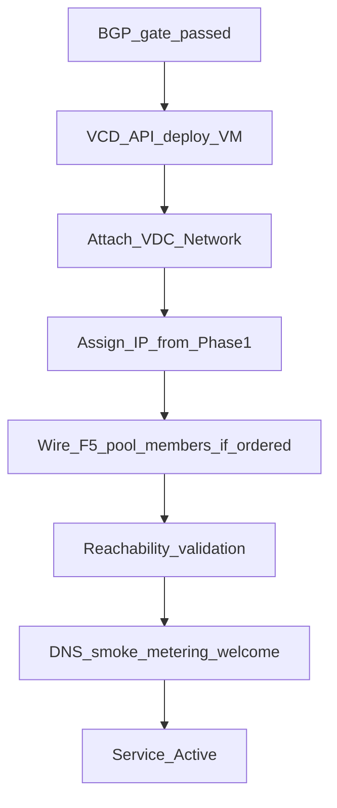

# Phase 7 — VM / compute provisioning and handoff

**CMP posture:** **Custom** for VCD VM deploy automation and acceptance smoke tests. Metering, notifications, and portal access are **Available**.

**Only after [Phase 5 — BGP gate](https://stackconsole.atlassian.net/wiki/spaces/DataMount/pages/396558343) passes.** Optional [Phase 6 — F5](https://stackconsole.atlassian.net/wiki/spaces/DataMount/pages/396853249) may complete before or in parallel with initial VM deploy depending on whether pool members require running VMs.

**Prev:** [Phase 6 — F5](https://stackconsole.atlassian.net/wiki/spaces/DataMount/pages/396853249) · **Next:** [Phase 8 — Reconciliation](https://stackconsole.atlassian.net/wiki/spaces/DataMount/pages/396787742)

---

## Compute provisioning

| # | System | Action | Detail | CMP posture |
|---|---|---|---|---|
| 7.1 | VCD | Deploy VM | From catalog template; poll async task | **Custom** |
| 7.2 | VCD | Attach VDC network | Network from [Phase 2](https://stackconsole.atlassian.net/wiki/spaces/DataMount/pages/396623926) | **Custom** |
| 7.3 | VCD / IPAM | Assign IP | From Phase 1 reservation | **Custom** |
| 7.4 | F5 | Update pool members | If Phase 6 ordered | **Custom** |
| 7.5 | CMP | Reachability validation | VM → NSX-T → T0 → Palo Alto → Internet | **Custom** |

---

## Acceptance and handoff

| # | System | Action | Detail | CMP posture |
|---|---|---|---|---|
| 7.6 | PowerDNS | A / PTR records | Create for public IPs / hostnames | **Partial** — APIs **Available**; auto from VM/IP **Discuss** |
| 7.7 | CMP | Acceptance smoke tests | Probe DNAT, VPN, F5 VIP as ordered | **Custom** |
| 7.8 | Veeam | Enroll VMs / policy | Per backup add-on | **Partial** — subscription **Available**; VM add/manage **manual** |
| 7.9 | CMP | Metering | Start vCPU, RAM, storage, IP, bandwidth meters | **Available** |
| 7.10 | CMP | Welcome / notifications | Portal access, status emails | **Available** |
| 7.11 | CMP | Secure credential handoff | One-time link + VPN pack if ordered | **Partial / Discuss** |

---

## Smoke-test examples

| Probe | When |
|---|---|
| Public IP / DNAT reachability | Always if public IP allocated |
| F5 VIP HTTP/HTTPS health | If F5 add-on |
| IPSec / SSL VPN connect | If VPN add-on |
| End-to-end internet path | VM → segment → T1 → T0 → PA → internet |

Fail → remediate within workflow or compensate and alert (do not mark Active).

---

## DNS and Veeam (CMP today)

| Capability | Status |
|---|---|
| PowerDNS record APIs | **Available** — [PowerDNS](/orchestrators/powerdns/) |
| Auto-create A/PTR on VM or IP provision | **Not today** |
| Veeam subscription + dashboard | **Available** |
| Auto enroll / restore / DR | **Custom** |

Related: [Veeam orchestrator](/orchestrators/veeam/) · [Veeam features](/orchestrator-features/veeam/).

On success → service **Active**; ongoing [Phase 8 — Reconciliation](https://stackconsole.atlassian.net/wiki/spaces/DataMount/pages/396787742) and [Day-2](https://stackconsole.atlassian.net/wiki/spaces/DataMount/pages/396623879).
