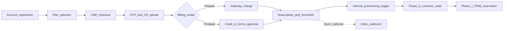

# Registration and billing trigger

**CMP posture:** **Partial** — billing, subscriptions, prepaid/postpaid triggers, and payment gateways are **Available**. KYC (OTP + CR) is **Partial / Discuss**. Checkout may **redirect** to the gateway then return (**Partial** vs DataMount “no external redirect”). Odoo outbound is **Custom** (not built); provisioning must not wait on Odoo.

**Prev:** [Provider abstraction](https://stackconsole.atlassian.net/wiki/spaces/DataMount/pages/396591106) · **Next:** [Phase 0 — Customer order](https://stackconsole.atlassian.net/wiki/spaces/DataMount/pages/396132360)

---

## DataMount ideal

CMP owns the customer-facing billing relationship. After plan selection and order approval, CMP **internally** triggers infrastructure provisioning. Odoo receives order/invoice data **asynchronously** and never starts the build.

Principles (document §3–4):

- Integrated billing inside the portal (catalogue, subscription, usage, invoices)
- Order approval triggers provisioning (prepaid charge or postpaid credit/terms)
- Single customer portal for compute, networking, security, billing, and usage
- Auto-renewal, suspension, and reactivation in-portal

---

## End-to-end path

| Step | System | Action | CMP posture |
|---|---|---|---|
| Account | CMP | Customer registers / signs in | **Available** |
| Plan | CMP store | Select VM or VPC plan and add-ons; see cost estimate | **Available** — [Store](/platform-features/store/) / packages |
| Capacity pre-check | CMP + pools | Block or queue if compute / ASN / public IP unavailable | **Custom** — see [Phase 1 — IPAM](https://stackconsole.atlassian.net/wiki/spaces/DataMount/pages/396787713) |
| Checkout | CMP billing | Order summary, payment method, billing cycle | **Available** |
| KYC | CMP | Email/SMS OTP + company CR upload; CR review parallel; gates activation | **Partial / Discuss** |
| Prepaid approval | CMP + gateway | Successful charge → trigger provisioning | **Available** |
| Postpaid approval | CMP | Credit / terms approval → trigger; invoice in arrears | **Available** |
| Subscription | CMP | Create subscription, assign **Service ID**, entitlements, billing cycle | **Available** |
| Workflow ID | CMP orchestration | Durable Workflow Instance ID bound to Service ID | **Custom** |
| Odoo notify | CMP → Odoo | Push order data async; formal VAT invoice in Odoo | **Custom** — CMP invoices remain SoR until built |
| Trigger | CMP | Fire Phases 0–7 internally | **Partial** — billing trigger Available; infra phases Custom |

---

## Billing model details

| Topic | DataMount requirement | CMP today |
|---|---|---|
| Billing module | Subscriptions, metering, dashboard | **Available** — [Billing overview](/billing/overview) |
| Prepaid | Charge starts provisioning | **Available** |
| Postpaid | Credit/terms approval starts provisioning | **Available** |
| Payment gateways | Stripe / PayPal / regional | **Available** — [Payment gateways](/billing/payment-gateways/): Stripe, AsiaPay, HyperPay, Authorize.net, M-Pesa, PayPal, Razorpay, Mollie, Dinger, Cardlink, Paytm, Payduniya |
| Checkout UX | Prefer no external billing system | **Partial** — catalogue and wallet in CMP; **redirect to gateway** to complete payment, then auto-return |
| Invoices | Odoo generates VAT invoices | **Discuss** — CMP generates invoices today; Odoo integration not yet built |
| Usage / quota | Real-time in portal | **Available** — usage + [quota](/quota/global-quotas) |
| Auto-suspend | Billing-driven | **Available** — [Disciplinary actions](/billing/disciplinary-actions/) |

> [!NOTE]
> **Order trigger**
>
> Most services can be automated when APIs exist. If a component lacks APIs or automation is not feasible, **manual support** may be required for that step. Provisioning does **not** wait on Odoo.
>

---

## Odoo (outbound only)

| Integration point | Direction | CMP posture |
|---|---|---|
| New subscription / order | CMP → Odoo | **Custom** |
| Monthly usage sync | CMP → Odoo | **Custom** |
| Credit notes / refunds | CMP → Odoo | **Custom** |
| Termination close | CMP → Odoo | **Custom** |
| Order / suspend trigger from Odoo | — | **Not applicable** — must remain outbound-only |

Until Odoo is connected, CMP remains the invoice system of record.

---

## What happens after the trigger

1. [Phase 0 — Customer order](https://stackconsole.atlassian.net/wiki/spaces/DataMount/pages/396132360) — package selection (customer-visible)
2. [Phase 1 — IPAM reservation](https://stackconsole.atlassian.net/wiki/spaces/DataMount/pages/396787713) — atomic public IP + private subnet + ASN pair
3. [Phase 2 — VCD](https://stackconsole.atlassian.net/wiki/spaces/DataMount/pages/396623926) — Org / VDC / Edge / networks
4. [Phase 3 — NSX-T](https://stackconsole.atlassian.net/wiki/spaces/DataMount/pages/396755006) → [Phase 4 — Panorama](https://stackconsole.atlassian.net/wiki/spaces/DataMount/pages/396755039)
5. [Phase 5 — BGP gate](https://stackconsole.atlassian.net/wiki/spaces/DataMount/pages/396558343) — hard stop before compute
6. Optional [Phase 6 — F5](https://stackconsole.atlassian.net/wiki/spaces/DataMount/pages/396853249) → [Phase 7 — Compute and handoff](https://stackconsole.atlassian.net/wiki/spaces/DataMount/pages/396722238)
7. Ongoing [Phase 8 — Reconciliation](https://stackconsole.atlassian.net/wiki/spaces/DataMount/pages/396787742)
