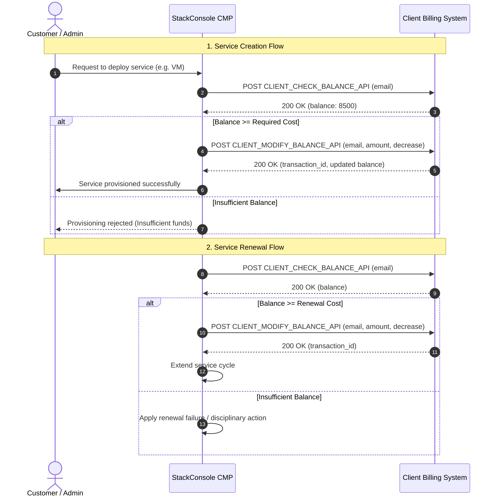

# Custom External Balance APIs

This document outlines the API specifications for integrating an external accounting or billing system with StackConsole CMP.

Instead of requiring customers to top up an internal CMP wallet using integrated payment gateways, CMP can connect directly to a client’s existing billing or accounting system. In this model, CMP queries and modifies the client's external balance in real-time, permitting services to be created and renewed based on the funds available in the client system.

:::info[Current Status: Custom Staging Integration]
These endpoints reflect the current staging balance workflow developed for customized customer deployments. StackConsole is working on standardizing and generalizing these configurations for wider multi-tenant adoption.
:::

---

## Architecture and Account Identification

In standard CMP deployments, prepaid accounts maintain a wallet balance directly within CMP, funded via native payment gateways (such as Stripe, Razorpay, Flutterwave, etc.).

When integrated with **Custom External Balance APIs**:

1. **Centralized Billing Authority:** The client's external billing/ERP system remains the single source of truth for customer account balances and funds.
2. **Real-Time Validation:** CMP makes server-to-server POST calls to the client system to check balance before allowing service provisioning.
3. **Automated Deductions:** CMP triggers balance deductions directly in the external system upon service creation and recurring renewal cycles.
4. **Zero Wallet Friction:** Customers manage payment and credit through the client's native billing portal without needing separate wallet deposits inside CMP.

:::important[Email Address as Unique Identifier & Account Pre-creation]
The customer's **email address** serves as the **primary unique identifier** across both StackConsole CMP and the client's external billing/accounting system.

- **Exact Email Matching:** Every customer account in CMP must have a corresponding billing profile in the client system registered with the exact same email address.
- **No Automatic Account Provisioning:** CMP does **not** automatically create, sync, or provision accounts on the external billing system when a new account is registered or created in CMP.
- **Provider Setup Prerequisite:** The provider must ensure that customer accounts are created in the external billing system prior to service deployment. If an account exists in CMP but has not yet been set up in the external billing system, CMP balance queries will fail with `404 Client not found`, and service creation will be blocked.
- **Request Routing:** All API requests initiated by CMP pass the customer's `email` to query or modify the corresponding external balance.
:::

:::caution[Critical: Provider Responsibility for Account Funding]
**Adding and managing funds in client accounts is strictly the provider's responsibility.**

- **No Fund Top-Up by CMP:** CMP does **not** perform any action to add funds, collect payments, or ingest balance into the client’s billing/accounting system.
- **Provider-Governed Funding Methods:** How funds are added—whether provider staff manually credit accounts via their billing/ERP interface, provide access to a separate self-service customer portal, or process direct bank transfers and offline invoices—is entirely decided, managed, and maintained on the provider's side.
- **CMP Boundary:** CMP acts exclusively as a consumer of the balance. It only queries the current balance (`Check Balance API`) and debits funds (`Modify Balance API` with `decrease`) when cloud services are created or renewed.
:::

### Workflow Sequence



---

## Platform Impacts & Known Challenges

Integrating CMP with external balance APIs alters several standard CMP billing capabilities and introduces important operational considerations:

### 1. CMP UI Changes & Removed Options
Because customer balances and payments are handled exclusively on the client's external billing platform:
- **Invoice Transactions Removed:** Native CMP invoice transaction views, transaction history logs, and payment receipts are removed or hidden.
- **Native Top-Up Bypassed:** Wallet top-up buttons and native payment gateway checkout flows in CMP are disabled.

### 2. Strictly Prepaid Workflow
- This integration workflow operates **exclusively with the PREPAID billing model**.
- Every service action (deployment or renewal) requires immediate upfront balance verification. It cannot be used with postpaid or invoicing-in-arrears accounts.

### 3. No Internal Balance Tracking — Balance Reverts Not Supported
- CMP does **not** maintain a local account balance.
- If a service fails post-deduction, or if an administrative rollback is needed, the balance credit/adjustment must be issued manually inside the client billing system.

### 4. Connection Failures & Disciplinary Action Risks
Continuous, reliable connectivity between CMP and the client billing system is critical:
- **Zero / Negative Balance Impact:** If the connection between CMP and the client API is interrupted, slow, or down, CMP will receive a failure or timeout. The balance will be treated as zero or inaccessible.
- **Service Creation Impact:** Customers will be unable to order or launch new services while connectivity is disrupted.
- **Disciplinary Action Trigger Risk:** During scheduled service renewals, an inability to verify or debit balance will result in a failed renewal. Consequently, CMP's automated **disciplinary workflows** (such as automatic service freezing, suspension, or eventual termination) may trigger unintentionally against active customer workloads.

---

## Network & Connectivity Requirements

- **Server-to-Server Ingress:** CMP backend servers execute direct outbound HTTPS requests to the client billing API endpoints. The client API must accept inbound traffic from CMP backend server IP addresses.
- **Firewall & Allowlisting:** Ensure any perimeter firewalls, WAFs, or API gateways allow POST requests from the provisioned CMP backend server IPs.
- **HTTPS Only:** All requests must be served over secure TLS/HTTPS (`https://`).
- **HTTP Methods:** All endpoints accept **POST** requests only.

---

## Authentication & Credentials

All server-to-server requests initiated by CMP to the client billing system use **HTTP Basic Authentication**:

- **Authentication Scheme:** HTTP Basic Authentication (`Authorization: Basic <base64(CLIENT_USERNAME:CLIENT_PASSWORD)>` or curl flag `-u "CLIENT_USERNAME:CLIENT_PASSWORD"`).
- **Credentials:**
  - **Username / Identifier:** `CLIENT_USERNAME`
  - **Password / Secret:** `CLIENT_PASSWORD`
- **Expiration Policy:** **No Expiration** — Credentials must be permanent (long-lived / non-expiring). They must not expire automatically and remain valid indefinitely until manually rotated by the provider.
- **Payload Format:** Requests transmit parameters via `Content-Type: application/x-www-form-urlencoded`.

:::warning[Authentication Failures (HTTP 401)]
If credentials are missing, invalid, or mismatched, the client billing system must return `HTTP 401 Unauthorized`:
```json
{
  "success": false,
  "message": "Unauthorized – Invalid credentials"
}
```
:::

---

## Standard Error Codes & Response Format

The client billing API must return standard HTTP status codes along with a structured JSON response body indicating `success` status and a descriptive `message`.

### HTTP Status Code Reference

| HTTP Status | Error Type | JSON Response Body | Description |
|---|---|---|---|
| **`400`** | Bad Request | `{"success": false, "message": "Bad Request – Missing or invalid email"}` | Missing required fields, invalid email format, invalid amount, or unsupported operation. |
| **`401`** | Unauthorized | `{"success": false, "message": "Unauthorized – Invalid credentials"}` | Missing, expired, or invalid API authorization token / credentials. |
| **`404`** | Not Found | `{"success": false, "message": "Client not found"}` | No customer account or billing profile exists for the specified email. |
| **`500`** | Internal Error | `{"success": false, "message": "Internal Server Error – Try again later"}` | Unhandled server exception or temporary database failure on the client side. |
| **Default** | Unexpected Error | `{"success": false, "message": "Unexpected error occurred"}` | Fallback for any unmapped server status codes. |

---

## API Endpoints

### 1. Check Balance API

CMP calls this endpoint to inspect the available account balance of a customer in the external billing system.

- **URL:** `https://<YOUR_CLIENT_URL>/balance_check.php`
- **Method:** `POST`
- **Content-Type:** `application/x-www-form-urlencoded`
- **Authentication:** HTTP Basic Auth (`-u "CLIENT_USERNAME:CLIENT_PASSWORD"`)
- **When CMP Calls This API:**
  - At the time of **creating a new service**
  - At the time of **service renewal**

#### Request Parameters

| Parameter | Required | Type | Description |
|---|---|---|---|
| `email` | **Yes** | `String` | Customer email address acting as the unique identifier on both systems. |

#### Request Example

```bash
curl -X POST "https://YOUR_CLIENT_URL/balance_check.php" \
  -u "CLIENT_USERNAME:CLIENT_PASSWORD" \
  -H "Content-Type: application/x-www-form-urlencoded" \
  -d "email=test@example.com"
```

#### Successful Response (HTTP 200)

Returned when the user account exists in the client billing system:

```json
{
  "success": true,
  "message": "Account information retrieved successfully",
  "balance": 8500
}
```

| Field | Type | Description |
|---|---|---|
| `success` | `boolean` | Indicates transaction success (`true`). |
| `message` | `string` | Human-readable confirmation message. |
| `balance` | `number` | Current available balance in the user's account. |

#### Error Responses

##### Account Not Found (HTTP 404)
Returned when no billing record exists matching the customer's email:

```json
{
  "success": false,
  "message": "Client not found"
}
```

*(Legacy staging format: `{"message": "No billing account found for the test user"}`)*

##### Missing or Invalid Email (HTTP 400)

```json
{
  "success": false,
  "message": "Bad Request – Missing or invalid email"
}
```

---

### 2. Modify Balance API

CMP calls this endpoint to update (deduct or credit) the customer's account balance in the external billing system.

- **URL:** `https://<YOUR_CLIENT_URL>/balance_modify.php`
- **Method:** `POST`
- **Content-Type:** `application/x-www-form-urlencoded`
- **Authentication:** HTTP Basic Auth (`-u "CLIENT_USERNAME:CLIENT_PASSWORD"`)
- **When CMP Calls This API:**
  - **Service Creation:** To deduct the initial creation/setup cost (`operation: decrease`).
  - **Service Renewal:** To deduct recurring subscription/cycle charges (`operation: decrease`).
  - **Refunds or Adjustments:** To credit the account when applicable (`operation: increase`).

#### Request Parameters

| Parameter | Required | Type | Description |
|---|---|---|---|
| `email` | **Yes** | `String` | Customer email address acting as the unique identifier on both systems. |
| `amount` | **Yes** | `Number` | Transaction amount. Must be a numeric value greater than `0`. |
| `operation` | **Yes** | `String` | Type of balance adjustment. Allowed values: `increase` or `decrease`. |
| `comment` | No | `String` | Contextual note or transaction description (e.g. reason for deduction). |

#### Request Example

```bash
curl -X POST "https://YOUR_CLIENT_URL/balance_modify.php" \
  -u "CLIENT_USERNAME:CLIENT_PASSWORD" \
  -H "Content-Type: application/x-www-form-urlencoded" \
  -d "email=test@example.com&amount=2000&operation=decrease&comment=CMP staging test decrease"
```

#### Successful Response (HTTP 200)

Returned when the balance modification succeeds:

```json
{
  "success": true,
  "message": "Balance decreased successfully.",
  "transaction_id": "cmp_test_68596c5d42f1a",
  "balance": 6500
}
```

| Field | Type | Description |
|---|---|---|
| `success` | `boolean` | Indicates transaction success (`true`). |
| `message` | `string` | Confirmation message of the completed transaction. |
| `transaction_id` | `string` | Unique reference ID generated by the client billing system for this transaction. |
| `balance` | `number` | Resulting account balance after applying the modification. |

#### Error Responses

##### 1. Invalid Amount (HTTP 400)
Returned when `amount` is missing, non-numeric, or `<= 0`:

```json
{
  "success": false,
  "message": "Invalid amount. Amount must be a number greater than zero."
}
```

##### 2. Invalid Operation (HTTP 400)
Returned when `operation` is neither `increase` nor `decrease`:

```json
{
  "success": false,
  "message": "Invalid operation. Use 'increase' or 'decrease'."
}
```

##### 3. Insufficient Balance (HTTP 400)
Returned when the account has insufficient funds to satisfy a `decrease` operation:

```json
{
  "success": false,
  "message": "Insufficient funds in the account.",
  "current_balance": 1500,
  "required_amount": 2000
}
```

##### 4. Account Not Found (HTTP 404)
Returned when no client account exists for the email provided:

```json
{
  "success": false,
  "message": "Client not found"
}
```

---

## Currency & Decimal Precision

- **Currency Matching:** All amounts passed in `amount` and returned in `balance` must correspond to the primary currency configured on the CMP platform (e.g. USD, EUR, DZD).
- **Major Units:** Values must be represented in standard major currency units (e.g. `2000` or `2000.50`), **not** in minor subunits (cents).
- **Audit Tracking:** The `transaction_id` returned on balance modifications should be stored in the client billing database to facilitate end-to-end reconciliation with CMP log records.

---

## Information to Share with StackConsole

To activate this integration on your CMP environment, provide the following details to the StackConsole support and engineering team:

| Parameter | Example Value | Description |
|---|---|---|
| **Check Balance Endpoint URL** | `https://billing.example.com/balance_check.php` | The full HTTPS URL where CMP checks customer balance. |
| **Modify Balance Endpoint URL** | `https://billing.example.com/balance_modify.php` | The full HTTPS URL where CMP debits/credits customer balance. |
| **CLIENT_USERNAME** | `cmp_backend_prod` | Basic Authentication username (permanent / non-expiring). |
| **CLIENT_PASSWORD** | `StrongSecretKey123!` | Basic Authentication password (permanent / non-expiring). |
| **Platform Currency** | `USD` / `EUR` / `DZD` | Primary currency configured for client accounts. |
| **CMP Egress IP Whitelisting** | *Provided by StackConsole* | Ask StackConsole for the CMP backend server outbound IPs to whitelist on your firewall. |

---

## Integration and Testing Checklist

Before connecting the CMP backend to your API endpoints, complete the following verification steps:

- [ ] **HTTP Basic Auth Credentials:** Permanent, non-expiring `CLIENT_USERNAME` and `CLIENT_PASSWORD` generated on the client billing system and configured in CMP.
- [ ] **Email Identifier Sync:** Ensure test accounts in CMP and the external billing system share the exact same email address.
- [ ] **Customer Account Pre-creation:** Confirm customer profiles are created on the external billing system before customers attempt to deploy services in CMP.
- [ ] **Network Allowlisting:** CMP backend server IP addresses are permitted through client firewalls and API gateways.
- [ ] **HTTPS Certificate:** Valid, non-expired SSL/TLS certificate is installed on the client API domain.
- [ ] **Authentication Test (HTTP 401):** Verify that missing, invalid, or mismatched Basic Auth credentials return `401 Unauthorized`.
- [ ] **Account Lookup Test (HTTP 200):** Verify that `POST CLIENT_CHECK_BALANCE_API` returns `balance` as a numeric value for active test accounts.
- [ ] **Client Not Found (HTTP 404):** Verify that querying an unmapped email returns `{"success": false, "message": "Client not found"}`.
- [ ] **Debit Test (`decrease`):** Confirm that deducting an amount updates the account balance and returns a unique `transaction_id`.
- [ ] **Credit Test (`increase`):** Confirm that increasing an amount increments the balance appropriately.
- [ ] **Insufficient Balance Test:** Test requesting a deduction larger than the available balance and verify that `current_balance` and `required_amount` are returned.
- [ ] **Error Code Handling:** Verify that invalid requests (HTTP 400) and server errors (HTTP 500) return the standard JSON error schema.
