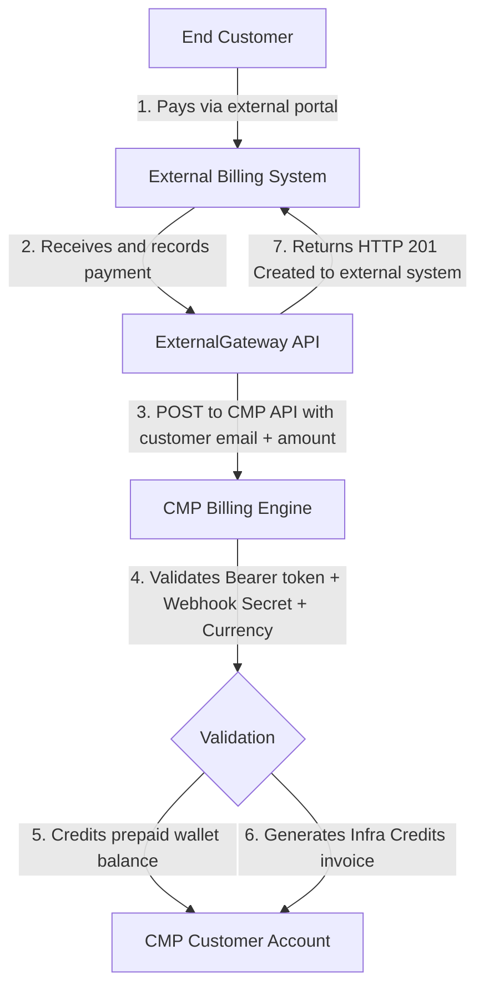

# External Billing Payment Provider (ExternalGateway)

### Admin Enablement Guide

ExternalGateway allows providers to use their own external billing or payment system to collect payments and then add the corresponding prepaid balance to CMP customer accounts through the CMP API. CMP does not process the payment through its built-in payment gateways in this flow.

:::important[Key Concept: External Billing Integration, Not a Payment Gateway]
ExternalGateway is **not** a built-in payment gateway like Stripe or Razorpay where CMP directly charges customer cards. Instead, it is an **external billing and payment integration** where your external platform (such as WHMCS or a custom billing ERP) collects funds directly from the end customer and invokes CMP APIs to credit the customer's prepaid account balance.
:::

:::caution[Strictly Prepaid Workflow]
This integration operates **exclusively with the Prepaid billing model**.

Every service action (deployment or renewal) requires immediate upfront balance verification. This integration **cannot** be used with Postpaid or invoicing-in-arrears accounts.
:::

---


## 1. Purpose

Administrators must enable two CMP configurations before new ExternalGateway payments can be created:

1. **ExternalGateway Payment Provider** — activates the provider and selects supported currencies.
2. **ExternalGateway Payment Setting** — associates the provider with a branch, manages the Webhook Secret, and defines currency-specific transaction limits.

### Overall Flow

```
Customer payment → External billing system → ExternalGateway API → CMP prepaid account balance
```

* The customer pays through your external billing platform (e.g. WHMCS invoice, bank transfer, local payment gateway).
* The external billing system receives the funds and makes an authorized server-to-server API call to CMP (`POST /api/admin/external-gateway/payments`).
* CMP validates the provider, settings, currency, and customer account, then credits the customer's prepaid balance and generates the corresponding Infra Credits invoice.

---

## 2. Prerequisites

Before enabling ExternalGateway, ensure the following requirements are met:

* **Administrator Access:** Admin credentials with write permissions for **Settings → Billing Setup**.
* **Supported Currencies:** Identify which currencies your external billing system and customer accounts use (e.g. USD, EUR, INR).
* **Secure Webhook Secret:** A strong, unshared secret string used to authenticate external API calls.
* **External Billing Integration:** An external billing or payment platform capable of sending authenticated JSON requests to the CMP ExternalGateway API.
* **Prepaid Accounts Only:** **Phase 1 supports prepaid accounts only.** Postpaid accounts and postpaid auto-charge flows are not supported.

---

## 3. Enable External Billing Payment Provider

This configuration determines whether ExternalGateway is available as an active payment provider and which currencies can be used for new ExternalGateway payments.

**Navigation:** **Settings → Billing Setup → Payment Provider**


*Figure 1 — ExternalGateway Payment Provider*

### Steps to Enable

1. Open **Settings** from the main menu.
2. Expand **Billing Setup**.
3. Select **Payment Provider**.
4. Locate and edit **ExternalGateway**.
5. Under **Currencies\***, select all currencies that ExternalGateway should support (e.g., `EUR`, `USD`, `TRY`, `INR`).
6. Set **Status\*** to **Active**.
7. Click **Submit**.

### Form Fields — Payment Gateway Providers

**Currencies**

*Required.* Select all currencies this provider record supports (for example, **EUR**, **USD**, **TRY**, **INR**). Only currencies selected here can be utilized for new ExternalGateway payment API requests.

**Has Autocharge**

*Optional.* Set to **No**. ExternalGateway Phase 1 is designed strictly for prepaid balance crediting; postpaid merchant auto-charge is not supported.

**Upload Light Theme Logo / Upload Dark Theme Logo**

*Optional.* Upload custom branding icons for ExternalGateway in light and dark UI themes.

**Status**

*Required.* Select **Active** to enable ExternalGateway for new payments. If set to **Inactive**, all new payment attempts are rejected.

:::caution[Provider Status Requirement]
A new ExternalGateway payment is **rejected** with HTTP `422 provider_inactive` when the ExternalGateway Payment Provider is inactive.
:::

---

## 4. Enable External Billing Payment Setting

This configuration associates ExternalGateway with the required branch and contains the webhook and currency-specific payment configuration used when processing ExternalGateway API requests.

**Navigation:** **Settings → Billing Setup → Payment Setting**


*Figure 2 — ExternalGateway Payment Setting*

### Steps to Configure

1. Open **Settings** from the main menu.
2. Expand **Billing Setup**.
3. Select **Payment Setting**.
4. Locate and edit **ExternalGateway**.
5. Confirm **Payment Provider\*** is set to **ExternalGateway**.
6. Under **Branches\***, select the required branch (e.g. *StackConsole Management Portal*).
7. Configure or verify the **Webhook Secret** (click **Generate Webhook Secret** if creating a new one).
8. Set **Is Live** according to your environment (**Yes** for production, **No** for sandbox/staging).
9. In the currency table, configure the **Min. Amt.**, **Max. Amt.**, and **Auth. Amt.** for each supported currency.
10. Set **Status\*** to **Active**.
11. Click **Submit**.

### Form Fields — Payment Gateway Settings

**Payment Provider**

*Required.* Confirm this is set to **ExternalGateway**.

**Branches**

*Required.* Assign ExternalGateway to the relevant branches (for example, **StackConsole Management Portal**). Only accounts belonging to the assigned branches can accept payments via ExternalGateway.

**Webhook Secret**

*Required.* A secure token used to authenticate API requests. Click **Generate Webhook Secret** to generate a cryptographic key. The external billing system must supply this exact secret in the `X-Webhook-Secret` HTTP header. Keep this value confidential.

**Note**

*Optional.* Freeform administrative notes, such as the external billing system identifier (e.g. *WHMCS Production Integration*) or operational details.

**Is Live**

*Yes / No.* Set **Yes** for live production operation, or **No** for staging/sandbox testing.

**Currency Limits (Min. Amt. / Max. Amt. / Auth. Amt.)**

*Required.* For each supported currency, configure the transaction thresholds:
* **Min. Amt.:** Minimum deposit amount accepted per API call.
* **Max. Amt.:** Maximum allowable deposit cap per API call.
* **Auth. Amt.:** Default authorization verification amount (typically `1`).

**Status**

*Required.* Select **Active** to activate the payment setting for this branch. If set to **Inactive**, all new payment creation requests are rejected.

:::caution[Setting Status Requirement]
A new ExternalGateway payment is **rejected** with HTTP `422 provider_settings_inactive` when the corresponding ExternalGateway Payment Setting is inactive.
:::

---

## 5. Currency Configuration

ExternalGateway API consumers must use standard ISO-style three-letter currency codes such as:

* `INR`
* `USD`
* `EUR`
* `GBP`

API callers do not need to know CMP's internal currency slug or ID; input is normalized to uppercase automatically.

:::warning[Exact Currency Match Required — No Currency Conversion]
The requested payment currency must match the customer's CMP account currency exactly. **ExternalGateway does not perform currency conversion.**
:::

| Customer Account Currency | API Request Currency | Result |
|---|---|---|
| **INR** | **INR** | ✅ Payment proceeds if other validations pass |
| **INR** | **USD** | ❌ Rejected: HTTP `422 currency_mismatch` |
| **USD** | **USD** | ✅ Payment proceeds if other validations pass |
| **USD** | **INR** | ❌ Rejected: HTTP `422 currency_mismatch` |

**Example:**
* Customer account currency: `INR`
* API request currency: `USD`
* Result: `422 currency_mismatch` — *"The requested currency (USD) does not match the account currency (INR)."*

---

## 6. Configuration Verification

Before initiating API payments from your external billing platform, verify this checklist:

* [ ] `ExternalGateway` exists under **Payment Provider**
* [ ] Payment Provider status is **Active**
* [ ] All required currencies are selected under Payment Provider
* [ ] `ExternalGateway` exists under **Payment Setting**
* [ ] Required branch is assigned under Payment Setting
* [ ] **Webhook Secret** is generated, saved securely, and shared with the integration team
* [ ] Payment Setting status is **Active**
* [ ] Minimum, maximum, and authorization amounts are configured for each currency
* [ ] **Is Live** toggle reflects the correct environment mode

---

## 7. Configuration Behavior

The operational state of the provider and settings directly governs API payment creation:

| Configuration State | New Payment Creation |
|---|---|
| **Provider Active + Settings Active** | ✅ Can proceed, subject to API validations |
| **Provider Inactive** | ❌ Rejected (`422 provider_inactive`) |
| **Provider Active + Settings Inactive** | ❌ Rejected (`422 provider_settings_inactive`) |

:::info[Payment Revocation Decoupled from Active State]
Revocation of an existing ExternalGateway payment is handled separately. Deactivating the provider or its settings **does not** prevent an eligible existing payment from being revoked. The API validates the gateway configuration associated with the existing payment record at the time of creation.
:::

---

## 8. How ExternalGateway Works

ExternalGateway establishes an API-driven bridge between an external billing platform and CMP's internal ledger:



### Architectural Responsibilities

1. **Payment Collection:** The external billing system is exclusively responsible for collecting money from the end customer (credit cards, wires, PayPal, local bank transfers). CMP never touches or processes the financial transaction directly.
2. **Account Resolution:** The external system provides the customer's registered login `email`. CMP automatically resolves the internal account hierarchy (`users.email → users.account_id → accounts.id`).
3. **Credit Ingestion:** CMP verifies credentials and currency alignment, increases the customer's available prepaid balance, and creates an audit-tracked Infra Credits invoice.

---

## 9. API Reference

### Endpoints

| Method | Endpoint | Purpose |
|---|---|---|
| `POST` | `/api/admin/external-gateway/payments` | Create and credit a prepaid payment |
| `POST` | `/api/admin/external-gateway/payments/revoke` | Revoke an eligible prepaid payment (allowed as long as funds remain unused) |

#### Create Payment — Request Body

```json
{
  "transaction_id": "{{transaction_id}}",
  "email": "{{customer_email}}",
  "amount": {{amount}},
  "currency": "{{currency}}",
  "description": "Infra Credits"
}
```

| Field | Required | Description |
|---|---|---|
| `transaction_id` | **Yes** | Globally unique identifier for this transaction (e.g. UUID or external invoice reference). Used for idempotency. |
| `email` | **Yes** | The customer's registered CMP email address. Must match exactly across both systems. |
| `amount` | **Yes** | Numeric deposit amount in major currency units (e.g. `2000` or `2000.50`). Must be greater than `0`. |
| `currency` | **Yes** | ISO 4217 three-letter currency code (e.g. `USD`, `EUR`, `INR`). Must match the customer's CMP account currency. |
| `description` | No | Optional label for the transaction (e.g. `"Infra Credits"`). |

#### Revoke Payment — Request Body

```json
{
  "transaction_id": "{{transaction_id}}",
  "email": "{{customer_email}}"
}
```

| Field | Required | Description |
|---|---|---|
| `transaction_id` | **Yes** | The unique transaction ID of the payment to revoke. |
| `email` | **Yes** | The customer's registered email address associated with the original payment. |


### Authentication

Every request requires **BOTH** authentication mechanisms:

1. **CMP Admin Bearer Token:**
   `Authorization: Bearer {{admin_auth_token}}`
2. **Webhook Secret:**
   `X-Webhook-Secret: {{webhook_secret}}`

:::caution[Security Rule]
Always pass the Webhook Secret in the HTTP header `X-Webhook-Secret`. Never include the secret in the JSON request body, and never log it in plain text.
:::

### Customer Identification & Idempotency

* **Customer Resolution:** Customers are identified by their `email` address. CMP trims and normalizes the email to lowercase to locate the account.
* **Idempotency Key:** `transaction_id` is globally unique across all customer accounts.
  * **Same-Account Retry:** Sending the same `transaction_id` for the same account returns HTTP `200 OK` with `"idempotent": true`. No duplicate payment or invoice is created.
  * **Cross-Account Conflict:** Attempting to use a previously registered `transaction_id` for a different customer returns HTTP `409 Conflict` (`transaction_conflict`).

### Common HTTP Error Responses

| HTTP Status | Error Code | Description / Meaning |
|---|---|---|
| **`401 Unauthorized`** | — | Missing or invalid Bearer token, or missing Webhook Secret header |
| **`403 Forbidden`** | — | Invalid Webhook Secret, or Bearer token lacks admin billing permissions |
| **`404 Not Found`** | `account_not_found` | Supplied email does not exist in CMP or has no linked account |
| **`409 Conflict`** | `transaction_conflict` | The `transaction_id` has already been used on another account or was cancelled |
| **`422 Unprocessable`** | `provider_inactive` | ExternalGateway Payment Provider is inactive in CMP Settings |
| **`422 Unprocessable`** | `provider_settings_inactive` | ExternalGateway Payment Setting is inactive in CMP Settings |
| **`422 Unprocessable`** | `currency_mismatch` | Requested currency does not match customer's CMP account currency |
| **`422 Unprocessable`** | `invalid_currency` | Currency code is not supported by CMP or enabled on the provider |
| **`422 Unprocessable`** | — | Non-prepaid account, or consumed funds preventing revoke |

---

## 10. Do's, Don'ts, and Limitations

:::important[Critical Operational Guidelines]
Review the following constraints carefully before implementing or administering ExternalGateway.
:::

### Do's (Best Practices)

* ✅ **Do ensure currency matching:** Confirm that the external invoice currency matches the customer's CMP account currency exactly before submitting payment calls.
* ✅ **Do generate globally unique transaction IDs:** Use a distinct, unique `transaction_id` (e.g. UUID or external invoice prefix `WHMCS-INV-10023`) for every new transaction.
* ✅ **Do send authentication headers properly:** Provide both `Authorization: Bearer <token>` and `X-Webhook-Secret: <secret>` as HTTP headers over secure HTTPS connections.
* ✅ **Do utilize idempotent retries:** If a network timeout or unknown connection failure occurs, retry using the **exact same `transaction_id`**. CMP will safely return the original payment record without double-crediting funds.
* ✅ **Do treat monetary responses as strings:** High-precision decimals are returned as strings (e.g. `"10000.000000000000000000"`). Avoid parsing them as standard floating-point numbers in billing scripts.

### Don'ts (Strict Prohibitions)

* ❌ **Do not use for postpaid accounts:** ExternalGateway is strictly designed for prepaid balance top-ups. Do not attempt to process postpaid invoices or auto-charge flows through these APIs.
* ❌ **Do not send Webhook Secrets in the body:** The Webhook Secret must strictly be supplied via the `X-Webhook-Secret` header. Payloads containing secrets in the body will be rejected.
* ❌ **Do not attempt cross-currency top-ups:** Do not attempt to convert currencies on the fly; ExternalGateway will fail with `422 currency_mismatch`.
* ❌ **Do not reuse transaction IDs across accounts:** A `transaction_id` cannot be reused for another customer account, even if the previous payment was cancelled.
* ❌ **Do not log authentication credentials:** Ensure your external system does not log admin Bearer tokens or Webhook Secrets in application or access logs.

### Known Limitations

1. **Prepaid Accounts Only (Phase 1):** Postpaid account billing, monthly contract invoicing, and auto-charge recurring cycles are **not supported**.
2. **No Built-In Currency Conversion:** CMP does not perform exchange rate conversions during balance credit. All deposits must match the account's base currency.
3. **Revocation Allowed Until Funds are Consumed:** Payments can be revoked at any time as long as the added funds remain unused. A payment **cannot be revoked** if the customer has already spent or consumed the deposited funds on cloud resources such that revoking would drive their available prepaid balance into an invalid or negative state.
4. **Atomic Invoice Dependency:** Revoking a payment automatically cancels the linked Infra Credits invoice. If linked invoice cancellation encounters an error, payment revocation is aborted and rolled back.

---

## 11. Quick Setup Summary

| Component | CMP Path | Key Actions |
|---|---|---|
| **Payment Provider** | **Settings → Billing Setup → Payment Provider** | Find `ExternalGateway` → select supported currencies → set Status to **Active** → **Submit** |
| **Payment Setting** | **Settings → Billing Setup → Payment Setting** | Find `ExternalGateway` → select Branch → configure Webhook Secret & currency limits → set Status to **Active** → **Submit** |
| **External API Call** | `POST /api/admin/external-gateway/payments` | Send Bearer token + `X-Webhook-Secret`, pass `email`, `amount`, `currency`, and unique `transaction_id` |

---

## Related

* [Payment Gateways Overview](/billing/payment-gateways/)
* [Prepaid Payment Mode](/billing/payment-modes/prepaid)
* [Billing Settings (admin)](/billing/billing-settings)
* [Custom External Balance APIs](/billing/custom-balance-api)
* [New Payment Gateway Requirements](/billing/payment-gateways/new-gateway-requirements)
