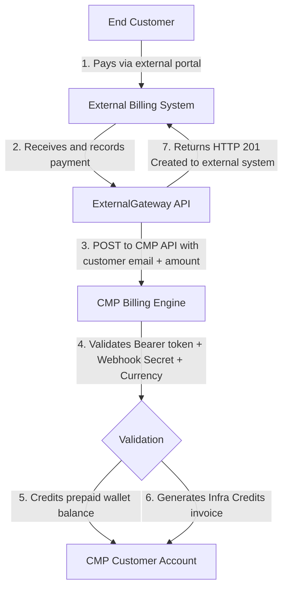

# External Billing Payment Provider (ExternalGateway)

ExternalGateway allows providers to integrate their own external billing or payment system with CMP. The external system collects funds from customers and calls the CMP ExternalGateway API to credit the corresponding prepaid balance — CMP does not process the payment itself.

:::important[Key Concept: External Billing Integration, Not a Payment Gateway]
ExternalGateway is **not** a built-in payment gateway like Stripe or Razorpay. It is a **server-to-server integration** where your external billing platform (such as WHMCS or a custom ERP) collects funds and invokes CMP APIs to credit the customer's prepaid account. CMP is the recipient of the API call, not the initiator.
:::

:::caution[Strictly Prepaid Workflow]
This integration operates **exclusively with the Prepaid billing model**. It **cannot** be used with Postpaid or invoicing-in-arrears accounts.
:::

---

## 1. Purpose

ExternalGateway is designed for providers who already operate an external billing system and want to synchronise customer balances into CMP without requiring customers to top up via CMP's native payment gateways.

**What CMP does:**
- Receives an authenticated API call from the external billing system
- Validates the request (credentials, currency, amount, account)
- Credits the customer's CMP prepaid wallet (Infra Credits)
- Generates the corresponding invoice record

**What CMP does NOT do:**
- Collect or process any payment from the customer directly
- Initiate or retry API calls to the external system
- Perform currency conversion

---

## 2. ExternalGateway Architecture

The payment flow is entirely server-to-server. The customer never interacts with CMP during the payment step:

```
Customer
  ↓ pays via external portal / WHMCS / bank transfer
External Billing System
  ↓ POST /api/admin/external-gateway/payments
ExternalGateway API (CMP)
  ↓ validates + credits
CMP Payment / PaymentOrder
  ↓
Infra Credits / Prepaid Balance
```



### Architectural Responsibilities

1. **Payment Collection:** The external billing system is exclusively responsible for collecting money from the end customer. CMP never touches the financial transaction.
2. **Account Resolution:** The external system provides the customer's registered CMP `email`. CMP resolves the internal account hierarchy automatically.
3. **Credit Ingestion:** CMP verifies credentials and currency alignment, increases the customer's prepaid balance, and creates an audit-tracked Infra Credits invoice.

---

## 3. Prepaid-Only Model

ExternalGateway exclusively supports **Prepaid** billing accounts. This means:

- Every service deployment or renewal requires sufficient prepaid balance at the time of the action.
- There is no invoicing-in-arrears, no auto-charge, and no deferred payment.
- If the customer's balance is insufficient, service creation or renewal is blocked immediately.

Postpaid accounts, monthly contract invoicing, and auto-charge recurring cycles are not supported.

---

## 4. ExternalGateway vs Customer Payment Gateway

### ExternalGateway is not visible to customers

ExternalGateway is **intentionally excluded** from the customer-facing payment gateway selection. Customers cannot see or select ExternalGateway when making a payment through the CMP portal.

| Aspect | Standard Payment Gateway (e.g. Stripe) | ExternalGateway |
|---|---|---|
| Customer initiates payment | ✅ Yes | ❌ No |
| Appears in customer checkout | ✅ Yes | ❌ No — excluded from customer gateway list |
| CMP processes the transaction | ✅ Yes | ❌ No — external system processes |
| Server-to-server API | ❌ No | ✅ Yes — external system calls CMP |
| Customer sees in transaction history | ✅ Yes | ✅ Yes (as "ExternalGateway" method) |

### Customer Transaction History

Successfully completed ExternalGateway payments appear in the customer's **Payment Transactions** list under the **Transactions** tab, with the method shown as **ExternalGateway**.

:::note
Revoked payments are **excluded** from the customer's transaction history view. The original payment record remains in the system for admin audit and reconciliation purposes.
:::

---

## 5. Prerequisites

Before enabling ExternalGateway, ensure the following:

- **Administrator Access:** Admin credentials with write permissions for **Settings → Billing Setup**.
- **Supported Currencies:** Identify which currencies your external billing system and customer accounts use (e.g. `USD`, `EUR`, `INR`).
- **Secure Webhook Secret:** A strong, unshared secret string to authenticate external API calls.
- **External Billing Integration:** An external billing or payment platform capable of sending authenticated JSON requests to the CMP ExternalGateway API.
- **Prepaid Customer Accounts:** Customer accounts that will receive ExternalGateway credits must be configured as Prepaid.

---

## 6. Enable ExternalGateway Provider

This configuration activates ExternalGateway as a provider and defines which currencies are available.

**Navigation:** **Settings → Billing Setup → Payment Provider**


*Figure 1 — ExternalGateway Payment Provider*

### Steps to Enable

1. Open **Settings** from the main menu.
2. Expand **Billing Setup**.
3. Select **Payment Provider**.
4. Locate and edit **ExternalGateway**.
5. Under **Currencies\***, select all currencies that ExternalGateway should support (e.g. `EUR`, `USD`, `TRY`, `INR`).
6. Set **Status\*** to **Active**.
7. Click **Submit**.

### Form Fields

**Currencies**

*Required.* Select all currencies this provider supports. These currencies control ExternalGateway's visibility in the customer gateway listing context. Note: the ExternalGateway transaction API also requires the currency to be configured at the **Payment Setting** level — provider-level currency alone is not sufficient for API transaction validation.

**Has Autocharge**

*Not applicable.* Set to **No**. ExternalGateway does not support postpaid auto-charge.

**Upload Light Theme Logo / Upload Dark Theme Logo**

*Optional.* Custom branding icons for ExternalGateway in the CMP admin UI.

**Status**

*Required.* Select **Active** to enable ExternalGateway. If **Inactive**, all new payment API requests are rejected with `422 provider_inactive`.

:::caution[Provider Status Requirement]
A new ExternalGateway payment is **rejected** with HTTP `422 provider_inactive` when the Payment Provider record is inactive.
:::

---

## 7. Enable ExternalGateway Payment Setting

This configuration holds the webhook authentication secret and currency-specific transaction limits used when processing ExternalGateway API requests.

**Navigation:** **Settings → Billing Setup → Payment Setting**


*Figure 2 — ExternalGateway Payment Setting*

### Steps to Configure

1. Open **Settings** from the main menu.
2. Expand **Billing Setup**.
3. Select **Payment Setting**.
4. Locate and edit **ExternalGateway**.
5. Confirm **Payment Provider\*** is set to **ExternalGateway**.
6. Under **Branches\***, select the required branch (e.g. *StackConsole Management Portal*).
7. Configure or verify the **Webhook Secret** (click **Generate Webhook Secret** if creating a new one).
8. In the currency table, configure the **Min. Amt.** and **Max. Amt.** for each supported currency.
9. Set **Status\*** to **Active**.
10. Click **Submit**.

### Form Fields

**Payment Provider**

*Required.* Must be set to **ExternalGateway**.

**Branches**

*Required.* Assign ExternalGateway to the relevant branches for administrative organisation. Note: the current server-to-server ExternalGateway API does not enforce branch assignment when processing a payment credit — see [Branch, Is Live & Authorization Amount Behaviour](#18-branch-is-live--authorization-amount-behaviour).

**Webhook Secret**

*Required.* A secure token used to authenticate API requests. Click **Generate Webhook Secret** to generate a cryptographic key. The external billing system must supply this exact value in the `X-Webhook-Secret` HTTP header. Keep this value confidential and never log it.

**Note**

*Optional.* Freeform administrative notes (e.g. *WHMCS Production Integration*).

**Is Live**

*Admin metadata only.* This field does not control whether the ExternalGateway API accepts or rejects payments — see [Branch, Is Live & Authorization Amount Behaviour](#18-branch-is-live--authorization-amount-behaviour).

**Currency Limits (Min. Amt. / Max. Amt.)**

*Required.* For each supported currency, configure the transaction amount boundaries. These are validated by the ExternalGateway API on every payment request. See [Transaction Amount Limits](#9-transaction-amount-limits).

:::note[Auth. Amt. — Not Used by ExternalGateway API]
The **Auth. Amt.** (authorization amount) field is not used by the ExternalGateway prepaid credit API. Amount validation uses the Min. Amt. and Max. Amt. fields only.
:::

**Status**

*Required.* Select **Active**. If **Inactive**, all new payment requests are rejected with `422 provider_settings_inactive`.

:::caution[Setting Status Requirement]
A new ExternalGateway payment is **rejected** with HTTP `422 provider_settings_inactive` when the Payment Setting is inactive.
:::

---

## 8. Currency Configuration

### Currency Validation Chain

The ExternalGateway API validates currency through the following chain:

```
Request currency (ISO 4217 code)
  ↓ normalized to uppercase
CMP active currency list
  ↓ must be a recognized currency
Payment Setting currency configuration
  ↓ must be configured here → otherwise: 422 currency_not_configured
Customer account currency
  ↓ must match request currency exactly → otherwise: 422 currency_mismatch
```

### Provider Currency vs Payment Setting Currency

These are two separate configurations with different purposes:

| Configuration | Purpose | Affects |
|---|---|---|
| **Provider-level currencies** | Controls which currencies ExternalGateway is associated with in gateway listing contexts | Gateway listing |
| **Payment Setting currencies** | Controls which currencies the ExternalGateway transaction API validates and accepts | API transaction processing |

**Both must be configured.** Provider-level currency configuration alone is not sufficient for the ExternalGateway API to process a transaction.

### No Currency Conversion

:::warning[Exact Currency Match Required]
ExternalGateway does **not** perform currency conversion. The requested payment currency must exactly match the customer's CMP account currency.
:::

| Customer Account Currency | API Request Currency | Result |
|---|---|---|
| **INR** | **INR** | ✅ Passes currency check |
| **INR** | **USD** | ❌ `422 currency_mismatch` |
| **USD** | **USD** | ✅ Passes currency check |
| **USD** | **INR** | ❌ `422 currency_mismatch` |
| **EUR** | **EUR** (not in Payment Setting) | ❌ `422 currency_not_configured` |

---

## 9. Transaction Amount Limits

The ExternalGateway API validates the transaction amount against the **Min. Amt.** and **Max. Amt.** configured in the Payment Setting for the request currency.

### Validation Rules

```
amount <= 0                     → rejected (invalid amount)
amount < min_transaction_amount → 422 amount_below_minimum
amount > max_transaction_amount → 422 amount_above_maximum
min_amount ≤ amount ≤ max_amount → proceeds to further validation
```

:::caution[Zero Does Not Mean Unlimited]
If `min_transaction_amount = 0` and `max_transaction_amount = 0`, **every positive transaction amount is rejected** as `amount_above_maximum`. Zero is not treated as "no limit." Always configure realistic non-zero min and max values for each currency.
:::

---

## 10. Webhook Authentication

Every ExternalGateway API request requires **both** authentication mechanisms:

1. **CMP Admin Bearer Token:**
   `Authorization: Bearer {{admin_auth_token}}`
2. **Webhook Secret:**
   `X-Webhook-Secret: {{webhook_secret}}`

:::caution[Security Rule]
Always pass the Webhook Secret in the HTTP header `X-Webhook-Secret`. Never include the secret in the JSON request body, and never log it in plain text.
:::

---

## 11. Customer Experience

### What customers see

- ExternalGateway **does not appear** in the customer's payment gateway selection.
- Customers **cannot initiate** an ExternalGateway payment from the CMP portal.
- Completed ExternalGateway credits appear in the customer's **Payment Transactions → Transactions** tab with the method shown as **ExternalGateway**.
- Revoked payments are not shown in the customer transaction list (though they remain in the admin system for audit).

### What customers do not see

- The ExternalGateway provider in checkout or top-up flows.
- Any indication that a server-to-server credit was requested by an external system.

---

## 12. `hide_infra_credits` Behaviour

`hide_infra_credits` is a global CMP setting that controls whether the Infra Credits top-up UI is visible to customers.

### Stored vs Effective Value

When ExternalGateway is the **only operational payment gateway**, the Infra Credits payment UI is effectively hidden from customers — even if the stored value of `hide_infra_credits` is `false`.

| Configuration | Effective `hide_infra_credits` |
|---|---|
| ExternalGateway only (active and operational) | Effectively `true` |
| ExternalGateway + other active payment gateway | Stored value |
| Other payment gateway only | Stored value |
| No operational gateway | Stored value |
| ExternalGateway configured but inactive | Stored value |

:::important[Stored Value Is Not Automatically Updated]
The effective `true` is **not** written back to the database automatically. If you want `hide_infra_credits = true` to be persisted, an administrator must set it manually via **[Settings → Global Settings](/platform-features/global-settings/)**.
:::

---

## 13. ExternalGateway-Only Tenant Behaviour

When ExternalGateway is the **only operational payment gateway** on the tenant:

- The Infra Credits / payment top-up UI is hidden from customers (see [`hide_infra_credits`](#12-hide_infra_credits-behaviour) above).
- Customer-initiated payment APIs are **blocked on the backend** — not just hidden from the frontend.
- The ExternalGateway admin API remains fully operational.
- Admins can still add Infra Credits manually.
- Existing payment callbacks and webhooks remain functional.

:::important[Frontend Hiding Is Not the Security Mechanism]
Hiding Infra Credits from the frontend UI is a UX measure. The actual security enforcement is **backend API blocking** of the four customer funding paths listed below.
:::

### Customer Payment APIs — Blocked in ExternalGateway-Only Mode

| API | ExternalGateway-Only Mode |
|---|---|
| `POST /payments` | ❌ Blocked |
| `POST /make-payment` | ❌ Blocked |
| `POST /mpesa/initiate-payment` | ❌ Blocked |
| `POST /payment-requests` | ❌ Blocked |
| ExternalGateway admin create API | ✅ Allowed |
| ExternalGateway admin revoke API | ✅ Allowed |
| Admin Infra Credits (manual) | ✅ Allowed |

:::note
Card management and autopay APIs are **not** blocked in ExternalGateway-only mode.
:::

---

## 14. Registration Behaviour

ExternalGateway does **not** change the customer registration flow.

- Customer self-registration remains enabled if `enable_signup` is active.
- Registration itself does **not** require a payment step.
- A newly registered customer may remain in a pending state depending on existing billing and account state rules — this is unaffected by ExternalGateway.
- After registration, the external billing system can credit the account via the ExternalGateway API.
- Admins can also manually add Infra Credits to a newly registered account.

---

## 15. API Reference

### Endpoints

| Method | Endpoint | Purpose |
|---|---|---|
| `POST` | `/api/admin/external-gateway/payments` | Create and credit a prepaid payment |
| `POST` | `/api/admin/external-gateway/payments/revoke` | Revoke an eligible prepaid payment |

### Create Payment — Request Body

```json
{
  "transaction_id": "{{transaction_id}}",
  "email": "{{customer_email}}",
  "amount": {{amount}},
  "currency": "{{currency}}",
  "description": "Infra Credits"
}
```

| Field | Required | Description |
|---|---|---|
| `transaction_id` | **Yes** | Globally unique identifier for this transaction (e.g. UUID or `WHMCS-INV-10023`). Used for idempotency. |
| `email` | **Yes** | The customer's registered CMP email address. Must match exactly. |
| `amount` | **Yes** | Numeric deposit amount in major currency units (e.g. `2000` or `2000.50`). Must be greater than `0` and within configured min/max limits. |
| `currency` | **Yes** | ISO 4217 three-letter currency code (e.g. `USD`, `EUR`, `INR`). Must match the customer's CMP account currency and be configured in the Payment Setting. |
| `description` | No | Optional label for the transaction (e.g. `"Infra Credits"`). |

### Revoke Payment — Request Body

```json
{
  "transaction_id": "{{transaction_id}}",
  "email": "{{customer_email}}"
}
```

| Field | Required | Description |
|---|---|---|
| `transaction_id` | **Yes** | The unique transaction ID of the payment to revoke. |
| `email` | **Yes** | The customer's registered email address associated with the original payment. |

### Idempotency

- **Same-account retry:** Sending the same `transaction_id` for the same account returns `HTTP 200 OK` with `"idempotent": true`. No duplicate payment or invoice is created.
- **Cross-account conflict:** Using a previously registered `transaction_id` for a different customer returns `HTTP 409 Conflict` (`transaction_conflict`).
- **Safe retry pattern:** If a network timeout or unknown failure occurs, retry using the **exact same `transaction_id`**. CMP will safely return the original payment record.

---

## 16. Error Codes

| HTTP Status | Error Code | Description |
|---|---|---|
| `401 Unauthorized` | — | Missing or invalid Bearer token, or missing Webhook Secret header |
| `403 Forbidden` | — | Invalid Webhook Secret, or Bearer token lacks admin billing permissions |
| `404 Not Found` | `account_not_found` | Supplied email does not exist in CMP or has no linked account |
| `409 Conflict` | `transaction_conflict` | The `transaction_id` has already been used on a different account or was cancelled |
| `422 Unprocessable` | `provider_inactive` | ExternalGateway Payment Provider is inactive |
| `422 Unprocessable` | `provider_settings_inactive` | ExternalGateway Payment Setting is inactive |
| `422 Unprocessable` | `currency_mismatch` | Request currency does not match the customer's CMP account currency |
| `422 Unprocessable` | `invalid_currency` | Currency code is not recognised by CMP or not enabled on the provider |
| `422 Unprocessable` | `currency_not_configured` | The requested currency is not configured in the ExternalGateway Payment Setting |
| `422 Unprocessable` | `amount_below_minimum` | Transaction amount is less than the configured minimum for this currency |
| `422 Unprocessable` | `amount_above_maximum` | Transaction amount exceeds the configured maximum for this currency |
| `422 Unprocessable` | — | Non-prepaid account, or consumed funds preventing revoke |

---

## 17. Admin vs Customer API Access

| Action | Who Can Perform It |
|---|---|
| Credit a customer account via ExternalGateway | External billing system (via admin API) |
| Revoke an ExternalGateway payment | External billing system (via admin API) |
| Manually add Infra Credits | CMP Admin |
| Initiate a normal payment top-up | ❌ Customer — blocked in ExternalGateway-only mode |
| View transaction history | Customer (completed payments only) |
| View all payment records including revoked | CMP Admin |

---

## 18. Branch, Is Live & Authorization Amount Behaviour

These three settings exist in the Payment Setting form but have **limited or no effect** on the ExternalGateway transaction API:

### Branch Assignment

Branch assignment is used for administrative organisation and customer gateway listing contexts. The current **ExternalGateway server-to-server API does not enforce branch assignment** when processing a payment credit. A valid API request with correct credentials and currency will be processed regardless of which branch the Payment Setting is assigned to.

### Is Live

The `is_live` field is **admin metadata only**. It does not control whether the ExternalGateway API accepts or rejects payment requests. Do not rely on `is_live = No` to block ExternalGateway API calls in a staging environment — use the Payment Setting **Status** field (Active/Inactive) instead.

### Authorization Amount (Auth. Amt.)

The authorization amount field is **not used** by the ExternalGateway prepaid credit API. Amount validation uses `min_transaction_amount` and `max_transaction_amount` (the Min. Amt. and Max. Amt. fields). The Auth. Amt. field may appear in the form for UI consistency with other gateway types.

---

## 19. Configuration Verification

Before initiating API payments from your external billing platform, verify this checklist:

- [ ] `ExternalGateway` exists under **Payment Provider** and Status is **Active**
- [ ] Required currencies are selected at the **Payment Provider** level
- [ ] `ExternalGateway` exists under **Payment Setting** and Status is **Active**
- [ ] Required currencies are configured at the **Payment Setting** level with realistic Min. Amt. and Max. Amt. values (not both zero)
- [ ] **Webhook Secret** is generated and securely shared with the integration team
- [ ] Customer accounts that will receive credits are **Prepaid** accounts
- [ ] Customer email addresses in CMP match those in the external billing system exactly
- [ ] Customer accounts are pre-created in CMP before the external system attempts to credit them

---

## 20. Known Limitations

1. **Prepaid Accounts Only:** Postpaid account billing, monthly contract invoicing, and auto-charge recurring cycles are not supported.
2. **No Built-In Currency Conversion:** All deposits must match the customer's account base currency exactly.
3. **No CMP-Side Retries:** CMP does not retry API calls. Retry logic is the responsibility of the integrating external system. Use the same `transaction_id` to safely retry without double-crediting.
4. **Revocation Allowed Until Funds are Consumed:** A payment cannot be revoked if the customer has already spent the deposited funds such that revoking would put their balance into a negative state.
5. **Atomic Invoice Dependency:** Revoking a payment automatically cancels the linked Infra Credits invoice. If invoice cancellation fails, the revocation is aborted and rolled back.
6. **Zero Min/Max is Not Unlimited:** If both `min_transaction_amount` and `max_transaction_amount` are `0`, every positive transaction is rejected.

---

## 21. Quick Setup Summary

| Component | CMP Path | Key Actions |
|---|---|---|
| **Payment Provider** | **Settings → Billing Setup → Payment Provider** | Find `ExternalGateway` → select supported currencies → Status **Active** → **Submit** |
| **Payment Setting** | **Settings → Billing Setup → Payment Setting** | Find `ExternalGateway` → select Branch → generate Webhook Secret → configure currency Min/Max amounts → Status **Active** → **Submit** |
| **hide_infra_credits** | **Settings → Global Settings** | Set to `true` if ExternalGateway is the only gateway and you want to persist the hidden state |
| **External API Call** | `POST /api/admin/external-gateway/payments` | Send Bearer token + `X-Webhook-Secret`, pass `email`, `amount`, `currency`, and unique `transaction_id` |

---

## Related

- [Payment Gateways Overview](/billing/payment-gateways/)
- [Prepaid Payment Mode](/billing/payment-modes/prepaid)
- [Global Settings](/platform-features/global-settings/)
- [Billing Settings](/billing/billing-settings)
- [New Payment Gateway Requirements](/billing/payment-gateways/new-gateway-requirements)
