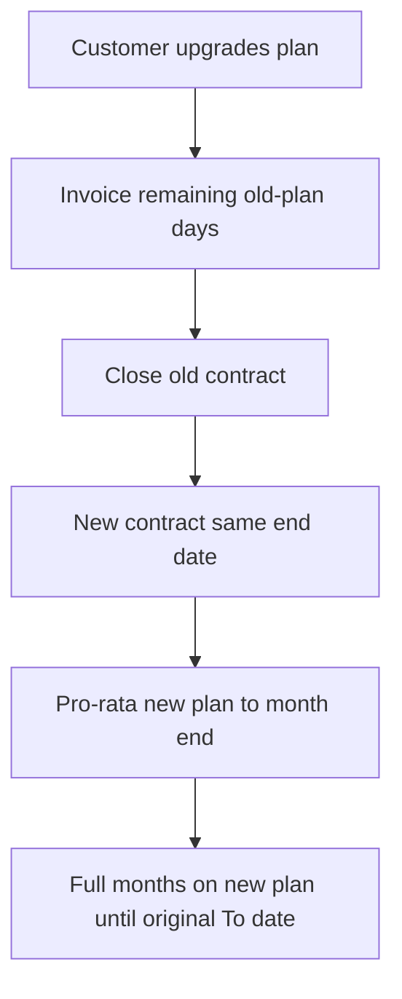

import ArchitectureDiagram from '@site/src/components/ArchitectureDiagram';

# Contract Billing Calculations & Lifecycle

How CMP prices a contract month, handles a mid-month start or upgrade, renews or ends the term, and what you do for an early exit.

---

## 1. Monthly installment

CMP reads the **Yearly** (or matching long-cycle) **rate card** price and **ignores** the **Monthly** column for the installment.

<ArchitectureDiagram
  src="/img/screenshots/cmp-rate-card-edit-vm-package-pricing.png"
  alt="Screenshot: Edit VM Package billing cycle and pricing table used as the Yearly baseline"
/>

```
Contract monthly baseline = Yearly price ÷ 12
Discount amount           = Baseline × (Discount % ÷ 100)
Final monthly charge      = Baseline − Discount amount
```

**Example** (annual contract, 10% discount)

| Input | Value |
|---|---|
| Rate card **Yearly** | $1,000.00 |
| Rate card **Monthly** | $30.00 (**not used** for the contract) |
| **Contract Discount** | 10% |

```
Baseline = 1000 ÷ 12 = 83.333
Discount = 83.333 × 10% = 8.333
Final    = 75.00 per month for 12 months
```

The customer-facing Review & Deploy copy may say “discount on the original **monthly** price”. That monthly figure is this **Yearly ÷ 12** baseline, not the Monthly rate-card cell.

Discounts are taken from **Update Billing Rule** for **that payment mode** (Prepaid / Postpaid / Manual). Same Yearly list price; different % per mode if you configured it that way.

---

## 2. First month (pro-rata)

Review & Deploy states monthly services use:

```
(Monthly installment / Avg days in month) × days remaining in the current month
```

CMP’s usual average month length is **30.5** days (same basis as [pricing formulas](/billing/rate-cards/pricing-formulas)). Use **30.5** in admin examples unless a portal screen shows a different divisor.

**Example** (start 15 January, baseline $83.333 before discount)

```
Daily rate     = 83.333 ÷ 30.5
January charge = daily rate × remaining days in January (inclusive of start day)
```

Later full months bill the **discounted** installment (for example $75.00), until the DATE_TO_DATE **To** date.

---

## 3. Invoicing vs wallet

| Mode | At deploy | Recurring |
|---|---|---|
| **Postpaid / Manual** | No full-term upfront invoice; billed monthly | Monthly invoice (or [OAOI](/billing/one-account-one-invoice) line) for the installment, including first-month pro-rata |
| **Prepaid** | Wallet / infra credits; monthly deduction rather than deducting the full-term cycle price upfront | Monthly deduction of the installment (first period can be pro-rata) |

The **From / To** dates on Review & Deploy are the **contract term** (DATE_TO_DATE). They are not “one invoice covering From–To”.

---

## 4. Mid-term plan upgrades

Upgrade **keeps the original end date**. CMP does **not** restart a new 12-month clock.



1. **Immediate / current-period charge** for the **old** plan up to the upgrade instant.
2. **Old contract** marked closed.
3. **New contract** starts at upgrade time with the **same To date**.
4. **New plan** is pro-rated from upgrade through month end, then full installments.

### Worked example

- Old plan: $120/year → 10% off → **$9.00/month**. Term **1 Jan 2026 – 31 Dec 2026**.
- Upgrade **15 Mar 2026** to $200/year → 10% off → **$15.00/month**.

| Step | When | Period | Plan | Amount |
|---|---|---|---|---|
| Prior months | 1 Feb / 1 Mar | Jan, Feb | Old | $9.00 each |
| Old plan close | 15 Mar | 1–15 Mar | Old | `15 × (9.00 ÷ 30.5) ≈ $4.43` |
| New plan start | Next invoice run | 15–31 Mar | New | `17 × (15.00 ÷ 30.5) ≈ $8.36` |
| Ongoing | From April | Full months | New | **$15.00/month** through original end date |

:::warning[No customer scale-down on contracts]

**Downgrade / scale-down** is for **hourly and pay-as-you-go** services. Do not promise self-service VM size-down on an active contract. If the customer must reduce capacity, treat it as a **commercial exception** (admin process), not a portal Change Plan to a smaller package.

:::

---

## 5. Renewal and cancellation deadline

```
Cancellation deadline timestamp = Contract end date − Cancellation Deadline (Months)
```

The exact clock time is shown on **Review & Deploy** (example: *cancelled before 01:59 20 Nov, 2026*).

| Setup | Window that **stops** auto-renewal |
|---|---|
| 12-month term, deadline **1** | Roughly months 1–10; requests in the last month **do not** stop renewal |
| 12-month term, deadline **4** | Roughly months 1–7; later requests apply only after a renewed term (they do not cancel the current compulsory renewal) |

If the customer **does not** submit **End of billing period** **before** the deadline, CMP **renews for another full term**.

---

## 6. Customer cancellation flow

**Customer path:** instance overview → destroy / trash → **Request To Destroy Service**

<ArchitectureDiagram
  src="/img/screenshots/cmp-contract-request-to-destroy-service.png"
  alt="Screenshot: Request To Destroy Service — Reason, Description, Type End of billing period, Yearly Contract badge"
/>

**Reason**

*Required.* Dropdown (for example **Other**, project completion, cost).

**Description**

*Required.* Free text for the audit trail.

**Type**

*Required.*

| Value | Contract service |
|---|---|
| **End of billing period** | **Allowed.** Service stays up and billed until **To**. No renewal. Then CMP deletes. |
| **Immediate** | **Blocked.** Error: *Immediate cancellation is not allowed for contract service. Please choose End of Billing Period to proceed.* |

After a valid request:

- Confirmation email to the account owner
- Listed as **Scheduled for deletion** under **Billing → Subscriptions**
- Admin can review **Cancellation Requests**
- Monthly installments continue until maturity
- On the end date, CMP tears down the instance and closes the contract

The contract **does not end while the VM still exists**. Deletion (scheduled or admin) is what closes it.

---

## 7. Admin early termination

When the customer must leave **before** the **To** date:

1. Customer contacts you (portal cannot Immediate-destroy).
2. Admin deletes via **admin instance management** or **login as the customer**.
3. Infrastructure is removed; the contract will not renew; further installments stop.

:::important[Penalties are manual]

CMP **does not** compute remaining-term buyout. If your MSA charges an early-termination fee, create a [custom invoice](/billing/invoice-settings/create-custom-invoice).

:::

---

## Lifecycle FAQ

### Does stopping a VM pause contract charges?

**Stoppable service** billing (compute pause while stopped) is for **hourly** stoppable resources. A **contract installment** is a term commitment — do not assume stop = no monthly contract charge. Storage and IPs on the contract continue as configured.

### What appears on One Account One Invoice?

For **postpaid/manual**, the **monthly installment** (rather than the full yearly cycle price) can appear on the consolidated invoice. **Prepaid** is not OAOI. Plain DATE_TO_DATE **without** contracts still does not consolidate — see [OAOI](/billing/one-account-one-invoice).

### Can I change discount % on a running contract?

Treat billing-rule changes as **forward-looking** for **new** deploys. Do not expect a live contract’s locked installment to follow a later discount edit. Change running commercials with a documented admin process.

### Hourly snapshots on a contract VM?

Snapshot/backup/bandwidth/ISO remain **hourly** service types. They are not converted into the VM’s yearly contract installment.

---

## Related

* [Service Contracts Overview](/billing/service-contracts/)
* [Preparing for Contract Billing](/billing/service-contracts/preparing-for-contract-billing)
* [DATE_TO_DATE](/billing/billing-rules/date-to-date)
* [Pricing formulas](/billing/rate-cards/pricing-formulas)
* [VM Downgrade](/orchestrator-features/cloudstack/virtual-machine/vm-downgrade) — pay-as-you-go / hourly, not contracts
* [Custom invoice](/billing/invoice-settings/create-custom-invoice)
* [Account Statement](/billing/customer-billing-dashboard/account-statement/)
