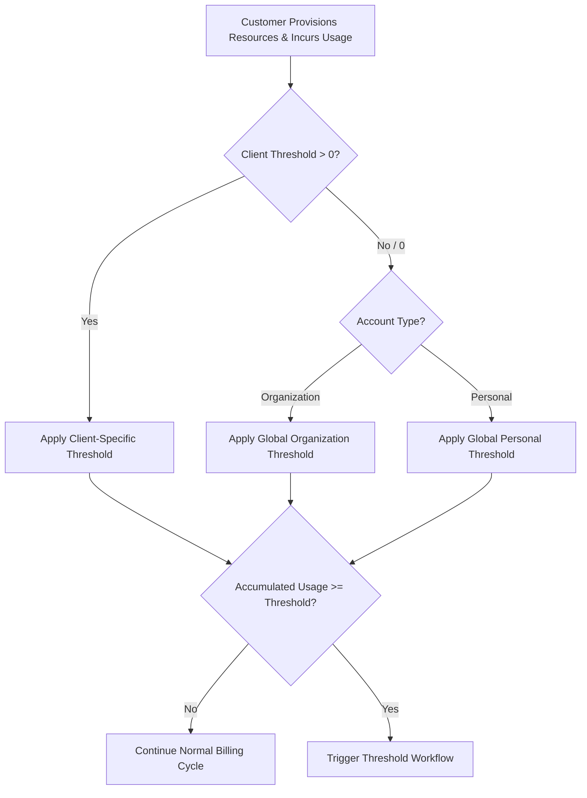
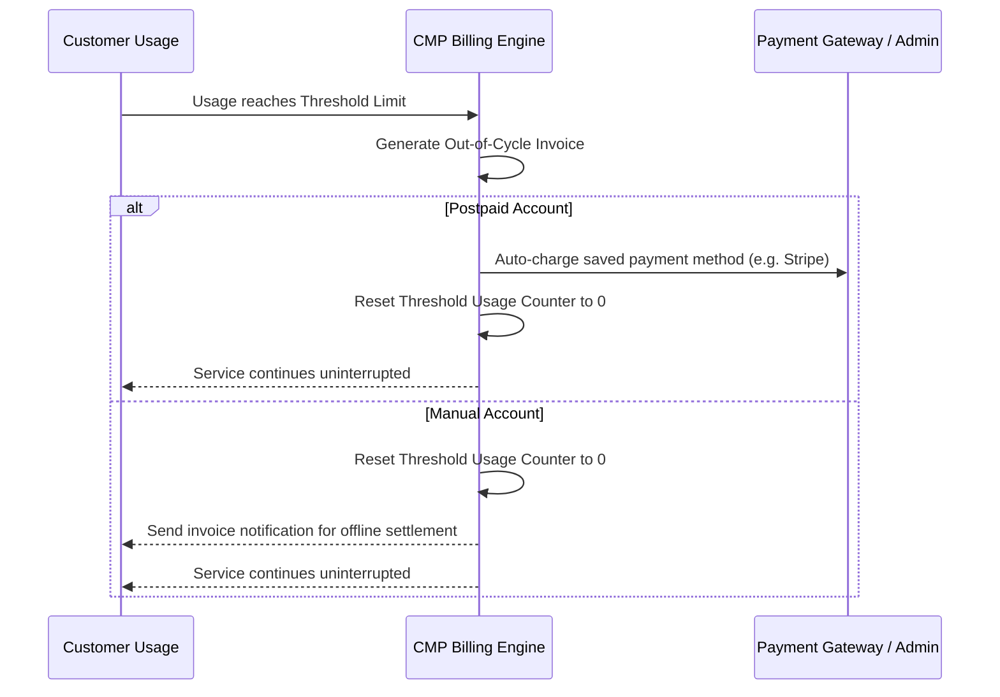

# Threshold (Spending Cap)

A **Threshold (Spending Cap)** is a safety limit that restricts unbilled usage exposure for accounts that consume resources before paying. It protects cloud providers from runaway usage, fraudulent provisioning, and bad debt by enforcing early invoicing or service creation restrictions before the standard billing cycle ends.

Threshold applies to **Postpaid** and **Manual** payment modes.

---

## Why Threshold Matters

In **Postpaid** and **Manual** billing modes, customers are billed in arrears (after resource consumption). Without a threshold:
* An account could run compute-heavy instances or large volumes for an entire month without paying.
* If payment fails at cycle end or the customer abandons the account, the provider absorbs significant financial loss.

By enforcing a threshold, CMP monitors accumulated unbilled charges in real time and takes immediate action as soon as the threshold limit is reached.

---

## Threshold Hierarchy

Thresholds can be defined at two tiers in CMP: **Global Currency Level** and **Client-Specific Override**.

### 1. Global Currency Thresholds

Configured per currency at the platform level. CMP allows providers to establish separate spending caps based on customer account classification:

* **Organization Threshold\*** — Spending cap applied to registered enterprise and business accounts (e.g. `$3,000`). Corporate customers generally require higher compute flexibility to avoid frequent mid-month billing interruptions.
* **Personal Threshold\*** — Spending cap applied to individual personal accounts (e.g. `$995`). Tighter limits are enforced to protect against credit card fraud and inadvertent resource sprawl.

**Admin path:** **Settings → Billing Setup → Currencies → Configure (Step 1 - Edit Currency)**

| Field | Description | Requirement |
|---|---|---|
| **Organization Threshold\*** | Spending cap applied to customer accounts classified as **Organization**. | Mandatory |
| **Personal Threshold\*** | Spending cap applied to customer accounts classified as **Personal**. | Mandatory |

---

### 2. Client-Level Override

Admins can override the global currency threshold for specific clients who need custom spending caps (e.g., VIP enterprise clients needing higher allowances, or high-risk accounts requiring stricter limits).

**Admin path:** **Clients → [Select Customer] → Billing Setup → Threshold**

| Value Entered | Effective Threshold |
|---|---|
| **`0` (Default)** | The client **inherits the global threshold** configured for their currency and account type (Organization or Personal). |
| **`> 0` (Custom Value)** | The entered value **overrides** the global currency threshold specifically for this customer. |

:::info[Onboarding assignment]
Admins can also assign the client-specific threshold during initial customer creation in **Clients → Register Client (Step 2 — Payment Mode & Pricing Settings)**.
:::

---

## System Behaviour on Threshold Breach

When a customer's unbilled usage reaches their defined threshold limit, CMP's response depends on the platform configuration setting **`generate_threshold_invoice`**.

### Configuration Flag: `generate_threshold_invoice`

Providers configure this setting in **Admin Panel → Global Settings** (or verify it via **Billing → Invoices → Billing Settings**).

---

### Scenario A: `generate_threshold_invoice = true` (Default)

When `generate_threshold_invoice` is set to **`true`**, CMP immediately generates an invoice as soon as the threshold limit is reached, regardless of whether the monthly billing cycle has ended.

#### Postpaid Accounts
1. **Invoice Generation**: CMP generates a payable invoice for the accumulated threshold amount.
2. **Automatic Charge**: CMP automatically attempts to charge the customer's saved payment method (e.g., credit card via payment gateway).
3. **Threshold Reset**: The customer's accumulated threshold usage counter **resets to 0**.
4. **Uninterrupted Operations**: Because the invoice is generated and payment is initiated, the customer can continue creating and using cloud services up to the threshold amount again.

#### Manual Accounts
1. **Invoice Generation**: CMP generates a payable invoice for the threshold amount.
2. **Threshold Reset**: The accumulated threshold usage counter **resets to 0**.
3. **Notification & Settlement**: An invoice notification is sent to the customer. Payment is settled offline (bank transfer, cheque, etc.), and an administrator manually marks the invoice as paid upon receipt.
4. **Uninterrupted Operations**: The customer can continue provisioning resources within their renewed threshold limit.

:::note[Multiple Thresholds in a Single Cycle]
If a high-usage customer reaches the threshold multiple times in a month, CMP generates a separate invoice each time and resets the counter each time. Any remaining usage at the end of the month is billed in the standard month-end renewal invoice.
:::

---

### Scenario B: `generate_threshold_invoice = false` (No Mid-Cycle Payable Invoice)

When `generate_threshold_invoice` is set to **`false`**, CMP enforces a spending guardrail without triggering early out-of-cycle payable invoices:

* **Invoice Behaviour (No PAYABLE Invoice)** — When a postpaid hourly customer reaches the threshold, **no PAYABLE threshold invoice is generated**. The customer receives the **“Threshold Limit Reached”** notification email, and usage continues accumulating on the same **USAGE** invoice.
* **Creating a New Service, Resizing, or Changing a Plan** — The platform function `validate_account()` continues to check the threshold. If the **current unpaid usage plus the new service cost exceeds the threshold**, the request is **blocked**.
* **Existing Services Continue Running and Billing** — All currently provisioned instances, volumes, and services continue running and accumulating usage even after the threshold is reached.
* **Renewing Existing Services** — Renewal continues normally and is **not affected** by this setting. The renewal flow does not perform the `validate_account()` threshold check.
* **Disciplinary Actions** — Reaching the threshold under this setting does **not** directly trigger account disciplinary actions ([Freeze](/billing/disciplinary-actions/freeze), [Suspension](/billing/disciplinary-actions/suspend), or [Termination](/billing/disciplinary-actions/terminate)). Disciplinary action can still occur if there are other overdue **PAYABLE** invoices that meet the configured platform conditions.

:::warning[When to use `generate_threshold_invoice = false`]
Use this setting when you prefer standard end-of-cycle invoicing without mid-cycle credit card charges, while ensuring customers cannot deploy additional infrastructure, resize VMs, or upgrade plans beyond their authorized limit.
:::

---

## Threshold Behaviour Comparison

| Feature / Behaviour | `generate_threshold_invoice = true` (Default) | `generate_threshold_invoice = false` |
|---|---|---|
| **Invoice on Threshold Hit** | ✅ **PAYABLE invoice generated immediately** | ❌ **No PAYABLE invoice generated**; usage continues tracking on current USAGE invoice |
| **Postpaid Auto-Charge** | Auto-charges saved payment method immediately | N/A (no payable invoice generated) |
| **Threshold Counter Reset** | Resets counter to `0` upon invoice creation | Does **not** reset; usage continues until month-end cycle invoice |
| **Customer Notifications** | Invoice generated and payment receipt notifications sent | “Threshold Limit Reached” notification email sent |
| **New Service / Resize / Plan Change** | ✅ **Allowed** — counter resets to `0` upon invoice creation | ❌ **Blocked** by `validate_account()` if (unpaid usage + new cost) > threshold |
| **Existing Services** | ✅ Uninterrupted (running & billing normally) | ✅ Uninterrupted (running & billing normally) |
| **Service Renewals** | ✅ Normal renewals (bypasses threshold check) | ✅ Normal renewals (bypasses threshold check) |
| **Disciplinary Action Impact** | Triggers if auto-charge retries exhaust and invoice freezes | No direct impact; only other overdue PAYABLE invoices trigger disciplinary action |
| **Primary Use Case** | Continuous billing & collection for active workloads | Hard budgetary guardrail without mid-cycle payable invoicing |

---

## Threshold vs. Monthly Billing Cycle

Threshold billing works in synergy with periodic billing cycles:

| Trigger | Timing | Purpose |
|---|---|---|
| **Threshold Hit** | Any time unbilled usage reaches the cap | Limits exposure during the active billing period |
| **Cycle Renewal** (e.g. Month End) | 1st of every month (or cycle renewal date) | Invoices any remaining usage accrued since the last threshold reset |

**Example Flow:**
* Customer has a threshold of **$1,000**.
* On **Day 12**, accrued usage reaches **$1,000**:
  * CMP generates Invoice #1 for $1,000.
  * Saved card is charged, and threshold resets to $0.
* On **Day 24**, accrued usage reaches **$1,000** again:
  * CMP generates Invoice #2 for $1,000.
  * Saved card is charged, and threshold resets to $0.
* On **Day 31** (Month End), accrued usage is **$450**:
  * Standard monthly renewal triggers.
  * CMP generates Invoice #3 for $450.
  * Total billed for the month across all invoices: $2,450.

---

## Related

* [Postpaid](/billing/payment-modes/postpaid)
* [Manual](/billing/payment-modes/manual)
* [Billing Settings (admin)](/billing/billing-settings)
* [Low Infra Credit Notifications](/billing/low-infra-credit-notifications)
* [Disciplinary Actions](/billing/disciplinary-actions/)
* [Create Custom Invoice](/billing/invoice-settings/create-custom-invoice)
