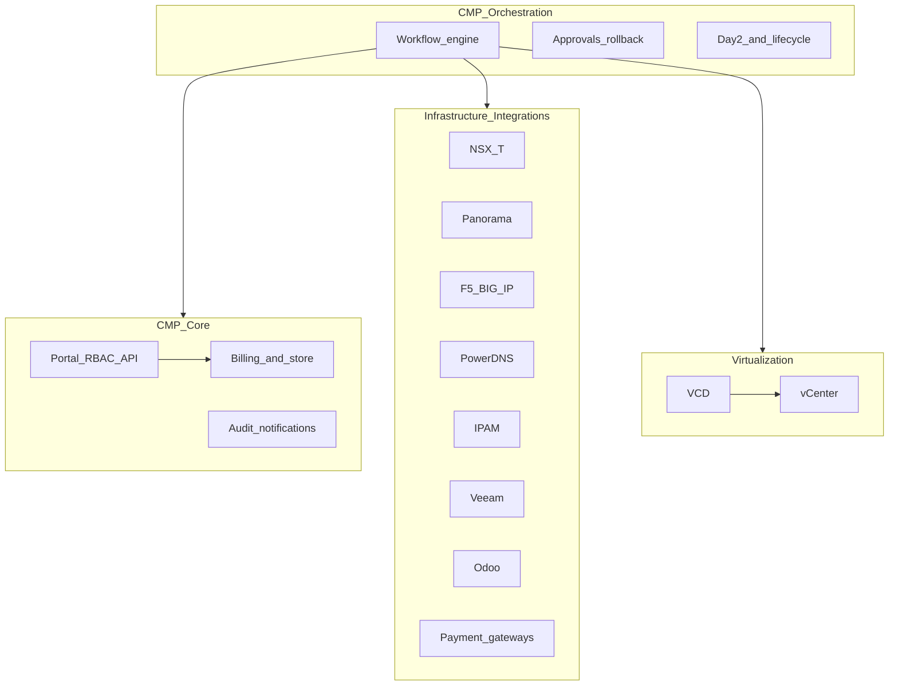
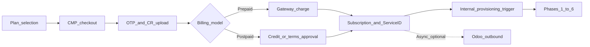
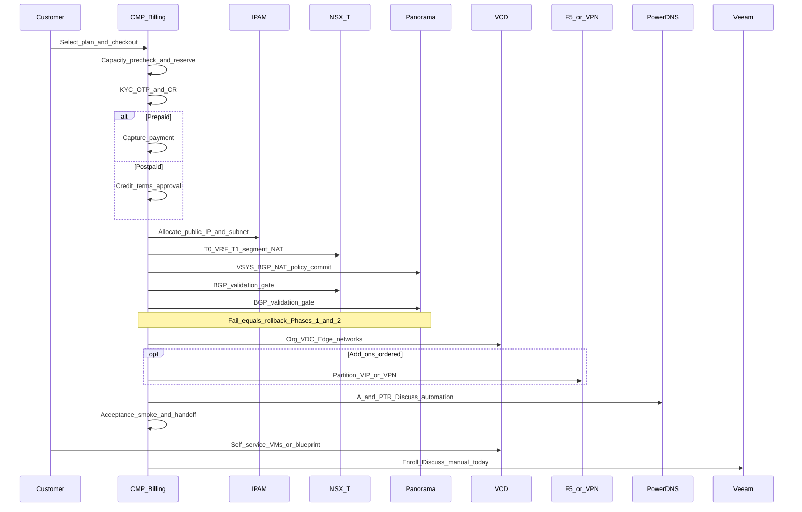
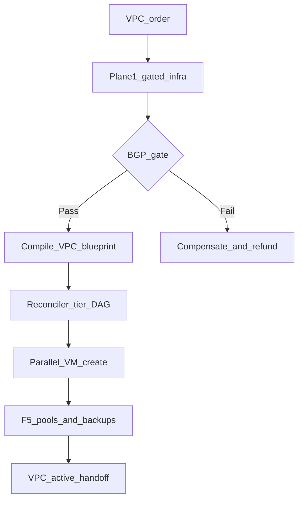

# DataMount — CMP Integration Review

StackConsole / CMP vendor response for the review meeting against **DataMount CMP Integration & Automation Workflow v1.4** (June 2026).

:::warning[Engagement-only — confidential]

This page is for **internal / vendor–client review**. It is not general product documentation.

Source: [DataMount CMP Integration & Automation Workflow v1.4](https://docs.google.com/document/d/1g8ZeU9PLwv55QSidItTy1_TnLZz4gog-kdnjhqYt44A/edit?tab=t.f1ztsrp7lit7)

:::

## Purpose

Align on:

1. Overall architecture (four layers) and the VMware VCD vs vCenter model
2. What CMP **already provides** vs what requires **custom connectors / orchestration**
3. Annotated onboarding and lifecycle workflows (network-first, BGP gate, Day-2)
4. Open items for scoping and SoW

### Status legend

| Label | Meaning |
|---|---|
| **Available** | Supported in CMP today (product or existing connector) |
| **Partial** | Exists with limits, different model, or needs configuration |
| **Custom** | Not out of the box — connector, workflow, or product work required |
| **Discuss** | Decision or clarification needed in this review |

---

## 1. Overall architecture — four layers

| Layer | Systems / responsibilities |
|---|---|
| **Virtualization** | VMware Cloud Director (VCD), VMware vCenter |
| **Infrastructure integrations** | NSX-T, Palo Alto Panorama, F5 BIG-IP, DNS, IPAM, Veeam, Odoo, payment gateways |
| **CMP core services** | Billing, portal, users, RBAC, notifications, API, reporting, audit |
| **CMP orchestration** | Workflow engine, approvals, rollback, multi-system automation, Day-2, DR, reconciliation |

:::info[CMP position]

CMP is the **orchestration brain** and **system of record for billing**. Infrastructure domains are reached through connectors. Automation depth depends on **API availability** and scoped custom work. Where APIs are missing or incomplete, **manual operations** may remain in the path.

Related: [Architecture Overview](/overview/architecture-overview)

:::

---

## 2. VMware stack — VCD vs vCenter

| Capability | VMware Cloud Director (VCD) | VMware vCenter |
|---|---|---|
| Primary purpose | Multi-tenant cloud / self-service | Virtualization infrastructure management |
| Target users | Tenants, cloud provider ops via CMP | Infra / virtualization admins |
| Organizations / Org VDCs | Yes | No |
| Edge Gateway / NSX-T tenant networking | Yes | Infrastructure integration only |
| Catalogs and templates | Shared / private catalogs | VM templates |
| Multi-tenancy / self-service portal | Native | Not native |
| Quota / allocation models | Per Org VDC | Physical resource allocation |
| Billing awareness | Usage data only | No |

:::important[CMP today vs DataMount target]

- CMP currently integrates with **VMware vCenter** APIs for compute lifecycle.
- DataMount’s authoritative flow assumes **VCD** (Org, Org VDC, NSX-T-backed Edge Gateway, catalogs, tenant self-service).
- **Discuss:** deliver **native VCD** connector (recommended for this blueprint) vs extend vCenter-only (does not satisfy Org/VDC/Edge model as written).

:::

### VCD services requested (document §5.5 / capability notes)

| Requested service | VCD native | CMP posture | Remarks |
|---|---|---|---|
| Org VDC create / resize / delete | Yes | **Custom** (VCD connector) | Allocation Pool, Pay-As-You-Go, Reservation Pool |
| Edge Gateway + NSX-T attach | Yes | **Custom** | Bridges VCD to NSX-T T1 from Phase 1 |
| Catalog / OS templates | Yes | **Custom** | Expose via CMP after VCD connector |
| VM lifecycle (deploy, clone, snapshot, resize, console, delete) | Yes | **Partial** | Pattern exists for vCenter; VCD API mapping required |
| VDC networks / segment attach | Yes | **Custom** | Depends on NSX-T segments first |
| Storage policy selection | Yes | **Custom** | Map plan tiers (e.g. SSD vs NVMe) |
| RBAC Tenant Admin / User / Reseller | Partial in VCD | **Partial** | Reseller hierarchy is primarily a **CMP** concern |
| Self-service portal | VCD built-in | **Available** (CMP portal) | Customers use CMP, not raw VCD UI |

---

## 3. Billing and order model

DataMount requires: **CMP owns payment / order approval and triggers provisioning**. Odoo is **outbound-only** for invoices and financial records — never the provisioning trigger.

| Topic | DataMount requirement | CMP posture |
|---|---|---|
| Integrated billing module | Native subscriptions, metering, dashboard | **Available** — [Billing](/billing/overview) |
| Prepaid trigger | Successful charge starts provisioning | **Available** — order approval / payment capture |
| Postpaid trigger | Credit / terms approval starts provisioning; invoice in arrears | **Available** — postpaid / approval patterns |
| Payment gateways | Stripe / PayPal / regional | **Available** — [Payment gateways](/billing/payment-gateways/): Stripe, AsiaPay, HyperPay, Authorize.net, M-Pesa, PayPal, Razorpay, Mollie, Dinger, Cardlink, Paytm, Payduniya |
| Checkout UX | Prefer no external billing system | **Partial** — customers stay in CMP for catalogue and wallet; **redirect to gateway** to complete payment, then auto-return to CMP |
| Invoices | Odoo generates VAT invoices | **Discuss** — CMP generates invoices today; **Odoo integration not yet built** |
| Usage / quota | Real-time usage in portal | **Available** — usage + [quota](/quota/global-quotas) |
| Auto-suspend / reactivate | Billing-driven | **Available** — [Disciplinary actions](/billing/disciplinary-actions/) |

:::note[Order trigger]

Most services can be automated when APIs exist. If a component lacks APIs or automation is not feasible for technical reasons, **manual support** may be required for that step. Provisioning does **not** wait on Odoo.

:::

---

## 4. Master onboarding flow (annotated)

Authoritative DataMount rule: **network-first**. Do not start VCD compute (Phase 4) until the **BGP validation gate** (Phase 3) succeeds. On failure: compensate Phases 1–2, release reservations, alert admin.

### Cross-cutting conventions (v1.2)

Apply to every infrastructure step: **idempotency** (Workflow Instance ID + Service ID), **resource tagging**, **audit emit**.

### Phase summary and CMP posture

| Phase | Name | CMP posture | Notes for review |
|---|---|---|---|
| **0** | Billing, KYC, capacity pre-check, reservation, IPAM allocate, async Odoo | **Partial** | Billing + prepaid/postpaid triggers **Available**. Capacity/ASN/IP **atomic reservation** and IPAM connector **Custom**. KYC OTP + CR upload **Partial / Discuss**. Odoo push **Custom** |
| **1** | NSX-T: T0 VRF, T1, segments, SNAT/DNAT, micro-seg | **Custom** | No production NSX-T orchestration connector in CMP today |
| **2** | Panorama: VSYS, zones, VR, BGP, NAT, policy, commit-and-push | **Custom** | Panorama-only (not direct PAN-OS); commit lock serialization **Custom** |
| **3** | BGP gate (T1→T0, peers Established, routes in PA) + retry/backoff | **Custom** | Hard gate before compute |
| **4** | VCD Org, VDC, Edge, networks, catalog | **Custom** | Depends on VCD connector; vCenter alone insufficient for this blueprint |
| **5** | Optional F5 / IPSec VPN / SSL VPN | **Custom** | Add-on path mid-lifecycle also **Custom** |
| **6** | DNS A/PTR, smoke test, secure handoff, metering, Veeam enroll | **Partial** | Metering / welcome **Available**. DNS: [PowerDNS](/orchestrators/powerdns/) records via API — **no** auto-create tied to VM/IP provision today. Veeam: subscription + dashboard **Available**; VM add/manage for backup **manual**. Smoke-test gate **Custom** |

### VPC two-plane model (document §5.8)

| Plane | Model | CMP posture |
|---|---|---|
| **Plane 1 — Infrastructure** | Imperative Phases 1–4 (network → security → BGP gate → VCD) | **Custom** orchestration |
| **Plane 2 — Workload** | Declarative blueprint, tier DAG, parallel VM fan-out, self-heal, wire F5/Veeam | **Custom** — beyond current CMP VM order flows |

---

## 5. Other integrations matrix

| Integration | Requested features | CMP posture | Remarks |
|---|---|---|---|
| **NSX-T Manager** | T0 VRF, T1, segments, NAT, BGP, route queries, micro-seg | **Custom** | Required before VCD in DataMount sequence |
| **Palo Alto Panorama** | VSYS, DG/templates, zones, VR, BGP, NAT, VPN, commit-and-push | **Custom** | Direct PAN-OS API not acceptable per client |
| **F5 BIG-IP** | Partitions, VS, pools, monitors, SSL, WAF, stats | **Custom** | Per-customer partition isolation required |
| **DNS** | Create/delete A and PTR | **Partial** | PowerDNS integration and record APIs **Available**. **No** automation from VM create / IP allocate into DNS today |
| **IPAM** | Allocate / reserve / release public IPs and private subnets | **Custom** | Infoblox / NetBox (or equivalent) — confirm platform |
| **Veeam** | Enroll, remove, restore, job status | **Partial** | Customers can buy Veeam subscriptions and get dashboard access; **adding VMs and day-to-day backup management is manual** today. Auto enroll on first boot = **Custom** |
| **Odoo ERP** | Outbound orders, usage, credit notes, termination | **Custom** | Required direction: CMP → Odoo only. Not implemented yet |
| **Payment gateway** | Charge, renewals, confirmations | **Available** | See [Payment gateways](/billing/payment-gateways/) |

---

## 6. CMP core platform features

| Capability | Requested | CMP posture |
|---|---|---|
| Billing engine | Subscriptions, recurring, metering, dashboard | **Available** |
| Payment processing | Prepaid / postpaid + gateways | **Available** |
| Customer portal | Self-service + billing + usage | **Available** |
| Users / tenants / RBAC | Customers, orgs, roles | **Available** |
| Reseller hierarchy | Reseller above tenant | **Partial** — discuss depth vs DataMount §9.10 |
| Approval engine | Firewall / WAF change queue | **Custom** for Panorama/F5; CMP has approval patterns elsewhere (e.g. quota) |
| Audit logging | Action, before/after, API codes | **Available** / extend for new connectors |
| Notifications | Welcome, status, alerts | **Available** — [Notifications](/platform-features/notifications) |
| API-first | REST for integrations | **Available** — [APIs](/platform-features/apis) |
| Multi-currency / localization | GCC VAT, languages | **Partial** — billing currencies + [multi-language](/platform-features/multi-language) |
| HA deployment | Active/active or standby | **Available** as topology — [Hosting topology](/installation/hosting-topology) |
| Security | MFA, secrets, PCI scope | **Partial** — [2FA](/auth/2fa); gateway-hosted card fields keep CMP out of full PCI; secrets vault for infra PSKs **Discuss** |

---

## 7. Orchestration and workflow features

This is where **most vendor effort** concentrates. DataMount expects a persistent multi-system orchestration brain.

| Workflow capability | CMP posture | Notes |
|---|---|---|
| Persistent workflow engine / resume | **Custom** | Workflow Instance ID, durable state |
| Idempotency / Service ID keys | **Custom** | Universal convention |
| Rollback / compensation saga | **Custom** | Reverse order + billing refund/credit |
| Capacity pre-check before charge | **Custom** | Compute + ASN + public IP |
| Atomic reservation | **Custom** | Single transaction across pools |
| Multi-system transactions | **Custom** | VCD + NSX + Panorama + F5 + DNS + IPAM + billing |
| Acceptance smoke tests | **Custom** | DNAT / VPN / F5 VIP probes |
| BGP validation gate | **Custom** | Mandatory before Phase 4 |
| Panorama commit serialization | **Custom** | Global commit lock / queue |
| Retry with backoff | **Custom** | Especially BGP window (10 min) |
| Day-2 plan change / add-ons | **Partial** / **Custom** | Billing plan change **Partial**; NSX/Panorama/F5 delta **Custom** |
| Drift reconciliation | **Custom** | Scheduled expected vs actual by tag |
| Offboarding reverse teardown | **Custom** | Document §10 |
| Change-approval firewall/WAF | **Custom** | Admin queue then commit |
| Certificate and PSK rotation | **Custom** | F5 / Panorama |
| Backup and DR orchestration | **Partial** / **Custom** | Veeam restore/DR beyond today’s manual model |
| Suspension and reactivation | **Available** | Billing disciplinary flows |
| Recurring billing loop | **Available** | Meter → invoice → charge; Odoo step **Custom** |
| Secure credential handoff | **Partial** / **Discuss** | Portal access **Available**; one-time secure link + VPN pack **Discuss** |

---

## 8. Lifecycle and exception workflows (document §9)

| Workflow | CMP posture | Short note |
|---|---|---|
| 9.1 Provisioning failure and rollback | **Custom** | Must resolve billing (refund / credit / retry) |
| 9.2 Suspension → dunning → reactivation | **Available** / **Partial** | Soft/hard suspend and pay-to-restore exist; tune to DataMount timelines |
| 9.3 Recurring billing and renewal | **Available** | Odoo sync **Custom** |
| 9.4 Plan upgrade / downgrade | **Partial** | Billing delta **Available**; VDC/NSX/Panorama resize **Custom** |
| 9.5 Day-2 add-on purchase | **Custom** | Re-enter Phase 5 mid-lifecycle |
| 9.6 Backup restore and DR | **Custom** | Beyond manual Veeam today |
| 9.7 Change-approval firewall/WAF | **Custom** | |
| 9.8 Drift reconciliation | **Custom** | |
| 9.9 Certificate and PSK rotation | **Custom** | |
| 9.10 Reseller / sub-tenant | **Partial** | Confirm hierarchy and wholesale billing |

---

## 9. Open discussion items (meeting agenda)

Prioritized for the review:

1. **VCD vs vCenter** — Confirm native **VCD 10.6** connector as Phase 1 target (required for Org/VDC/Edge as written).
2. **NSX-T 4.2 + Panorama + F5** — Scope connectors, API versions, who owns shared T0 / ASN pools / commit queue.
3. **IPAM platform** — Infoblox vs NetBox (or other); atomic reservation design.
4. **Odoo** — Confirm version, REST/XML-RPC, outbound-only events; until then CMP remains invoice SoR.
5. **DNS automation depth** — PowerDNS API exists; decide whether A/PTR create/delete is in automated onboarding/offboarding or stays operational.
6. **Veeam** — Keep subscription + manual VM management vs automate enroll/restore/DR (document §6.6 / §9.6).
7. **Orchestration engine** — Effort for workflow persistence, BGP gate, Panorama serialization, compensation, smoke tests, VPC blueprint plane.
8. **KYC** — Email/SMS OTP + CR upload (gates activation, parallel review) vs later third-party KYC.
9. **Firewall multi-vendor** — Document standardises on Panorama; SoW mentions FortiGate/Barracuda — confirm out of scope.
10. **Timeline** — Reconcile SoW Phase 1 date with v1.4 (June 2026 reference).

---

## 10. Proposed next steps

1. Lock decisions on items **1–4** and **9** from the agenda above.
2. Produce a **per-domain SoW** (discovery → connector → workflow → UAT): VCD, NSX-T, Panorama, F5, IPAM, DNS automation, Veeam automation, Odoo, orchestration engine.
3. Split delivery: **CMP-native billing + portal** (baseline) vs **DataMount multi-system orchestration** (custom phases).
4. Confirm Phase 1 milestone list and acceptance criteria (including BGP gate and network-first rule).
5. Optionally map DataMount open questions Q1–Q19 to a written vendor response annex after this meeting.
