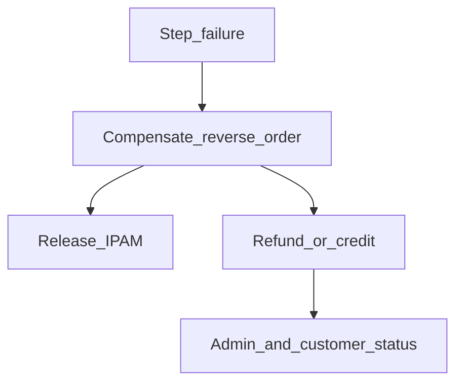

# Day-2 and lifecycle workflows

**CMP posture:** Mixed — suspension/reactivation and recurring billing are largely **Available**; infrastructure deltas (NSX / Panorama / F5 / VCD resize), drift, approvals, and DR are **Custom**.

**Prev:** [Phase 8 — Reconciliation](/engagements/datamount/phase-8-reconciliation) · **Next:** [Offboarding](/engagements/datamount/offboarding)

---

## Document §9 workflows

| # | Workflow | CMP posture | Notes |
|---|---|---|---|
| 9.1 | Provisioning failure and rollback | **Custom** | Compensate infra; refund / credit / retry |
| 9.2 | Suspension → dunning → reactivation | **Available** / **Partial** | Soft/hard suspend and pay-to-restore exist; tune timelines — [Disciplinary actions](/billing/disciplinary-actions/) |
| 9.3 | Recurring billing and renewal | **Available** | Meter → invoice → charge; Odoo sync **Custom** |
| 9.4 | Plan upgrade / downgrade | **Partial** | Billing delta **Available**; VDC / NSX / Panorama resize **Custom** |
| 9.5 | Day-2 add-on purchase | **Custom** | Re-enter [Phase 6 — F5](/engagements/datamount/phase-6-f5) or Phase 4 VPN blocks |
| 9.6 | Backup restore and DR | **Custom** | Beyond manual Veeam today |
| 9.7 | Change-approval firewall / WAF | **Custom** | Admin queue then Panorama/F5 commit |
| 9.8 | Drift reconciliation | **Custom** | [Phase 8 — Reconciliation](/engagements/datamount/phase-8-reconciliation) |
| 9.9 | Certificate and PSK rotation | **Custom** | F5 / Panorama |
| 9.10 | Reseller / sub-tenant | **Partial** | Confirm hierarchy vs CMP reseller model |

---

## Provisioning failure (9.1)

Compensation order (typical): Phase 7 → 6 → 4 → 3 → 2 → Phase 1 IPAM release. Never leave billed Active service without reachable network.

---

## Suspension and reactivation (9.2)

| State | Billing | Infra intent (DataMount) | CMP today |
|---|---|---|---|
| Soft suspend | Warning / restricted portal | May keep VMs; block new orders | **Available** patterns |
| Hard suspend | Non-payment | Power off / isolate as agreed | **Available** / tune |
| Reactivate | Payment received | Restore access and power policy | **Available** |

Infra power-off against VCD/NSX is **Custom** until VCD connector exists.

---

## Plan change (9.4)

1. Customer selects new plan in CMP (**Available**)
2. CMP processes payment delta (**Available**)
3. Orchestration adjusts Org VDC quotas, NSX policy, Panorama if needed (**Custom**)
4. Audit emit + optional Odoo usage/plan event (**Custom**)

---

## Drift, approvals, certs

| Topic | Ideal | CMP posture |
|---|---|---|
| Drift | Scheduled reconcile by Service ID tag; alert or auto-heal | **Custom** — see [Phase 8](/engagements/datamount/phase-8-reconciliation) |
| Firewall / WAF change | Customer request → admin approve → commit-and-push | **Custom** (quota-style approvals exist elsewhere) |
| Cert / PSK rotation | Automated before expiry | **Custom** |

---

## Reseller

Reseller hierarchy and wholesale billing are primarily **CMP** concerns. Depth vs DataMount §9.10 is **Discuss**. See platform reseller docs if present in your build; engagement confirmation still required for DataMount wholesale rules.
