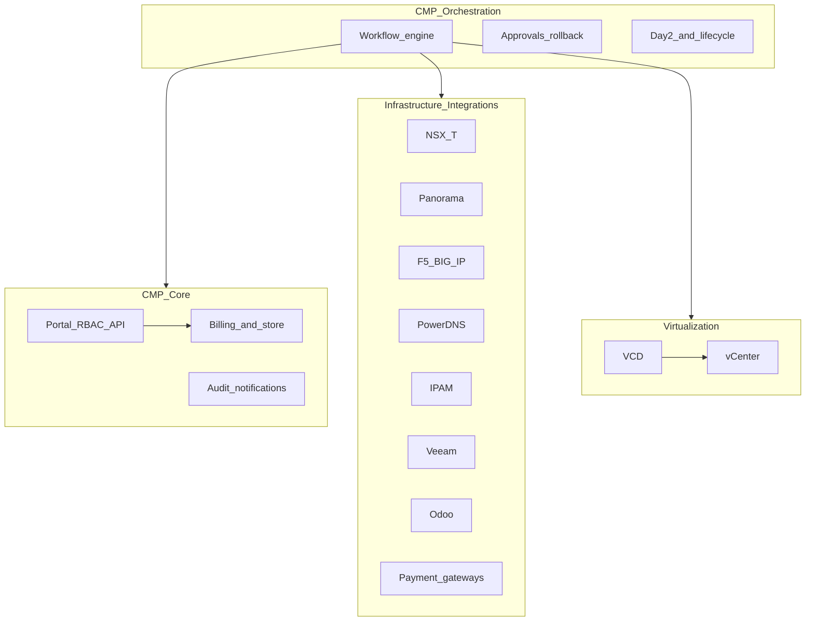
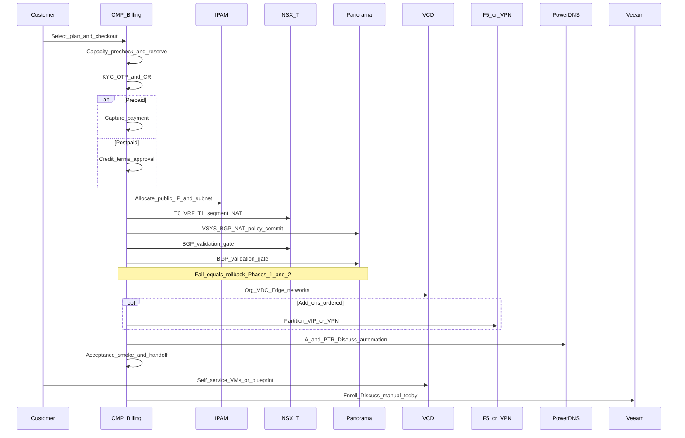
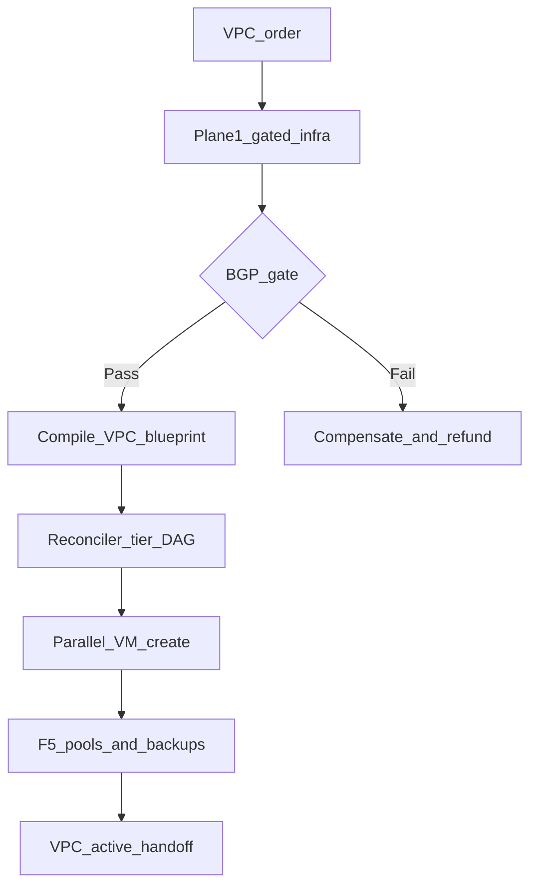

# DataMount — CMP Integration Review

StackConsole / CMP vendor response for the review meeting against **DataMount CMP Integration & Automation Workflow v1.4** (June 2026).

This suite walks the **full path** from customer registration through network-first orchestration to handoff, Day-2, and offboarding. Each workflow page annotates the DataMount ideal with CMP posture today.

:::warning[Engagement-only — confidential]

These pages are for **internal / vendor–client review**. They are not general product documentation.

Source: [DataMount CMP Integration & Automation Workflow v1.4](https://docs.google.com/document/d/1g8ZeU9PLwv55QSidItTy1_TnLZz4gog-kdnjhqYt44A/edit?tab=t.f1ztsrp7lit7)

:::

## Purpose

Align on:

1. Overall architecture (four layers) and the VMware VCD vs vCenter model
2. Treating **VCD as an infrastructure provider** (same abstraction pattern as CloudStack)
3. What CMP **already provides** vs what requires **custom connectors / orchestration**
4. Annotated onboarding and lifecycle workflows (network-first, BGP gate, Day-2)
5. Open items for scoping and SoW

### Status legend

| Label | Meaning |
|---|---|
| **Available** | Supported in CMP today (product or existing connector) |
| **Partial** | Exists with limits, a different model, or needs configuration |
| **Custom** | Not out of the box — connector, workflow, or product work required |
| **Discuss** | Decision or clarification needed in this review |

---

## Workflow map

| Step | Page | CMP posture |
|---|---|---|
| Provider model | [Provider abstraction](/engagements/datamount/provider-abstraction) | **Discuss** / **Custom** (VCD connector) |
| Registration → billing trigger | [Registration and billing](/engagements/datamount/registration-and-billing) | **Partial** (billing Available; KYC/Odoo Discuss) |
| Phase 0 | [Capacity and IPAM](/engagements/datamount/phase-0-capacity-ipam) | **Partial** / **Custom** |
| Phase 1 | [NSX-T](/engagements/datamount/phase-1-nsx-t) | **Custom** |
| Phase 2 | [Panorama](/engagements/datamount/phase-2-panorama) | **Custom** |
| Phase 3 | [BGP gate](/engagements/datamount/phase-3-bgp-gate) | **Custom** |
| Phase 4 | [VCD](/engagements/datamount/phase-4-vcd) | **Custom** |
| Phase 5 | [Add-ons (F5 / VPN)](/engagements/datamount/phase-5-addons) | **Custom** |
| Phase 6 | [Handoff](/engagements/datamount/phase-6-handoff) | **Partial** |
| Day-2 | [Day-2 and lifecycle](/engagements/datamount/day-2-and-lifecycle) | **Partial** / **Custom** |
| Offboarding | [Offboarding](/engagements/datamount/offboarding) | **Custom** |
| Reference | [Integrations matrix](/engagements/datamount/integrations-matrix) · [Discovery questions](/engagements/datamount/discovery-questions) · [Glossary](/engagements/datamount/glossary) | — |

---

## 1. Overall architecture — four layers

| Layer | Systems / responsibilities |
|---|---|
| **Virtualization** | VMware Cloud Director (VCD), VMware vCenter |
| **Infrastructure integrations** | NSX-T, Palo Alto Panorama, F5 BIG-IP, DNS, IPAM, Veeam, Odoo, payment gateways |
| **CMP core services** | Billing, portal, users, RBAC, notifications, API, reporting, audit |
| **CMP orchestration** | Workflow engine, approvals, rollback, multi-system automation, Day-2, DR, reconciliation |

:::info[CMP position]

CMP is the **orchestration brain** and **system of record for billing**. Infrastructure domains are reached through connectors. Automation depth depends on **API availability** and scoped custom work. Where APIs are missing or incomplete, **manual operations** may remain in the path.

Related: [Architecture Overview](/overview/architecture-overview) · [Provider abstraction](/engagements/datamount/provider-abstraction)

:::

---

## 2. VMware stack — VCD vs vCenter

| Capability | VMware Cloud Director (VCD) | VMware vCenter |
|---|---|---|
| Primary purpose | Multi-tenant cloud / self-service | Virtualization infrastructure management |
| Target users | Tenants, cloud provider ops via CMP | Infra / virtualization admins |
| Organizations / Org VDCs | Yes | No |
| Edge Gateway / NSX-T tenant networking | Yes | Infrastructure integration only |
| Catalogs and templates | Shared / private catalogs | VM templates |
| Multi-tenancy / self-service portal | Native | Not native |
| Quota / allocation models | Per Org VDC | Physical resource allocation |
| Billing awareness | Usage data only | No |

:::important[CMP today vs DataMount target]

- CMP currently integrates with **VMware vCenter** APIs for compute lifecycle.
- DataMount’s authoritative flow assumes **VCD** (Org, Org VDC, NSX-T-backed Edge Gateway, catalogs, tenant self-service).
- **Discuss:** deliver **native VCD** connector (recommended for this blueprint) vs extend vCenter-only (does not satisfy Org/VDC/Edge model as written).

:::

See [Provider abstraction](/engagements/datamount/provider-abstraction) for the CloudStack ↔ VCD mapping and [Phase 4 — VCD](/engagements/datamount/phase-4-vcd) for Org/VDC steps.

---

## 3. Master onboarding flow

Authoritative DataMount rule: **network-first**. Do not start VCD compute (Phase 4) until the **BGP validation gate** (Phase 3) succeeds. On failure: compensate Phases 1–2, release reservations, alert admin.

### Cross-cutting conventions (v1.2)

Apply to every infrastructure step: **idempotency** (Workflow Instance ID + Service ID), **resource tagging**, **audit emit**.

### Phase summary

| Phase | Name | CMP posture | Notes |
|---|---|---|---|
| **0** | Billing, KYC, capacity, reservation, IPAM, async Odoo | **Partial** | Billing triggers **Available**. Atomic reservation / IPAM **Custom**. KYC **Partial / Discuss**. Odoo **Custom** |
| **1** | NSX-T: T0 VRF, T1, segments, SNAT/DNAT, micro-seg | **Custom** | No production NSX-T orchestration connector today |
| **2** | Panorama: VSYS, zones, VR, BGP, NAT, policy, commit-and-push | **Custom** | Panorama-only; commit lock **Custom** |
| **3** | BGP gate + retry/backoff | **Custom** | Hard gate before compute |
| **4** | VCD Org, VDC, Edge, networks, catalog | **Custom** | vCenter alone insufficient for this blueprint |
| **5** | Optional F5 / IPSec VPN / SSL VPN | **Custom** | Mid-lifecycle add-ons also **Custom** |
| **6** | DNS, smoke test, handoff, metering, Veeam | **Partial** | Metering / welcome **Available**. DNS APIs **Available**, no auto from VM/IP. Veeam subscription **Available**, VM backup manage **manual**. Smoke gate **Custom** |

### VPC two-plane model (document §5.8)

| Plane | Model | CMP posture |
|---|---|---|
| **Plane 1 — Infrastructure** | Imperative Phases 1–4 (network → security → BGP gate → VCD) | **Custom** orchestration |
| **Plane 2 — Workload** | Declarative blueprint, tier DAG, parallel VM fan-out, self-heal, wire F5/Veeam | **Custom** — beyond current CMP VM order flows |

---

## 4. Known CMP gaps (callouts)

| Area | Today | DataMount ideal |
|---|---|---|
| **Veeam** | Subscription + dashboard **Available**; adding VMs / day-to-day backup **manual** | Auto enroll / restore / DR |
| **DNS** | [PowerDNS](/orchestrators/powerdns/) record APIs **Available**; **no** auto A/PTR from VM create or IP allocate | Automated DNS on provision / offboard |
| **Payment** | [Payment gateways](/billing/payment-gateways/) **Available**; checkout may **redirect** to gateway then return | Prefer in-portal only (Partial) |
| **Odoo** | CMP generates invoices today; Odoo outbound **not built** (**Custom** / **Discuss**) | CMP → Odoo only; never provisioning trigger |
| **Automation** | Depends on API availability; otherwise manual | Full multi-system saga |
| **Compute API** | **vCenter** integration exists | **VCD** Org/VDC/Edge model required |

Full tables: [Integrations matrix](/engagements/datamount/integrations-matrix).

---

## 5. Open discussion items

Prioritized for the review — details and Q1–Q19 style discovery on [Discovery questions](/engagements/datamount/discovery-questions):

1. **VCD vs vCenter** — Confirm native **VCD 10.6** connector as Phase 1 target.
2. **NSX-T 4.2 + Panorama + F5** — Connectors, API versions, T0 / ASN / commit queue ownership.
3. **IPAM platform** — Infoblox vs NetBox (or other); atomic reservation design.
4. **Odoo** — Version, REST/XML-RPC, outbound-only events.
5. **DNS automation depth** — Wire PowerDNS into onboarding/offboarding or keep operational.
6. **Veeam** — Keep subscription + manual VM management vs automate enroll/restore/DR.
7. **Orchestration engine** — Persistence, BGP gate, Panorama serialization, compensation, smoke tests, VPC blueprint plane.
8. **KYC** — OTP + CR upload vs later third-party KYC.
9. **Firewall multi-vendor** — Panorama standard; FortiGate/Barracuda out of scope?
10. **Timeline** — Reconcile SoW Phase 1 date with v1.4 (June 2026 reference).

### Proposed next steps

1. Lock decisions on items **1–4** and **9**.
2. Produce a **per-domain SoW** (discovery → connector → workflow → UAT).
3. Split delivery: **CMP-native billing + portal** (baseline) vs **DataMount multi-system orchestration** (custom phases).
4. Confirm Phase 1 milestone list and acceptance criteria (including BGP gate and network-first rule).
5. Map open questions to a written vendor response annex after the meeting.
