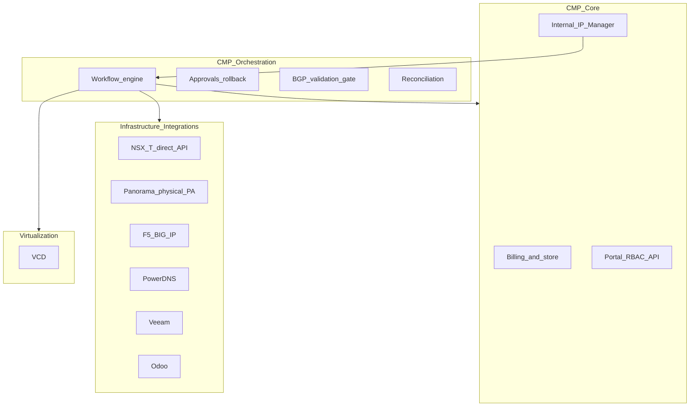
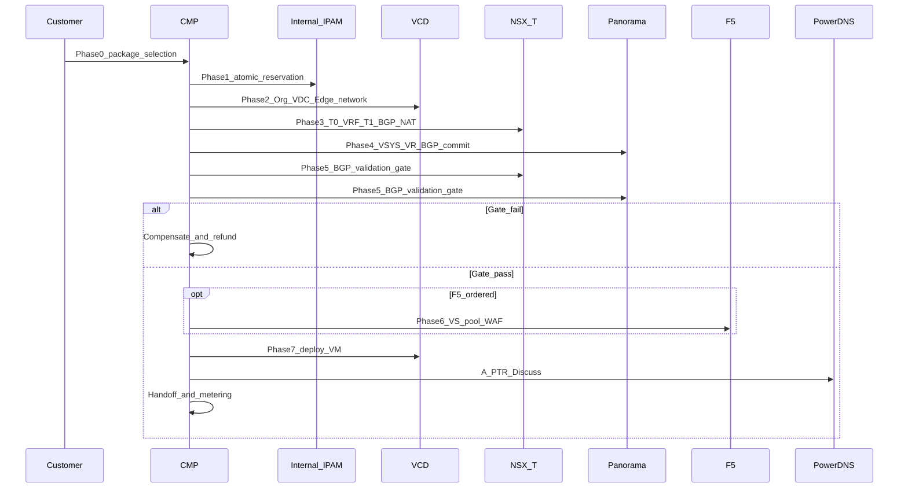

# DataMount — CMP Integration Review

StackConsole / CMP vendor response for the review meeting against **DataMount CMP Integration & Automation Workflow v1.4** (June 2026), updated with the **Final Admin & Customer Workflows** consolidation (VCD + NSX-T + physical Palo Alto via Panorama + F5).

This suite walks the **full path** from customer registration through multi-system orchestration to handoff, Day-2, offboarding, and reconciliation. Each workflow page annotates the DataMount ideal with CMP posture today.

Source: [DataMount CMP Integration & Automation Workflow v1.4](https://docs.google.com/document/d/1g8ZeU9PLwv55QSidItTy1_TnLZz4gog-kdnjhqYt44A/edit?tab=t.f1ztsrp7lit7)

## Purpose

Align on:

1. [Confirmed architecture](/engagements/datamount/architecture) — physical Palo Alto via Panorama, direct NSX-T API, StackConsole IPAM as system of record, mandatory BGP infrastructure
2. [Admin setup](/engagements/datamount/admin-setup) — one-time provider configuration before customer orders
3. Treating **VCD as an infrastructure provider** (same abstraction pattern as CloudStack) — borrow CloudStack **object model and admin UX**, not its single-vendor architecture
4. What CMP **already provides** vs what requires **custom connectors / orchestration**
5. Annotated customer provisioning phases (IPAM → VCD → NSX-T → Panorama → BGP gate → F5 → compute)
6. Open items for scoping and SoW — see [Milestones and timeline](/engagements/datamount/milestones-and-timeline)

### Status legend

| Label | Meaning |
|---|---|
| **Available** | Supported in CMP today (product or existing connector) |
| **Partial** | Exists with limits, a different model, or needs configuration |
| **Custom** | Not out of the box — connector, workflow, or product work required |
| **Discuss** | Decision or clarification needed in this review |

---

## Workflow map

| Step | Page | CMP posture |
|---|---|---|
| Architecture | [Confirmed architecture](/engagements/datamount/architecture) | **Discuss** |
| Admin setup | [Admin setup (one-time)](/engagements/datamount/admin-setup) | **Custom** |
| UX reference | [CloudStack reference patterns](/engagements/datamount/cloudstack-reference-patterns) | **Discuss** (borrow object model / UX) |
| Provider model | [Provider abstraction](/engagements/datamount/provider-abstraction) | **Discuss** / **Custom** (VCD connector) |
| Registration → billing trigger | [Registration and billing](/engagements/datamount/registration-and-billing) | **Partial** |
| Phase 0 | [Customer order (portal)](/engagements/datamount/phase-0-customer-order) | **Available** / **Custom** mapping |
| Phase 1 | [IPAM reservation](/engagements/datamount/phase-1-ipam-reservation) | **Custom** |
| Phase 2 | [VCD Org / VDC / Edge](/engagements/datamount/phase-2-vcd) | **Custom** |
| Phase 3 | [NSX-T (direct API)](/engagements/datamount/phase-3-nsx-t) | **Custom** |
| Phase 4 | [Panorama (physical PA)](/engagements/datamount/phase-4-panorama) | **Custom** |
| Phase 5 | [BGP validation gate](/engagements/datamount/phase-5-bgp-gate) | **Custom** |
| Phase 6 | [F5 LB / WAF](/engagements/datamount/phase-6-f5) | **Custom** |
| Phase 7 | [Compute and handoff](/engagements/datamount/phase-7-compute) | **Custom** / **Partial** |
| Phase 8 | [Reconciliation](/engagements/datamount/phase-8-reconciliation) | **Custom** |
| Day-2 | [Day-2 and lifecycle](/engagements/datamount/day-2-and-lifecycle) | **Partial** / **Custom** |
| Offboarding | [Offboarding](/engagements/datamount/offboarding) | **Custom** |
| Delivery | [Milestones and timeline](/engagements/datamount/milestones-and-timeline) — **12-week** full CMP journey (parallel teams) |
| Reference | [Integrations matrix](/engagements/datamount/integrations-matrix) · [Discovery questions](/engagements/datamount/discovery-questions) · [Glossary](/engagements/datamount/glossary) | — |

---

## 1. Overall architecture — four layers

| Layer | Systems / responsibilities |
|---|---|
| **Virtualization** | VMware Cloud Director (VCD), VMware vCenter |
| **Infrastructure integrations** | NSX-T (direct API), Palo Alto Panorama, F5 BIG-IP, DNS, StackConsole IPAM, Veeam, Odoo, payment gateways |
| **CMP core services** | Billing, portal, users, RBAC, notifications, API, reporting, audit |
| **CMP orchestration** | Workflow engine, approvals, rollback, multi-system automation, BGP gate, Day-2, DR, reconciliation |

:::info[CMP position]

CMP is the **orchestration brain**, **billing system of record**, and **IPAM system of record**. VCD, NSX-T, and Palo Alto implement CMP allocation decisions — they do not independently allocate customer IPs or ASNs. See [Confirmed architecture](/engagements/datamount/architecture).

:::

---

## 2. VMware stack — VCD vs vCenter

| Capability | VMware Cloud Director (VCD) | VMware vCenter |
|---|---|---|
| Primary purpose | Multi-tenant cloud / self-service | Virtualization infrastructure management |
| Organizations / Org VDCs | Yes | No |
| Edge Gateway / NSX-T tenant networking | Yes | Infrastructure integration only |
| Catalogs and templates | Shared / private catalogs | VM templates |
| Multi-tenancy / self-service portal | Native | Not native |

:::important[CMP today vs DataMount target]

- CMP currently integrates with **VMware vCenter** APIs for compute lifecycle.
- DataMount's authoritative flow assumes **VCD** (Org, Org VDC, NSX-T-backed Edge Gateway, catalogs).
- CMP also requires **direct NSX-T Manager API** for T0 VRF, BGP, and route validation.
- **Discuss:** deliver **native VCD** connector (recommended for this blueprint).

:::

See [Provider abstraction](/engagements/datamount/provider-abstraction) and [Phase 2 — VCD](/engagements/datamount/phase-2-vcd).

---

## 3. Master onboarding flow

Authoritative rule: **BGP validation gate (Phase 5) must pass before VM compute (Phase 7).** VCD Org/VDC/Edge framework (Phase 2) and NSX-T/Panorama (Phases 3–4) are provisioned first; compute waits for routing health.

### Cross-cutting conventions

Apply to every infrastructure step: **idempotency** (Workflow Instance ID + Service ID), **resource tagging**, **audit emit**, and **request → task → poll → validate → continue** for async APIs.

### Phase summary

| Phase | Name | CMP posture | Notes |
|---|---|---|---|
| **0** | Customer package selection (portal) | **Available** / **Custom** | Customer never sees VRF/ASN/BGP internals |
| **1** | Atomic IPAM reservation | **Custom** | Public IP + private subnet + ASN pair in one transaction |
| **2** | VCD Org, VDC, Edge, networks | **Custom** | IP Space implements CMP allocations |
| **3** | NSX-T T0 VRF, T1, BGP, NAT | **Custom** | Direct NSX-T API — mandatory BGP infrastructure |
| **4** | Panorama VSYS, VR, BGP, NAT, policy | **Custom** | Physical PA; REST + XML; commit serialization |
| **5** | BGP validation gate | **Custom** | Hard gate before compute |
| **6** | F5 LB / WAF (optional) | **Custom** | After BGP gate; architecture questions open |
| **7** | VM deploy + handoff | **Custom** / **Partial** | Only after Phase 5 pass |
| **8** | Reconciliation | **Custom** | Ongoing drift detection |

### VPC two-plane model (document §5.8)

| Plane | Model | CMP posture |
|---|---|---|
| **Plane 1 — Infrastructure** | Imperative Phases 1–5 (IPAM → VCD → NSX-T → Panorama → BGP gate) | **Custom** orchestration |
| **Plane 2 — Workload** | Declarative blueprint, tier DAG, parallel VM fan-out, self-heal, wire F5/Veeam | **Custom** — beyond current CMP VM order flows |

---

## 4. Known CMP gaps (callouts)

| Area | Today | DataMount ideal |
|---|---|---|
| **IPAM** | No full module | StackConsole Internal IP Manager with atomic reservation; UX modeled on [CloudStack reference patterns](/engagements/datamount/cloudstack-reference-patterns) |
| **NSX-T** | No connector | Direct API for T0 VRF, BGP, route queries |
| **Panorama** | No connector | REST + XML; physical PA; commit queue |
| **Veeam** | Subscription + dashboard; VM backup **manual** | Auto enroll / restore / DR |
| **DNS** | PowerDNS APIs **Available**; no auto A/PTR from VM/IP | Automated DNS on provision / offboard |
| **Odoo** | Outbound **not built** | CMP → Odoo only; never provisioning trigger |
| **Compute API** | **vCenter** integration exists | **VCD** Org/VDC/Edge model required |

Full tables: [Integrations matrix](/engagements/datamount/integrations-matrix).

---

## 5. Open discussion items

Prioritized for the review — details on [Discovery questions](/engagements/datamount/discovery-questions):

1. **F5 architecture** — physical vs VE, tenancy model, placement vs Palo Alto, BGP gate participation.
2. **StackConsole IPAM capability gap** — public pool, private subnet, atomic reservation, release/reuse; object model per [CloudStack reference patterns](/engagements/datamount/cloudstack-reference-patterns).
3. **Palo Alto commit/push failure handling** — compensating actions on partial push failure.
4. **Customer self-service zone creation** — boundaries within VSYS.
5. **VCD vs vCenter** — Confirm native **VCD 10.6** connector.
6. **Odoo** — Version, REST/XML-RPC, outbound-only events.
7. **DNS automation depth** — Wire PowerDNS into onboarding/offboarding or keep operational.
8. **Veeam** — Keep subscription + manual VM management vs automate enroll/restore/DR.
9. **Orchestration engine** — Persistence, BGP gate, Panorama serialization, compensation, smoke tests, VPC blueprint plane.
10. **Development phasing** — Reconcile delivery phases against this workflow so nothing blocks out of order.

### Proposed next steps

1. Lock decisions on **F5 architecture** and **IPAM capability gap** (items 1–2).
2. Produce a **per-domain SoW** (discovery → connector → workflow → UAT).
3. Split delivery: **CMP-native billing + portal** (baseline) vs **DataMount multi-system orchestration** (custom phases).
4. Confirm acceptance criteria including BGP gate and reconciliation — [Milestones and timeline](/engagements/datamount/milestones-and-timeline).
5. Map open questions to a written vendor response annex after the meeting.
