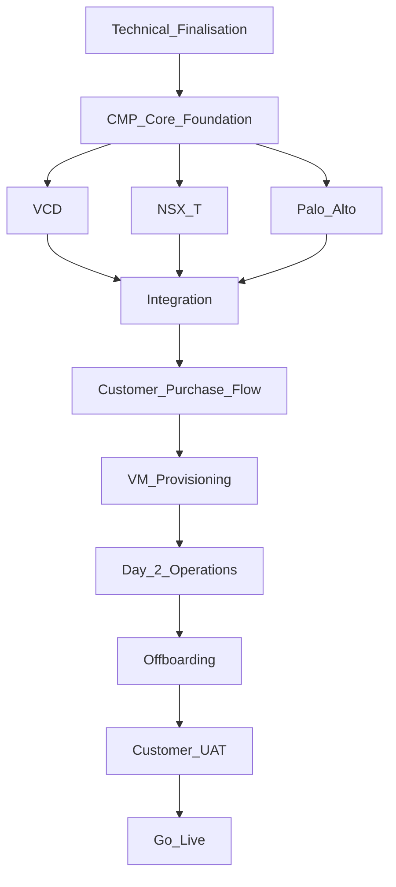

# DataMount — 12-week project plan

<div class="no-print">

**Hub:** [DataMount Integration Review](/engagements/datamount/) · **Prev:** [Offboarding](/engagements/datamount/offboarding)

</div>

Management roadmap for the **complete CMP journey** — not only VCD / NSX-T / Palo Alto integration, but admin setup through Go-Live. With multiple teams, workstreams run **in parallel** wherever dependencies allow.

<div class="no-print">

Workflow reference: [Confirmed architecture](/engagements/datamount/architecture) · [Admin setup](/engagements/datamount/admin-setup) · [Customer phases](/engagements/datamount/phase-0-customer-order) · [CloudStack UX patterns](/engagements/datamount/cloudstack-reference-patterns)

</div>

---

## Assumptions

State these when submitting — timelines shift if they do not hold:

| # | Assumption |
|---|---|
| 1 | **~12 weeks elapsed** calendar time with multiple teams working in parallel (not sequential single-team delivery) |
| 2 | Durations are **elapsed weeks**, not total effort-hours — actual calendar depends on team size and availability |
| 3 | **F5** and **Backup/DR** timelines are contingent on architecture and API confirmation — treat as provisional until M0 closes |
| 4 | **Weeks 1–7:** parallel development · **Weeks 8–10:** integration + E2E + stabilisation · **Week 11:** customer UAT · **Week 12:** production readiness + Go-Live |

---

## 1. Scope covered

The 12-week plan includes:

| Area | In scope |
|---|---|
| Architecture | Technical architecture and API finalisation |
| Admin | CMP admin configuration, IPAM, ASN, rate cards |
| Integrations | VCD, NSX-T (direct API), Palo Alto Panorama, F5 BIG-IP |
| Customer | Registration, KYC, product purchase, provisioning |
| Compute | VCD/VDC framework, VM provisioning, VM lifecycle |
| Day-2 | Resize, snapshot, clone, network/IP ops, console, backup hooks |
| Security | Panorama VSYS/VR, BGP, policies, VPN |
| Orchestration | End-to-end workflow, rollback, reconciliation |
| Lifecycle | Offboarding, failure handling |
| Delivery | E2E testing, customer UAT, production readiness, Go-Live |

Backup/DR scope is included **where APIs and architecture are confirmed** (see [M10](#m10--f5--backup--dr-weeks-49)).

---

## 2. High-level 12-week roadmap

| Milestone | Workstream | Timeline | Workflow docs |
|---|---|---|---|
| **M0** | Technical finalisation & environment readiness | Week 1 | [Architecture](/engagements/datamount/architecture), [Discovery questions](/engagements/datamount/discovery-questions) |
| **M1** | CMP core / orchestration foundation | Weeks 1–3 | [Integrations matrix](/engagements/datamount/integrations-matrix) |
| **M2** | IPAM & ASN management | Weeks 1–3 | [Admin §2.2](/engagements/datamount/admin-setup), [Phase 1](/engagements/datamount/phase-1-ipam-reservation) |
| **M3** | VMware Cloud Director | Weeks 1–6 | [Phase 2](/engagements/datamount/phase-2-vcd), [Phase 7](/engagements/datamount/phase-7-compute) |
| **M4** | NSX-T integration | Weeks 1–7 | [Phase 3](/engagements/datamount/phase-3-nsx-t), [Admin §2.5](/engagements/datamount/admin-setup) |
| **M5** | Palo Alto / Panorama | Weeks 1–7 | [Phase 4](/engagements/datamount/phase-4-panorama), [Admin §2.4](/engagements/datamount/admin-setup) |
| **M6** | Rate cards & service packages | Weeks 4–7 | [Admin §2.6](/engagements/datamount/admin-setup), [Phase 0](/engagements/datamount/phase-0-customer-order) |
| **M7** | Registration & KYC | Weeks 1–4 | [Registration and billing](/engagements/datamount/registration-and-billing) |
| **M8** | Customer purchase & provisioning | Weeks 6–9 | Phases [0](/engagements/datamount/phase-0-customer-order)–[7](/engagements/datamount/phase-7-compute) |
| **M9** | VM lifecycle & Day-2 operations | Weeks 3–9 | [Day-2 and lifecycle](/engagements/datamount/day-2-and-lifecycle) |
| **M10** | F5 + Backup / DR * | Weeks 4–9 | [Phase 6 — F5](/engagements/datamount/phase-6-f5) |
| **M11** | Offboarding & reconciliation | Weeks 9–10 | [Offboarding](/engagements/datamount/offboarding), [Phase 8](/engagements/datamount/phase-8-reconciliation) |
| **M12** | End-to-end integration testing | Weeks 8–10 | QA against full workflow |
| **M13** | Customer UAT | Week 11 | Customer sign-off scenarios |
| **M14** | Production readiness & Go-Live | Week 12 | Runbooks, training, deploy |

\* F5 and Backup/DR dependent on architecture, API access, and technical confirmation.

---

## 3. Twelve-week view (parallel workstreams)

| Workstream | W1 | W2 | W3 | W4 | W5 | W6 | W7 | W8 | W9 | W10 | W11 | W12 |
|---|---|---|---|---|---|---|---|---|---|---|---|---|
| Technical finalisation (M0) | ■ | | | | | | | | | | | |
| CMP core / orchestration (M1) | ■ | ■ | ■ | | | | | | | | | |
| IPAM / ASN (M2) | ■ | ■ | ■ | | | | | | | | | |
| VCD (M3) | ■ | ■ | ■ | ■ | ■ | ■ | | | | | | |
| NSX-T (M4) | ■ | ■ | ■ | ■ | ■ | ■ | ■ | | | | | |
| Palo Alto (M5) | ■ | ■ | ■ | ■ | ■ | ■ | ■ | | | | | |
| Rate cards (M6) | | | | ■ | ■ | ■ | ■ | | | | | |
| Registration / KYC (M7) | ■ | ■ | ■ | ■ | | | | | | | | |
| Customer purchase (M8) | | | | | | ■ | ■ | ■ | ■ | | | |
| VM / Day-2 (M9) | | ■ | ■ | ■ | ■ | ■ | ■ | ■ | ■ | | | |
| F5 (M10) | | | | ■ | ■ | ■ | ■ | ■ | ■ | | | |
| Backup / DR (M10) | | | | ■ | ■ | ■ | ■ | ■ | ■ | | | |
| Offboarding (M11) | | | | | | | | | ■ | ■ | | |
| E2E testing (M12) | | | | | | | | ■ | ■ | ■ | | |
| UAT (M13) | | | | | | | | | | | ■ | |
| Production / Go-Live (M14) | | | | | | | | | | | | ■ |

---

## 4. Critical path

With parallel teams, the critical path is shorter than summing every workstream:



**Runs in parallel** (not on critical path): IPAM/ASN, rate cards, registration/KYC, F5, backup/DR, QA automation, documentation.

**Target cadence:**

| Period | Focus |
|---|---|
| Weeks 1–7 | Parallel development across integration teams |
| Weeks 8–10 | Integration, E2E, stabilisation |
| Week 11 | Customer UAT |
| Week 12 | Production readiness + Go-Live |

---

## Milestone detail

### M0 — Technical finalisation & environment readiness

**Week 1** — Freeze the technical contract before teams diverge.

| ID | Task |
|---|---|
| M0.1 | Finalise customer onboarding workflow |
| M0.2 | Finalise customer provisioning workflow ([phases 0–7](/engagements/datamount/phase-0-customer-order)) |
| M0.3 | Finalise VCD → NSX-T architecture |
| M0.4 | Finalise NSX-T → Palo Alto BGP architecture |
| M0.5 | Confirm Palo Alto VSYS architecture |
| M0.6 | Confirm Virtual Router model |
| M0.7 | Confirm IPAM allocation model ([Admin §2.2](/engagements/datamount/admin-setup)) |
| M0.8 | Confirm ASN allocation model |
| M0.9 | Confirm [F5 architecture](/engagements/datamount/architecture#f5--open-architecture-questions) |
| M0.10 | Confirm Backup/DR architecture |
| M0.11 | Finalise API list |
| M0.12 | Obtain API credentials |
| M0.13 | Confirm Dev/UAT environments |
| M0.14 | Finalise technical acceptance criteria |

**Output:** All teams can start development without blocking on another team.

---

### M1 — CMP core / orchestration foundation

**Weeks 1–3** — Common foundation for all integration teams.

| Area | Scope |
|---|---|
| API framework | Common authentication, API client, timeout, retry |
| Workflow engine | Multi-step provisioning workflow |
| State management | Track each provisioning step |
| Async operations | Poll VCD / NSX-T / Panorama tasks |
| Error handling | Standard error handling |
| Retry | Retry failed API calls |
| Rollback | Reverse completed operations |
| Dependency management | Prevent invalid execution order |
| Audit | Record API actions and results |
| Logs | Workflow execution logs |
| Notifications | Success/failure status |
| Reconciliation | CMP vs infrastructure state ([Phase 8](/engagements/datamount/phase-8-reconciliation)) |

**Provisioning flow:**

```
Order → IPAM → VCD → NSX-T → Palo Alto → BGP Validation → VM
```

**Rollback example:**

```
Palo Alto failure → Rollback NSX-T → Rollback VCD → Release IPAM → Order = Failed
```

---

### M2 — IPAM & ASN management

**Weeks 1–3** — Internal IPAM foundation ([CloudStack reference patterns](/engagements/datamount/cloudstack-reference-patterns)).

**IP management**

| Scope |
|---|
| Public IP pools · Private IP pools · CIDR hierarchy · Subnet allocation |
| Fragmentation management · IP reservation · IP release · Tenant allocation |
| IP utilization · [VRF-scoped overlap validation](/engagements/datamount/admin-setup#23-vrf-aware-overlap-validation) |

**ASN management**

| Scope |
|---|
| ASN pool · ASN pair allocation · ASN reservation · ASN release · Tenant mapping |

**Atomic reservation** ([Phase 1](/engagements/datamount/phase-1-ipam-reservation)):

```
Public IP + Private Subnet + ASN Pair  →  all succeed or all roll back
```

---

### M3 — VMware Cloud Director

**Weeks 1–6** — Starts immediately while NSX-T and Palo Alto teams work in parallel.

| Area | Scope |
|---|---|
| API integration | OAuth, authentication, token management, connector, error handling, async tasks |
| Organization / VDC | Org create/update/delete, VDC create, resource allocation, quotas, VDC delete |
| Networking | Edge Gateway, VDC network, network attachment, IP Space, public IP, network delete |
| Catalog | Catalog, templates, OS images, customer templates |

Maps to [Phase 2 — VCD](/engagements/datamount/phase-2-vcd).

---

### M4 — NSX-T

**Weeks 1–7**

| Area | Scope |
|---|---|
| Provider infrastructure | T0 discovery, T0 uplink, VRF creation/configuration, ASN allocation |
| Customer networking | T1 Gateway, T1 config, segments, gateway association, subnet mapping |
| BGP | BGP config, peers, ASN, route advertisement, route policies, BGP state |
| Validation | Route table, prefix validation, BGP Established, route propagation |
| NAT / networking | NAT where required, network mapping, public/private connectivity |

Maps to [Phase 3 — NSX-T](/engagements/datamount/phase-3-nsx-t) and [Phase 5 — BGP gate](/engagements/datamount/phase-5-bgp-gate).

---

### M5 — Palo Alto / Panorama

**Weeks 1–7**

| Area | Scope |
|---|---|
| Panorama | REST + XML API, authentication, commit, push, commit validation, failure handling |
| VSYS | Discovery, create/assign, Internet VSYS, default profiles, enterprise profiles, service tiers |
| Virtual Router | Separate from VSYS — discovery, create, interface association, static routes, BGP peers, route policies |
| Security | Zones, address objects, NAT, security policies, IPS, threat prevention, URL filtering, AV, app control |
| VPN | IPSec VPN, tunnels, VPN users where applicable |

Maps to [Phase 4 — Panorama](/engagements/datamount/phase-4-panorama) and [Admin §2.4](/engagements/datamount/admin-setup).

---

### M6 — Rate cards & service packages

**Weeks 4–7** — Start before infrastructure integrations are fully complete.

Rate cards should be driven by **resource parameters**, not hardcoded to a single infrastructure product.

| Package layer | Example parameters |
|---|---|
| **VSYS package** | Dedicated VSYS, bandwidth, firewall throughput, public IPs, IPSec tunnels, VPN users, security policies, IPS/TP/URL/AV, concurrent sessions, monitoring |
| **Virtual Router package** | Shared/dedicated, BGP, BGP peers, static routes, route policies, bandwidth |
| **IPAM parameters** | Public IP block, private subnet, CIDR size, ASN, ASN pair |
| **VM parameters** | vCPU, memory, storage, storage policy, VM quantity, backup, OS/template |

Maps to [Admin §2.6](/engagements/datamount/admin-setup) and [Phase 0 — Customer order](/engagements/datamount/phase-0-customer-order).

---

### M7 — Registration & KYC

**Weeks 1–4** — Fully independent of infrastructure integrations.

| Registration | KYC |
|---|---|
| Self-registration | Document upload |
| Company information | Verification queue |
| Domain | Admin review — approve / reject |
| Email verification | Notification |
| Account creation | |

**Admin-assisted path:**

```
CMP Admin → Create Customer → Configure Customer → Assign Package → Provision
```

Maps to [Registration and billing](/engagements/datamount/registration-and-billing).

---

### M8 — Customer purchase & provisioning

**Weeks 6–9** — Connects all previously developed components.

**Purchase flow:**

```
Customer → Select Product → Select Package → Select Resources → Calculate Price → Confirm Order
```

**Reservation:**

```
IPAM: Public IP + Private Subnet + ASN Pair
```

**Provisioning:**

```
VCD → NSX-T → Palo Alto → BGP Validation → VM
```

Each workflow step carries state: **Pending · In Progress · Completed · Failed · Rolled Back**

---

### M9 — VM lifecycle & Day-2 operations

**Weeks 3–9** — Explicit scope; not a small subset of VCD.

| Area | Scope |
|---|---|
| VM provisioning | Deploy VM, template/OS, CPU, memory, storage, network, assign IP |
| VM lifecycle | Start, stop, shutdown, restart, delete |
| Resize | CPU, memory, storage |
| Storage | Add disk, extend disk, remove disk, change storage policy |
| Network | Attach/detach/change network, assign/release IP |
| VM operations | Snapshot, restore, delete snapshot, clone, console, metadata/tags |
| Backup | Enable backup, policy, status, restore, delete config (where in scope) |
| Monitoring | VM status, utilization, task status, provisioning status |

Maps to [Phase 7 — Compute](/engagements/datamount/phase-7-compute) and [Day-2 and lifecycle](/engagements/datamount/day-2-and-lifecycle).

---

### M10 — F5 + Backup / DR

**Weeks 4–9** * — Parallel tracks; not blockers for basic VCD/NSX/Palo Alto development.

**F5**

| Scope |
|---|
| API authentication (iControl REST) · Tenant/partition · Virtual Server · Pool · Pool Member |
| Health Monitor · SSL profile · WAF policy · Validation · Delete |

**Backup / DR** *(scope frozen after Veeam/VCD API confirmation)*

| Scope |
|---|
| Backup policy · VM backup enablement · Status · Schedule · Restore |
| DR configuration · DR status · Failover/failback if included · Resource cleanup |

Maps to [Phase 6 — F5](/engagements/datamount/phase-6-f5). Backup posture: [Integrations matrix — Veeam](/engagements/datamount/integrations-matrix).

---

### M11 — Offboarding & reconciliation

**Weeks 9–10** — Deletion designed as carefully as provisioning.

```
Customer Delete → VM → F5 → Palo Alto → NSX-T → VCD → IP Release → ASN Release → Reconciliation
```

**Reconciliation checks:** VM deleted · Network deleted · Palo Alto config removed · NSX-T resources removed · IP released · ASN released · No orphans

Maps to [Offboarding](/engagements/datamount/offboarding) and [Phase 8 — Reconciliation](/engagements/datamount/phase-8-reconciliation).

---

### M12 — End-to-end integration testing

**Weeks 8–10**

**Primary E2E path:**

```
Registration → KYC → Product Selection → Order → IPAM → VCD → NSX-T → Palo Alto
  → BGP Gate → VM → Public IP → Customer Ready
```

**Day-2 test:** Resize, start/stop/restart, snapshot, clone, disk, network, IP, backup, console, delete

**Failure tests:** IPAM, VCD, NSX-T, Panorama, BGP, commit, timeout, duplicate request, concurrent orders, partial provisioning, rollback, orphaned resources

---

### M13 — Customer UAT

**Week 11**

| UAT scenario |
|---|
| Registration · KYC · Basic package · Enterprise package |
| Public IP · Private subnet · BGP · Palo Alto security |
| VM deployment · VM resize · Snapshot · Clone |
| Network change · IP change · Backup |
| F5 / LB / WAF (if applicable) · VM deletion · Customer offboarding · Rollback/failure |

---

### M14 — Production & Go-Live

**Week 12**

| Area | Tasks |
|---|---|
| Production | Production API endpoints |
| Security | Credentials / permissions |
| Monitoring | Infrastructure / API monitoring |
| Logging | Workflow / API audit logs |
| Backup | CMP backup / recovery |
| Documentation | Admin + customer documentation |
| Runbook | Failure / recovery procedures |
| Training | Admin knowledge transfer |
| UAT | Final UAT closure |
| Go-Live | Production deployment |

---

## Mapping to customer workflow phases

| Project milestone | Customer workflow phase |
|---|---|
| M2 | [Phase 1 — IPAM reservation](/engagements/datamount/phase-1-ipam-reservation) |
| M3 (framework) | [Phase 2 — VCD](/engagements/datamount/phase-2-vcd) |
| M4 | [Phase 3 — NSX-T](/engagements/datamount/phase-3-nsx-t) |
| M5 | [Phase 4 — Panorama](/engagements/datamount/phase-4-panorama) |
| M8 (BGP) | [Phase 5 — BGP gate](/engagements/datamount/phase-5-bgp-gate) |
| M10 (F5) | [Phase 6 — F5](/engagements/datamount/phase-6-f5) |
| M8 / M9 (VM) | [Phase 7 — Compute and handoff](/engagements/datamount/phase-7-compute) |
| M11 | [Phase 8 — Reconciliation](/engagements/datamount/phase-8-reconciliation) |
| M6 / M7 / M8 (portal) | [Phase 0](/engagements/datamount/phase-0-customer-order), [Registration](/engagements/datamount/registration-and-billing) |

---

## Related

- [Discovery questions](/engagements/datamount/discovery-questions) — workshop agenda before locking SoW
- [Integrations matrix](/engagements/datamount/integrations-matrix) — CMP posture per capability
- [Open items](/engagements/datamount/architecture#open-items-before-final-sign-off) — blockers affecting timeline confidence
