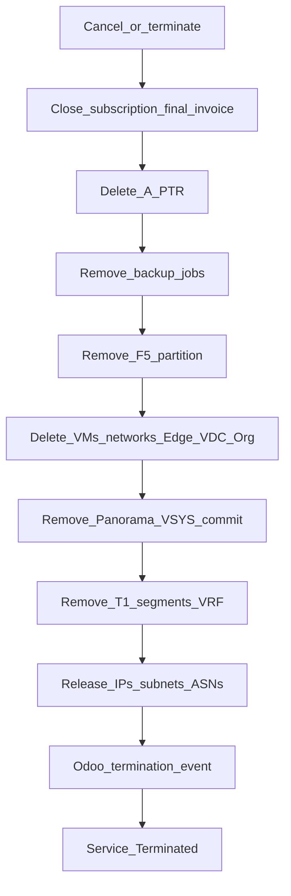

# Offboarding — reverse teardown

:::warning[Engagement-only — confidential]

Internal / vendor–client review. Not general product documentation.

:::

**CMP posture:** **Custom** — reverse-order multi-system teardown keyed by Service ID. Billing cancellation / final invoice patterns are **Available**; Odoo termination event is **Custom**.

**Prev:** [Day-2 and lifecycle](/engagements/datamount/day-2-and-lifecycle) · **Hub:** [DataMount Integration Review](/engagements/datamount/)

---

## DataMount ideal (document §10)

Tear down in **reverse** dependency order. Every object stamped with Service ID in Phases 1–6 must be found and removed (or verified absent for idempotent retries).

---

## Teardown sequence

| Order | Domain | Actions | CMP posture |
|---|---|---|---|
| 1 | Billing | Cancel subscription; final invoice / credit as policy | **Available** / tune |
| 2 | DNS | Delete A / PTR for Service ID | **Partial** (API Available; automation **Discuss**) |
| 3 | Veeam | Remove jobs / enrollment | **Partial** / **Custom** (manual today) |
| 4 | F5 | Delete VS, pools, partition | **Custom** |
| 5 | VPN | Remove IPSec / SSL VPN on Panorama | **Custom** |
| 6 | VCD | Delete VMs → networks → Edge → VDC → Org (respect async tasks) | **Custom** |
| 7 | Panorama | Remove NAT/policy/BGP/VR/zones/VSYS; commit-and-push | **Custom** |
| 8 | NSX-T | Remove NAT, segments, T1, T0 VRF | **Custom** |
| 9 | IPAM | Release public IPs, private subnets, ASN pair | **Custom** |
| 10 | Odoo | Termination / close subscription event | **Custom** |
| 11 | Audit | Immutable teardown record | **Available** / extend |

:::important[Idempotency]

Offboarding must tolerate partial prior runs: existence-check each delete; treat “already gone” as success. Never release IPAM while VCD/NSX objects still reference the addresses.

:::

---

## Billing and customer experience

| Topic | Behaviour |
|---|---|
| Trigger | Customer cancel, admin terminate, or unpaid hard-offboard policy |
| Portal | Clear “terminating / terminated” status; block new orders |
| Prepaid unused credit | Refund / credit per commercial policy — **Discuss** |
| Data retention | Snapshots/backups retention before Veeam removal — **Discuss** |

Return to [Hub](/engagements/datamount/) · [Integrations matrix](/engagements/datamount/integrations-matrix).
