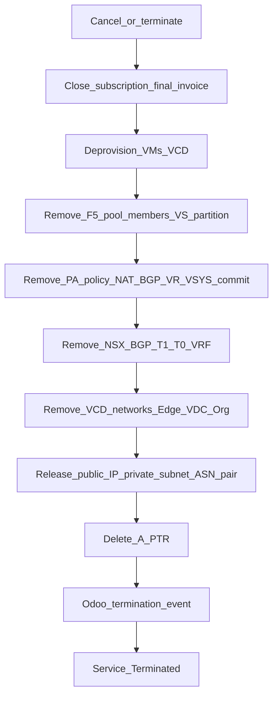

# Offboarding — reverse teardown

**CMP posture:** **Custom** — reverse-order multi-system teardown keyed by Service ID. Billing cancellation / final invoice patterns are **Available**; Odoo termination event is **Custom**.

<div class="no-print">

**Prev:** [Day-2 and lifecycle](/engagements/datamount/day-2-and-lifecycle) · **Hub:** [DataMount Integration Review](/engagements/datamount/)

</div>

---

## DataMount ideal

Mirror of provisioning, run in **reverse**, with explicit rollback semantics reused from [Phase 1](/engagements/datamount/phase-1-ipam-reservation) transaction model. Every object stamped with Service ID in Phases 2–7 must be found and removed (or verified absent for idempotent retries).



---

## Teardown sequence

| Order | Domain | Actions | CMP posture |
|---|---|---|---|
| 1 | Billing | Cancel subscription; final invoice / credit as policy | **Available** / tune |
| 2 | VCD | Delete VMs → networks → Edge → VDC → Org (respect async tasks) | **Custom** |
| 3 | F5 | Remove pool members, VS, partition (if Phase 6 was used) | **Custom** |
| 4 | Panorama | Remove security policy → NAT → address objects → BGP peer → VR → zones → VSYS; commit-and-push | **Custom** |
| 5 | NSX-T | Remove BGP → NAT → segments → T1 → T0 VRF | **Custom** |
| 6 | IPAM | Release public IPs, private subnets, ASN pair → **AVAILABLE** | **Custom** |
| 7 | DNS | Delete A / PTR for Service ID | **Partial** |
| 8 | Veeam | Remove jobs / enrollment | **Partial** / **Custom** |
| 9 | Odoo | Termination / close subscription event | **Custom** |
| 10 | Audit | Immutable teardown record | **Available** / extend |

:::important[Idempotency]

Offboarding must tolerate partial prior runs: existence-check each delete; treat "already gone" as success. **Never release IPAM** while VCD, NSX-T, or Palo Alto objects still reference the addresses — see [Phase 8 — Reconciliation](/engagements/datamount/phase-8-reconciliation).

:::

---

## Lifecycle states on release

```
IN_USE → RELEASED → AVAILABLE
```

A mismatch during release (for example, PA NAT still references a released IP) should raise an **orphan resource alert**, not silently reuse the IP.

---

## Billing and customer experience

| Topic | Behaviour |
|---|---|
| Trigger | Customer cancel, admin terminate, or unpaid hard-offboard policy |
| Portal | Clear "terminating / terminated" status; block new orders |
| Prepaid unused credit | Refund / credit per commercial policy — **Discuss** |
| Data retention | Snapshots/backups retention before Veeam removal — **Discuss** |

<div class="no-print">

Return to [Hub](/engagements/datamount/) · [Integrations matrix](/engagements/datamount/integrations-matrix).

</div>
