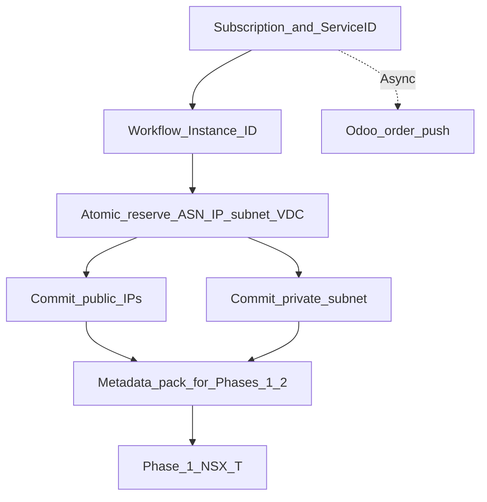

# Phase 0 — Capacity, reservation, and IPAM

:::warning[Engagement-only — confidential]

Internal / vendor–client review. Not general product documentation.

:::

**CMP posture:** **Partial** / **Custom** — order and subscription creation are **Available**. Capacity pre-check across compute + ASN + public IP, **atomic reservation**, and IPAM allocate/release connectors are **Custom**. Async Odoo push is **Custom**.

**Prev:** [Registration and billing](/engagements/datamount/registration-and-billing) · **Next:** [Phase 1 — NSX-T](/engagements/datamount/phase-1-nsx-t)

---

## DataMount ideal

Runs after billing creates the subscription and **Service ID**. No Odoo call is required before provisioning. Phase 0 prepares durable workflow state and commits IP/ASN/capacity so Phases 1–2 cannot race on shared pools.

---

## Steps

| # | System | Action | Detail | CMP posture |
|---|---|---|---|---|
| 0.1 | Website / portal | Plan selected | VM or VPC plan, add-ons, cost estimate | **Available** |
| 0.2 | CMP / pools | Capacity & quota pre-check | Verify VDC capacity, ASN pair, public IP count exist before charge | **Custom** |
| 0.3–0.6 | CMP billing | Checkout, KYC, approval, subscription | See [Registration and billing](/engagements/datamount/registration-and-billing) | **Partial** |
| 0.7 | CMP | Workflow Instance ID | Durable ID bound to Service ID; keys idempotency and resume | **Custom** |
| 0.8 | CMP / IPAM / NSX-T | Atomic reservation | Single transaction: ASN pair, public IP(s), private subnet, VDC capacity | **Custom** |
| 0.9 | CMP | Trigger provisioning | Internal start of Phases 1–6 | **Partial** |
| 0.10 | CMP / IPAM | Allocate public IPs | Commit reserved public IPs for plan quantity | **Custom** |
| 0.11 | CMP / IPAM | Allocate private subnet | Commit east-west subnet(s) for NSX-T segments | **Custom** |
| 0.12 | CMP → Odoo | Send order data | Async; does not block | **Custom** |

---

## IPAM notes

| Topic | DataMount | CMP today |
|---|---|---|
| Platform | Infoblox / NetBox (or equivalent) — **Discuss** | No IPAM connector in product today |
| Public IP | Allocate / reserve / release | **Custom** |
| Private subnet | Allocate for segments | **Custom** |
| Manual tracking today | Ops may track Edge VLAN / ASN / /30 in spreadsheets during walkthroughs | Target: replace with API-backed IPAM |

:::tip[Metadata pack]

Phase 0 should leave a structured pack for later phases: Service ID, Workflow Instance ID, ASN-A / ASN-B, public IP list, private CIDR(s), plan entitlements, and add-on flags (F5, VPN).

:::

---

## Failure behaviour

| Failure | Expected compensation |
|---|---|
| Capacity pre-check fail | Block or queue order; **do not charge** |
| Reservation fail | Release any partial holds; alert admin |
| IPAM allocate fail after charge | Refund / credit path (see [Day-2 — provisioning failure](/engagements/datamount/day-2-and-lifecycle)); release reservation |

On success → [Phase 1 — NSX-T](/engagements/datamount/phase-1-nsx-t).
