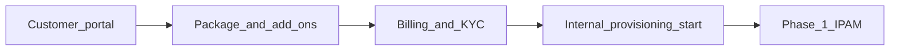

# Phase 0 — What the customer sees

**CMP posture:** **Available** / **Partial** — plan selection, checkout, and package tiers are **Available**. Translating selections into backend infrastructure parameters is **Custom** orchestration.

The customer never sees T0 VRFs, ASNs, BGP peer IPs, or Palo Alto virtual router internals. They select a **service/package**; CMP translates that into Phases 1–7.

**Prev:** [Registration and billing](/engagements/datamount/registration-and-billing) · **Next:** [Phase 1 — IPAM reservation](/engagements/datamount/phase-1-ipam-reservation)

---

## Customer-facing options

| Option | Example | Backend mapping |
|---|---|---|
| Internet connectivity | Enabled | Panorama NAT + security baseline |
| Routing type | Static / BGP | BGP profile always provisioned as provider infrastructure; customer-visible routing features vary by plan |
| Customer ASN | `65050` *(informational)* | CMP allocates from ASN pool — customer does not pick |
| Advertise customer prefix | `203.10.20.0/24` | NSX-T route advertisement + Palo Alto BGP |
| Security package | Basic / Standard / Advanced / Enterprise / Enterprise Plus | [VSYS profile](/engagements/datamount/admin-setup#24-palo-alto--admin-configuration-wizard) from admin setup |
| VM specs, storage, network size | Standard CMP compute order fields | [Phase 7 — Compute](/engagements/datamount/phase-7-compute) |
| Load balancing / WAF add-on | Optional | [Phase 6 — F5](/engagements/datamount/phase-6-f5) |
| VPN add-on | IPSec / SSL VPN | Panorama VPN config in [Phase 4](/engagements/datamount/phase-4-panorama) |

---

## What CMP must derive from the order

| Customer selection | Orchestration output |
|---|---|
| Security package tier | VSYS profile, VR package, policy templates |
| Routing type + prefix | Prefix size in IPAM reservation; BGP advertisement rules |
| Public IP quantity | Public pool reservation size (`/32`, `/30`, etc.) |
| Private network size | Private subnet CIDR from pool |
| F5 / VPN flags | Skip or include Phases 6 / VPN blocks in Phase 4 |

Store all derived values in the workflow metadata pack keyed by **Service ID** and **Workflow Instance ID** for idempotent resume.

---

## Relationship to billing

Phase 0 is the **last customer-visible step**. [Registration and billing](/engagements/datamount/registration-and-billing) covers account creation, KYC, payment, and subscription trigger. After payment approval, CMP starts [Phase 1 — IPAM reservation](/engagements/datamount/phase-1-ipam-reservation) without customer interaction.
