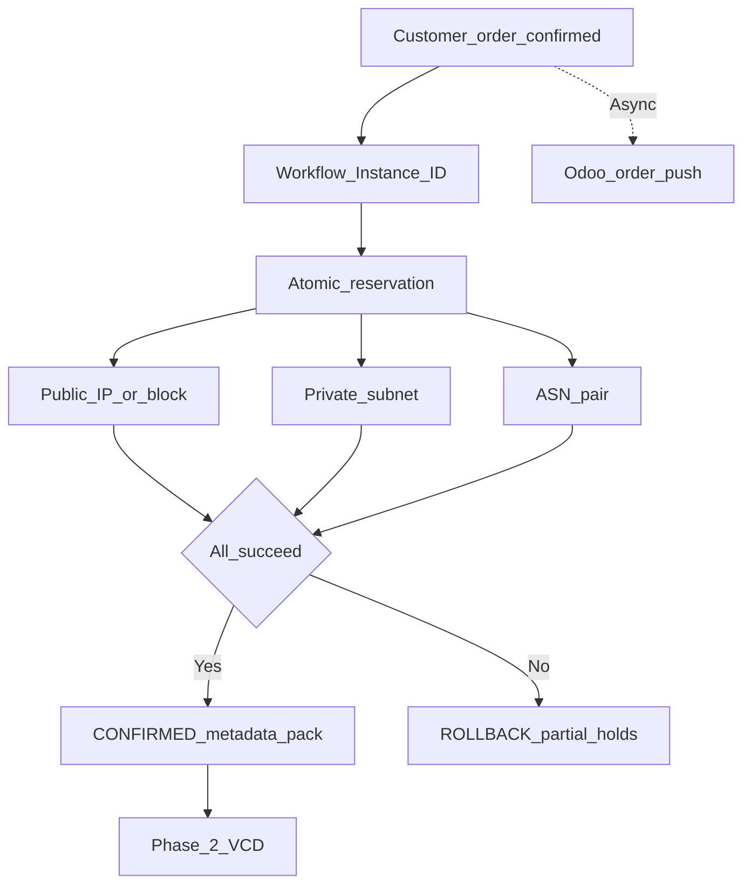

# Phase 1 — Atomic resource reservation (CMP IPAM)

**CMP posture:** **Custom** — atomic reservation across public IP, private subnet, and ASN pair is not in product today.

On order confirmation, CMP performs **one atomic transaction**. VCD, NSX-T, and Palo Alto never independently allocate customer-facing IP/ASN resources — they only consume what CMP hands them. See [Confirmed architecture — ownership](/engagements/datamount/architecture#provisioning-ownership).

<div class="no-print">

**Prev:** [Phase 0 — Customer order](/engagements/datamount/phase-0-customer-order) · **Next:** [Phase 2 — VCD](/engagements/datamount/phase-2-vcd)

</div>

---

## DataMount ideal



---

## Steps

| # | System | Action | Detail | CMP posture |
|---|---|---|---|---|
| 1.1 | CMP | Workflow Instance ID | Durable ID bound to Service ID; keys idempotency and resume | **Custom** |
| 1.2 | CMP / IPAM | Capacity pre-check | Verify ASN pair, public IP count, private subnet size available | **Custom** |
| 1.3 | CMP / IPAM | Atomic reservation | Single transaction: public IP(s), private subnet, ASN pair | **Custom** |
| 1.4 | CMP | Metadata pack | Service ID, ASN-A / ASN-B, public IP list, private CIDR(s), plan entitlements, F5/VPN flags | **Custom** |
| 1.5 | CMP → Odoo | Send order data | Async; does not block provisioning | **Custom** |

---

## IPAM notes

| Topic | DataMount target | CMP today |
|---|---|---|
| Platform | StackConsole Internal IP Manager | **Custom** |
| Public IP | Allocate / reserve / release | **Custom** |
| Private subnet | Per-VRF allocation; [VRF-scoped overlap](/engagements/datamount/admin-setup#23-vrf-aware-overlap-validation) | **Custom** |
| ASN pair | Two ASNs per customer for Active-Active BGP | **Custom** |
| Contiguous blocks only | Never combine fragmented free IPs | **Custom** |

:::tip[Metadata pack]

Phase 1 must leave a structured pack for later phases: Service ID, Workflow Instance ID, ASN-A / ASN-B, public IP list, private CIDR(s), plan entitlements, and add-on flags (F5, VPN).

:::

---

## Lifecycle states

Recommend explicit states rather than binary used/unused:

```
AVAILABLE → RESERVED → ALLOCATED → ASSIGNED → IN_USE → RELEASED → AVAILABLE
```

---

## Failure behaviour

| Failure | Expected compensation |
|---|---|
| Capacity pre-check fail | Block or queue order; **do not charge** |
| Reservation fail | Release any partial holds; alert admin |
| IPAM allocate fail after charge | Refund / credit path (see [Day-2 — provisioning failure](/engagements/datamount/day-2-and-lifecycle)); release reservation |

On success → [Phase 2 — VCD](/engagements/datamount/phase-2-vcd).
