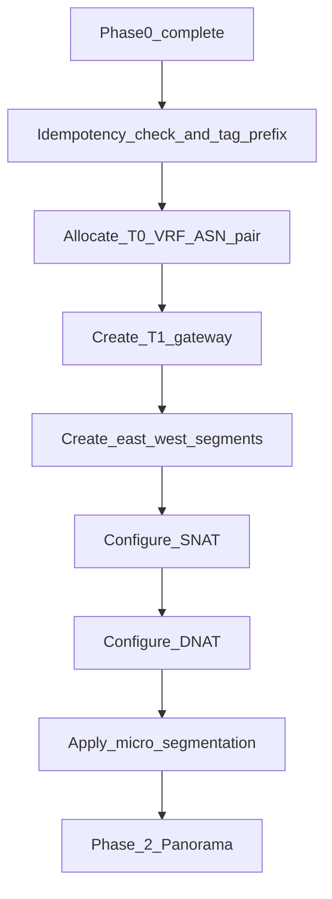

# Phase 1 — Network layer (NSX-T)

:::warning[Engagement-only — confidential]

Internal / vendor–client review. Not general product documentation.

:::

**CMP posture:** **Custom** — no production NSX-T orchestration connector in CMP today. This phase is the first infrastructure action after billing confirms the subscription. It must complete before Panorama or VCD.

**Stack reference:** VMware NSX-T **4.2.0** (DataMount v1.4).

**Prev:** [Phase 0 — Capacity and IPAM](/engagements/datamount/phase-0-capacity-ipam) · **Next:** [Phase 2 — Panorama](/engagements/datamount/phase-2-panorama)

---

## DataMount ideal

Network-first: allocate a customer VRF on the shared T0, create T1, segments, NAT, and micro-segmentation. Tag every object with **Service ID**. On failure, release IPAM reservations from Phase 0.

---

## Steps

| # | System | Action | Detail | CMP posture |
|---|---|---|---|---|
| 1.0 | CMP / NSX-T | Idempotency pre-check | Skip create if VRF/T1 for Service ID already exists; register tag prefix | **Custom** |
| 1.1 | NSX-T | Allocate T0 VRF | Dedicated VRF on shared T0; two ASNs (ASN-A / ASN-B) for Active-Active BGP | **Custom** |
| 1.2 | NSX-T | Create T1 Gateway | `T1-{ServiceID}` linked to T0 VRF; enable prefix advertisement T1 → T0 | **Custom** |
| 1.3 | NSX-T | Create east-west segment(s) | L2 segments on T1 using IPAM private subnet(s) | **Custom** |
| 1.4 | NSX-T | Configure SNAT | Outbound from customer subnets via allocated public IP(s) | **Custom** |
| 1.5 | NSX-T | Configure DNAT | Inbound on public IPs to VMs or F5 VIP | **Custom** |
| 1.6 | NSX-T | Micro-segmentation | Default deny-all east-west; Web / App / DB tags for customer use | **Custom** |

:::important[Ordering]

Do **not** start Panorama (Phase 2) or VCD (Phase 4) until Phase 1 objects exist and are tagged. BGP peer bring-up spans Phases 1–2; validation is Phase 3.

:::

---

## Operational walkthrough notes (NSX-T / VCD Part-2)

From the DataMount NSX-T and VCD walkthrough (local recording; not published on this site):

- **NSX Home overview** shows shared fabric inventory: Tier-0 / Tier-1 gateways, segments, edge clusters, and transport zones — tenant isolation is via **per-customer VRF / T1 / segment**, not a separate NSX instance.
- **T0 VRF BGP neighbors** are configured under Networking → Tier-0 Gateways → VRF (example VRF name `cmp` in the demo):
  - Neighbor **IP Address** (required)
  - **Remote AS number** (required) — private ASN range used in demo (e.g. 64550+)
  - **Source Addresses** on the VRF side of the /30
  - BFD optional; Graceful Restart / Max Hop Limit as fabric standard
  - Neighbor status must reach **Established** before Phase 3 can pass (Down neighbors block the gate)
- **Segments**: each customer gets a dedicated segment; shared uplink VLANs are fabric-level (two VLAN segments for all customers in the walkthrough model).
- **Failure**: if T0 VRF or T1 creation fails, compensate by deleting partial NSX objects and releasing Phase 0 IPAM holds.

API reference (external): [NSX-T Data Center REST API](https://developer.broadcom.com/xapis/nsx-t-data-center-rest-api/latest/).

---

## Isolation checklist

| Domain | Object | Tag / key |
|---|---|---|
| NSX-T | T0 VRF, T1, segments, NAT rules | Service ID |
| IPAM | Public IP, private subnet | Service ID |
| Later | Panorama VSYS, VCD Org, F5 partition | Same Service ID |

On success → [Phase 2 — Panorama](/engagements/datamount/phase-2-panorama).
