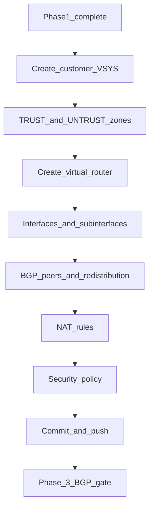

# Phase 2 — Perimeter security (Palo Alto via Panorama)

:::warning[Engagement-only — confidential]

Internal / vendor–client review. Not general product documentation.

:::

**CMP posture:** **Custom** — Panorama connector, Device Group / Template Stack targeting, and **global commit-and-push serialization** are not in CMP today. Direct PAN-OS device API is **not acceptable** per DataMount (must use Panorama).

**Prev:** [Phase 1 — NSX-T](/engagements/datamount/phase-1-nsx-t) · **Next:** [Phase 3 — BGP gate](/engagements/datamount/phase-3-bgp-gate)

---

## DataMount ideal

All Palo Alto configuration goes through **Panorama** APIs. After each logical configuration block, CMP must **commit-and-push** and confirm success before advancing. Concurrent customer builds need a **commit lock / queue** so pushes do not collide.

---

## Steps

| # | System | Action | Detail | CMP posture |
|---|---|---|---|---|
| 2.1 | Panorama | Create customer VSYS | Complete policy isolation at firewall | **Custom** |
| 2.2 | Panorama | TRUST / UNTRUST zones | TRUST = VDC / NSX-T facing; UNTRUST = internet | **Custom** |
| 2.3 | Panorama | Virtual router | Routing between zones and BGP peers | **Custom** |
| 2.4 | Panorama | Interfaces | Subinterfaces (VLAN tags) for internet and LAN; align with IPAM / Edge sheet | **Custom** |
| 2.5 | Panorama | BGP | Neighbors toward T0 VRF; redistribute / advertise customer prefixes | **Custom** |
| 2.6 | Panorama | NAT | Align with NSX-T SNAT/DNAT public IPs | **Custom** |
| 2.7 | Panorama | Security policy | Baseline allow/deny; Day-2 changes via approval queue | **Custom** |
| 2.8 | Panorama | Commit-and-push | After each logical block; wait for success | **Custom** (serialized) |

:::warning[Commit serialization]

Panorama commits are global. CMP must queue commit-and-push across workflow instances (Service ID aware) so parallel onboardings do not overwrite or fail each other.

:::

---

## Operational walkthrough notes (Firewall Part-1)

From the DataMount firewall configuration walkthrough (local recording; not published on this site):

- **Perimeter platform** in the demo is a **PA-5450** pair (Active–Passive HA). CMP automation still targets **Panorama** Device Groups / Template Stacks, not ad-hoc device UI — the device UI illustrates the intended end state.
- **IP / VLAN / ASN inventory** is still spreadsheet-driven in ops today (example **Edge 1** sheet): `/30` blocks, usable IPs, sequential **VLAN** IDs, customer name, and **EBGP AS** (private ASN sequence). Phase 0 IPAM should replace this as the system of record; Panorama/NSX steps consume the same allocation.
- **Layer-3 aggregate subinterfaces** (example `ae1` + VLAN tag) bind customer edges; management profile naming in the demo uses a DataMount cloud profile (e.g. `DM_Cloud_mgmt`).
- **Virtual Router** per customer (example `CMP_Demo`): enable BGP, set **Router ID**, required **AS Number**, typically **Reject Default Route**, Aggregate MED / local preference per fabric standard, then peer with NSX-T T0 VRF neighbors from Phase 1.
- Manual path today: allocate row in Edge sheet → create subinterface → VR + BGP → commit. Automated path: same data from IPAM + Panorama API + queued commit.

---

## Isolation checklist

| Object | Isolation key |
|---|---|
| VSYS | One per customer / Service ID |
| Zones, VR, interfaces, NAT, policy | Inside that VSYS |
| Device Group / Template Stack | Mapped per customer or shared stack with VSYS scoping — **Discuss** |

On success → [Phase 3 — BGP gate](/engagements/datamount/phase-3-bgp-gate).
