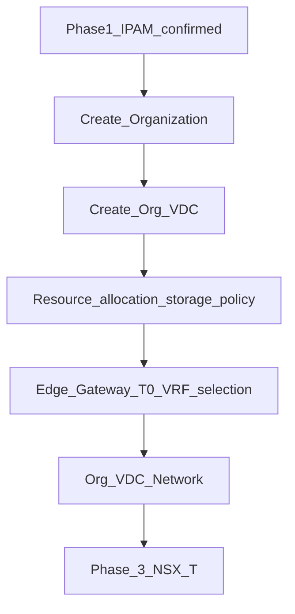

# Phase 2 — VMware Cloud Director (Org / VDC / Edge)

**CMP posture:** **Custom** — native **VCD** connector required for this blueprint. Existing **vCenter** API integration does not satisfy Org / Org VDC / Edge Gateway as written. Customers use the **CMP portal**, not the raw VCD UI.

**Stack reference:** VMware Cloud Director **10.6.0** (DataMount v1.4).

**Prev:** [Phase 1 — IPAM reservation](/engagements/datamount/phase-1-ipam-reservation) · **Next:** [Phase 3 — NSX-T](/engagements/datamount/phase-3-nsx-t)

---

## DataMount ideal

After [Phase 1](/engagements/datamount/phase-1-ipam-reservation) reserves resources, CMP creates the VCD tenant framework **before** direct NSX-T and Panorama provisioning. Use VCD **IP Space** to implement CMP allocations — do not let VCD become a second IPAM source of truth.

Every API call: **request → task → poll → validate → continue** (VCD IP allocation may return `202`).

---

## Steps

| # | System | Action | Detail | CMP posture |
|---|---|---|---|---|
| 2.1 | VCD | Create Organization | Unique org name; full name; description; tag Service ID | **Custom** |
| 2.2 | VCD | Create Org VDC | Allocation model; CPU/RAM/storage from plan | **Custom** |
| 2.3 | VCD | Resource allocation + network pool | Map plan entitlements | **Custom** |
| 2.4 | VCD | Edge Gateway | T0/VRF selection; IP from Phase 1 reservation via IP Space | **Custom** |
| 2.5 | VCD | Org VDC network | Routed network; gateway CIDR; static IP pools; DNS | **Custom** |
| 2.6 | VCD | Storage policy | Map plan tier (e.g. SSD vs NVMe) | **Custom** |
| 2.7 | VCD | Catalog | Expose OS / vApp templates for later [Phase 7](/engagements/datamount/phase-7-compute) | **Custom** |
| 2.8 | CMP | Portal mapping | Org/VDC/Edge IDs stored against Service ID | **Custom** |

:::note[Compute timing]

VM deployment happens in [Phase 7](/engagements/datamount/phase-7-compute) **only after** the [BGP validation gate](/engagements/datamount/phase-5-bgp-gate) passes. Phase 2 establishes Org/VDC/Edge/network framework only.

:::

---

## CloudStack ↔ VCD mapping

| CloudStack | VCD |
|---|---|
| Domain | Organization |
| Project | Org VDC |
| Network / VPC | Org network / Edge Gateway + routed network |
| Template | Catalog template |

Full abstraction: [Provider abstraction](/engagements/datamount/provider-abstraction).

---

## Operational walkthrough notes

From the DataMount NSX-T / VCD walkthrough (local recording; not published on this site):

- **Organization create** requires unique **Organization name** and **Organization full name**. Idempotency pre-check should query by name/Service ID before create.
- **Org VDC network wizard**: Scope → Network Type → Edge Connection → General (name, gateway CIDR) → Static IP Pools → DNS → Segment Profile Template → Ready to Complete.
- Demo path: import T0 VRF → provider gateway → Organization → VDC → Edge → Org VDC network (`CMP-Lan`-style naming).

---

## Requested VCD services (posture)

| Service | VCD native | CMP posture |
|---|---|---|
| Org VDC create / resize / delete | Yes | **Custom** |
| Edge Gateway + NSX-T attach | Yes | **Custom** |
| Catalog / OS templates | Yes | **Custom** |
| VM lifecycle | Yes | **Partial** (vCenter pattern exists; VCD mapping required) |
| VDC networks + IP Space | Yes | **Custom** |
| Storage policy | Yes | **Custom** |
| Self-service portal | Yes (VCD) | **Available** (CMP portal is customer UI) |

On success → [Phase 3 — NSX-T](/engagements/datamount/phase-3-nsx-t).
