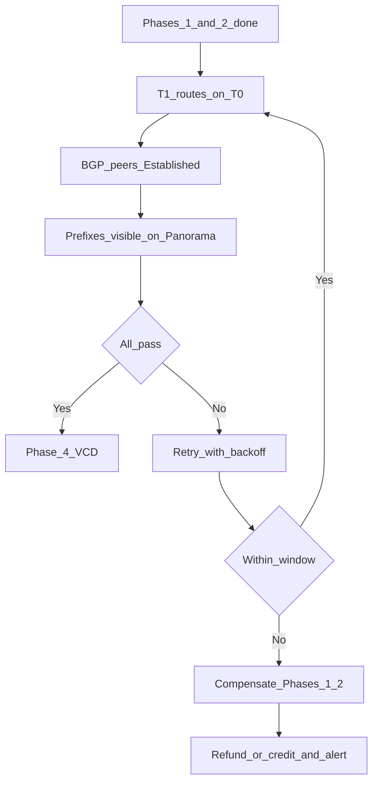

# Phase 3 — BGP validation gate

:::warning[Engagement-only — confidential]

Internal / vendor–client review. Not general product documentation.

:::

**CMP posture:** **Custom** — hard gate before VCD. Retry with backoff (document window ~**10 minutes**) and compensation of Phases 1–2 are orchestration features not in product today.

**Prev:** [Phase 2 — Panorama](/engagements/datamount/phase-2-panorama) · **Next:** [Phase 4 — VCD](/engagements/datamount/phase-4-vcd)

---

## DataMount ideal

Three-way BGP must be healthy before any VCD Org/VDC/Edge work:

1. NSX-T **T1** advertises to **T0 VRF**
2. **T0 VRF** peers with **Palo Alto VSYS** (via Panorama-pushed config)
3. Routes are learned / visible on both NSX-T and Panorama sides

---

## Gate checks

| Check | System | Success criteria | CMP posture |
|---|---|---|---|
| T1 → T0 advertisement | NSX-T | Customer prefixes learned on T0 VRF | **Custom** |
| T0 ↔ Panorama peers | NSX-T + Panorama | Neighbor state **Established** (not Down) | **Custom** |
| Route visibility on PA | Panorama / firewall | Expected prefixes present in VR routing table | **Custom** |
| Retry | CMP orchestration | Backoff within ~10 minute window | **Custom** |
| Fail | CMP + connectors | Compensate Phases 1–2; release IPAM; alert admin; billing refund/credit | **Custom** |

:::danger[Hard stop]

CMP must **not** proceed to [Phase 4 — VCD](/engagements/datamount/phase-4-vcd) until this gate returns success. Partial compute without routing creates orphan Orgs and support debt.

:::

---

## On failure

| Action | Order |
|---|---|
| Stop workflow | Immediately; mark Workflow Instance failed / compensating |
| Tear down Panorama objects | Reverse Phase 2 (policy → NAT → BGP → VR → zones → VSYS) with commit-and-push |
| Tear down NSX-T objects | Reverse Phase 1 (NAT → segments → T1 → T0 VRF) |
| Release IPAM | Public IPs, private subnet, ASN reservation from Phase 0 |
| Billing | Refund (prepaid) or credit / cancel subscription (postpaid) — see [Day-2](/engagements/datamount/day-2-and-lifecycle) |
| Notify | Platform admin alert + customer-safe status in portal |

On success → [Phase 4 — VCD](/engagements/datamount/phase-4-vcd).
