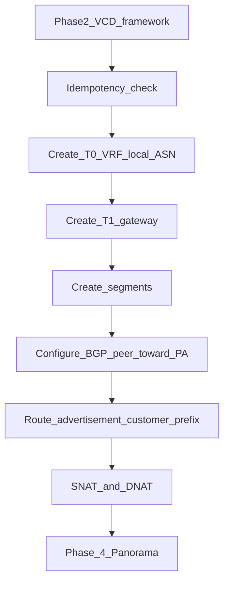

# Phase 3 — NSX-T provisioning (direct API)

**CMP posture:** **Custom** — no production NSX-T orchestration connector in CMP today. Tenant-level NSX-T-backed networking is provisioned via **VCD API** in Phase 2. Phase 3 calls **NSX-T Manager directly** only for provider-level operations **not exposed through VCD**.

**Stack reference:** VMware NSX-T **4.2.0** (DataMount v1.4).

**Prev:** [Phase 2 — VCD](/engagements/datamount/phase-2-vcd) · **Next:** [Phase 4 — Panorama](/engagements/datamount/phase-4-panorama)

---

## DataMount ideal

Create customer T0 VRF, T1, segments, NAT, and BGP toward Palo Alto using allocations from [Phase 1](/engagements/datamount/phase-1-ipam-reservation). Tag every object with **Service ID**.

---

## Steps

| # | System | Action | Detail | CMP posture |
|---|---|---|---|---|
| 3.0 | CMP / NSX-T | Idempotency pre-check | Skip create if VRF/T1 for Service ID exists | **Custom** |
| 3.1 | NSX-T | Create customer T0 VRF | Dedicated VRF on shared T0; local ASN from Phase 1 | **Custom** |
| 3.2 | NSX-T | Create T1 Gateway | `T1-{ServiceID}` linked to T0 VRF; prefix advertisement T1 → T0 | **Custom** |
| 3.3 | NSX-T | Create segment(s) | L2 segments on T1 using IPAM private subnet(s) | **Custom** |
| 3.4 | NSX-T | Configure BGP peer | Toward Palo Alto virtual router; second ASN from pair | **Custom** |
| 3.5 | NSX-T | Route advertisement | Customer prefix from order (Phase 0) | **Custom** |
| 3.6 | NSX-T | Configure SNAT | Outbound via allocated public IP(s) | **Custom** |
| 3.7 | NSX-T | Configure DNAT | Inbound on public IPs to VMs or F5 VIP | **Custom** |
| 3.8 | NSX-T | Micro-segmentation | Default deny-all east-west; Web/App/DB tags — **Discuss** depth | **Custom** |

:::important[BGP is mandatory infrastructure]

BGP between NSX-T T0 VRF and Palo Alto is **provider infrastructure**, not an optional customer toggle. Every onboarded customer on this stack gets the underlying VRF↔BGP path; plan tiers vary visible features (peer count, prefix limits, policy detail).

:::

---

## Operational walkthrough notes

- **T0 VRF BGP neighbors** under Networking → Tier-0 Gateways → VRF:
  - Neighbor **IP Address** and **Remote AS number** (required)
  - **Source Addresses** on the VRF side of the `/30`
  - Neighbor status must reach **Established** before [Phase 5 BGP gate](/engagements/datamount/phase-5-bgp-gate) can pass
- **Segments**: dedicated segment per customer; shared uplink VLANs are fabric-level.
- **Failure**: delete partial NSX objects and release Phase 1 IPAM holds on compensation.

API reference (external): [NSX-T Data Center REST API](https://developer.broadcom.com/xapis/nsx-t-data-center-rest-api/latest/).

---

## CloudStack parity — Virtual Router list view

The resulting T1 Gateway + BGP peer is conceptually the same object CloudStack surfaces as a per-account **Virtual Router** — one live instance per tenant network with its own NICs, guest network, and public IP. Reuse CloudStack's **one row per live tenant router, state and IP visible in the list** pattern for CMP's NSX-T T1 inventory screen.

img/screenshots/datamount/cloudstack-virtual-routers-list.png

See [CloudStack reference patterns](/engagements/datamount/cloudstack-reference-patterns#virtual-router--per-tenant-t1-analog).

---

## Isolation checklist

| Domain | Object | Tag / key |
|---|---|---|
| NSX-T | T0 VRF, T1, segments, NAT, BGP | Service ID |
| IPAM | Public IP, private subnet, ASN pair | Service ID |
| Later | Panorama VSYS, VCD Org, F5 partition | Same Service ID |

On success → [Phase 4 — Panorama](/engagements/datamount/phase-4-panorama).
