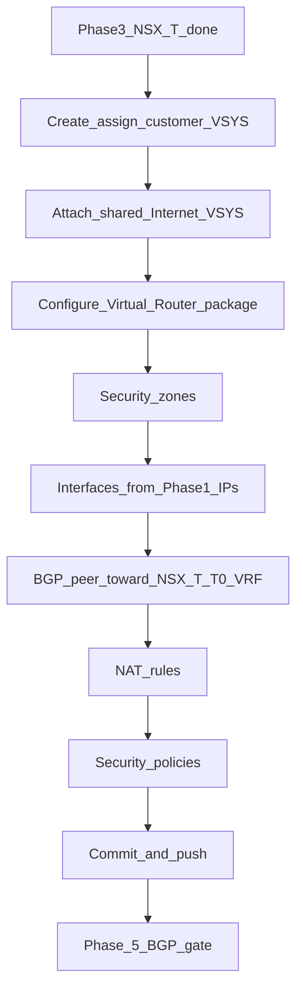

# Phase 4 — Palo Alto provisioning (Panorama API)

**CMP posture:** **Custom** — Panorama connector, Device Group / Template Stack targeting, and **global commit-and-push serialization** are not in CMP today. Direct PAN-OS device API is **not acceptable** — all changes via **Panorama** using **REST + XML** (REST alone is a partial API).

**Architecture:** **Physical firewall**, managed via Panorama — **no** VM-Series. NSX-T operations use **VCD API where supported**; **direct NSX-T Manager API** where VCD does not expose the operation. See [Confirmed architecture](/engagements/datamount/architecture).

**Prev:** [Phase 3 — NSX-T](/engagements/datamount/phase-3-nsx-t) · **Next:** [Phase 5 — BGP gate](/engagements/datamount/phase-5-bgp-gate)

---

## DataMount ideal

After each logical configuration block: **commit → push → confirm success** before advancing.

---

## Steps

| # | System | Action | Detail | CMP posture |
|---|---|---|---|---|
| 4.1 | Panorama | Create/assign customer VSYS | From selected [VSYS profile](/engagements/datamount/admin-setup#24-palo-alto--admin-configuration-wizard) | **Custom** |
| 4.2 | Panorama | Attach shared Internet VSYS | Per admin default config | **Custom** |
| 4.3 | Panorama | Virtual router | From selected VR package | **Custom** |
| 4.4 | Panorama | Security zones | Predefined: Internet / DMZ / Trust / Mgmt / VPN; customer may add custom zones within VSYS only — **Discuss** boundaries | **Custom** |
| 4.5 | Panorama | Interfaces | Bound to VSYS + VR + Zone + IP from Phase 1 | **Custom** |
| 4.6 | Panorama | BGP peer | Toward NSX-T T0 VRF; second ASN from pair | **Custom** |
| 4.7 | Panorama | Address objects, NAT | Align with NSX-T SNAT/DNAT public IPs | **Custom** |
| 4.8 | Panorama | Security policies | Baseline from profile tier | **Custom** |
| 4.9 | Panorama | VPN (if ordered) | IPSec / SSL VPN on Panorama | **Custom** |
| 4.10 | Panorama | Commit-and-push | After each logical block; wait for success | **Custom** (serialized) |

:::warning[Commit serialization]

Panorama commits are global. CMP must queue commit-and-push across workflow instances. Define compensating actions if commit succeeds but push to the physical device fails partway — **open item**.

:::

---

## Operational walkthrough notes

From the DataMount firewall configuration walkthrough (local recording; not published on this site):

- **Perimeter platform** in the demo is a **PA-5450** pair (Active–Passive HA). CMP automation targets **Panorama** Device Groups / Template Stacks.
- **Layer-3 aggregate subinterfaces** (example `ae1` + VLAN tag) bind customer edges.
- **Virtual Router** per customer: enable BGP, set **Router ID**, **AS Number**, peer with NSX-T T0 VRF neighbors from Phase 3.
- Ops today may still use Edge VLAN / ASN spreadsheets during walkthroughs — [Phase 1 IPAM](/engagements/datamount/phase-1-ipam-reservation) replaces this as system of record.

---

## Isolation checklist

| Object | Isolation key |
|---|---|
| VSYS | One per customer / Service ID |
| Zones, VR, interfaces, NAT, policy | Inside that VSYS |
| Device Group / Template Stack | Mapped per customer or shared stack with VSYS scoping — **Discuss** |

On success → [Phase 5 — BGP gate](/engagements/datamount/phase-5-bgp-gate).
