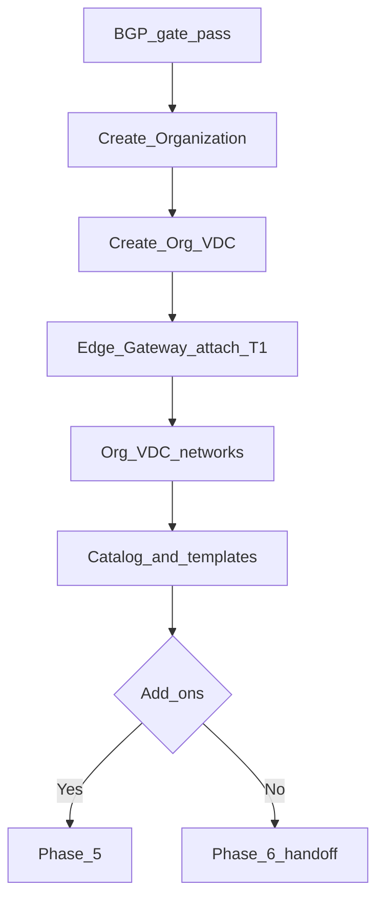

# Phase 4 — VMware Cloud Director (compute framework)

:::warning[Engagement-only — confidential]

Internal / vendor–client review. Not general product documentation.

:::

**CMP posture:** **Custom** — native **VCD** connector required for this blueprint. Existing **vCenter** API integration does not satisfy Org / Org VDC / Edge Gateway as written. Customers use the **CMP portal**, not the raw VCD UI.

**Stack reference:** VMware Cloud Director **10.6.0** (DataMount v1.4).

**Prev:** [Phase 3 — BGP gate](/engagements/datamount/phase-3-bgp-gate) · **Next:** [Phase 5 — Add-ons](/engagements/datamount/phase-5-addons)

---

## DataMount ideal

Only after the BGP gate passes: create Organization, Org VDC, Edge Gateway attached to the NSX-T T1 from Phase 1, Org VDC networks, and catalog access. Initial automation provides the **framework**; customers (or VPC blueprint plane) create VMs via CMP self-service afterward.

---

## Steps

| # | System | Action | Detail | CMP posture |
|---|---|---|---|---|
| 4.1 | VCD | Create Organization | Unique org name; full name; description; tag Service ID | **Custom** |
| 4.2 | VCD | Create Org VDC | Allocation model (Allocation Pool / Pay-As-You-Go / Reservation Pool); CPU/RAM/storage from plan | **Custom** |
| 4.3 | VCD | Provider gateway / T0 VRF import | Import created T0 VRF via NSX-T Manager; new provider gateway as required by fabric | **Custom** |
| 4.4 | VCD | Edge Gateway | Attach to NSX-T T1 from Phase 1; allocate Edge IP from IPAM | **Custom** |
| 4.5 | VCD | Org VDC network | Routed / direct as designed; gateway CIDR; static IP pools; DNS values | **Custom** |
| 4.6 | VCD | Storage policy | Map plan tier (e.g. SSD vs NVMe) | **Custom** |
| 4.7 | VCD | Catalog | Expose OS / vApp templates for CMP self-service | **Custom** |
| 4.8 | CMP | Portal mapping | Org/VDC/Edge IDs stored against Service ID; customer never needs VCD admin UI | **Custom** |

:::note[VM deployment scope]

DataMount medium-severity correction vs older diagrams: initial provisioning does **not** require deploying the first VM template automatically. Customers create VMs from CMP (or VPC blueprint plane) after handoff.

:::

---

## CloudStack ↔ VCD mapping (reminder)

| CloudStack | VCD |
|---|---|
| Domain | Organization |
| Project | Org VDC |
| Network / VPC | Org network / Edge Gateway + routed network |
| Template | Catalog template |

Full abstraction: [Provider abstraction](/engagements/datamount/provider-abstraction).

---

## Operational walkthrough notes (NSX-T / VCD Part-2)

From the DataMount VCD portion of the walkthrough (local recording; not published on this site):

- **Organization create** requires unique **Organization name** and **Organization full name**. Duplicate names fail with a clear API/UI error (idempotency pre-check should query by name/Service ID before create).
- **Org VDC network wizard** (illustrative steps): Scope → Network Type → Edge Connection → **General** (name, gateway CIDR, dual-stack / shared / guest VLAN flags) → Static IP Pools → DNS → Segment Profile Template → Ready to Complete.
- Demo path after NSX: import T0 VRF → provider gateway → Organization → VDC → Edge → Org VDC network (`CMP-Lan`-style naming) → tenant can then deploy VMs.
- Resource allocation and storage policies are set on the VDC; CMP plan entitlements must map 1:1 into those quotas.

---

## Requested VCD services (posture)

| Service | VCD native | CMP posture |
|---|---|---|
| Org VDC create / resize / delete | Yes | **Custom** |
| Edge Gateway + NSX-T attach | Yes | **Custom** |
| Catalog / OS templates | Yes | **Custom** |
| VM lifecycle | Yes | **Partial** (vCenter pattern exists; VCD mapping required) |
| VDC networks | Yes | **Custom** |
| Storage policy | Yes | **Custom** |
| Self-service portal | Yes (VCD) | **Available** (CMP portal is customer UI) |

On success → optional [Phase 5 — Add-ons](/engagements/datamount/phase-5-addons), else [Phase 6 — Handoff](/engagements/datamount/phase-6-handoff).
