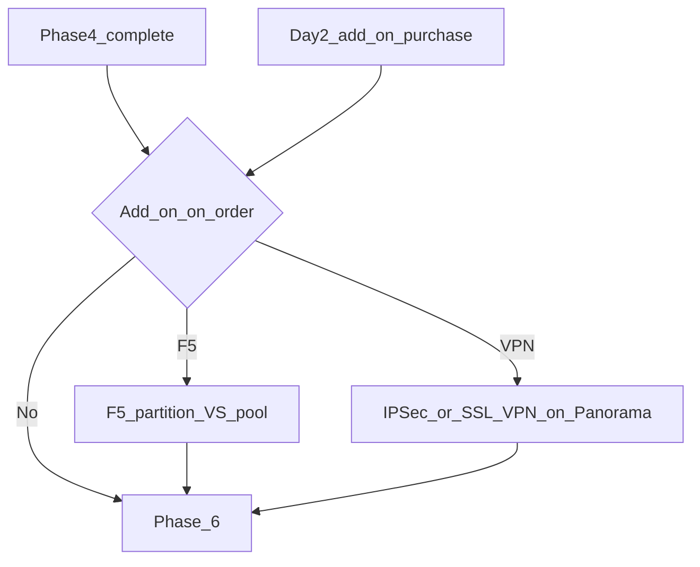

# Phase 5 — Optional add-ons (F5 / VPN)

:::warning[Engagement-only — confidential]

Internal / vendor–client review. Not general product documentation.

:::

**CMP posture:** **Custom** — F5 BIG-IP partition isolation and Panorama IPSec / SSL VPN provisioning are not in CMP today. This phase runs only when the order (or a Day-2 purchase) includes the add-on. It may also run **mid-lifecycle** after handoff.

**Prev:** [Phase 4 — VCD](/engagements/datamount/phase-4-vcd) · **Next:** [Phase 6 — Handoff](/engagements/datamount/phase-6-handoff)

---

## DataMount ideal

Optional services attach to the already-validated network and VCD framework without re-running Phases 1–3 unless capacity/IP changes require it.

---

## F5 BIG-IP

| Action | Detail | CMP posture |
|---|---|---|
| Create partition | Per-customer isolation | **Custom** |
| Virtual server / VIP | Bind to allocated public IP / DNAT target | **Custom** |
| Pools and members | Wire after VMs exist (often Phase 6 / Plane 2) | **Custom** |
| Health monitors | Per service | **Custom** |
| SSL / WAF | Certs and policies; Day-2 change-approval | **Custom** |
| Stats | Feed usage / health dashboards | **Custom** |

:::note[VIP and DNAT]

Phase 1 DNAT may forward public IPs to the F5 VIP. Coordinate IPAM + NSX-T + F5 in one idempotent block keyed by Service ID.

:::

---

## VPN (via Panorama)

| Type | Detail | CMP posture |
|---|---|---|
| IPSec VPN | Site-to-site; PSK/cert lifecycle | **Custom** |
| SSL VPN | Remote user access; secure handoff of client pack | **Custom** / **Discuss** credential delivery |

All VPN config follows the Phase 2 rule: **Panorama only**, commit-and-push serialized.

---

## Mid-lifecycle purchase

When a live customer buys LB/WAF/VPN later:

1. CMP billing captures charge / approval (**Available**)
2. Workflow re-enters Phase 5 with existing Service ID (**Custom**)
3. Skip Phases 1–4 unless new IPs/ASNs are required
4. Continue to smoke checks in [Phase 6](/engagements/datamount/phase-6-handoff)

See also [Day-2 and lifecycle](/engagements/datamount/day-2-and-lifecycle).
