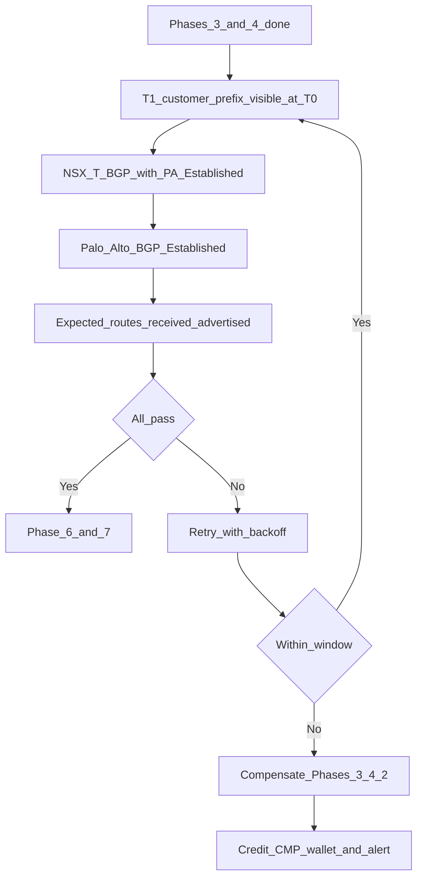

# Phase 5 — BGP validation gate

**CMP posture:** **Custom** — hard gate before compute (Phase 7) and recommended before F5 (Phase 6). Retry with backoff (document window ~**10 minutes**) and compensation of Phases 3–4 are orchestration features not in product today.

**Prev:** [Phase 4 — Panorama](/engagements/datamount/phase-4-panorama) · **Next:** [Phase 6 — F5](/engagements/datamount/phase-6-f5)

---

## DataMount ideal

Explicit **poll-and-validate** step — not an assumption that API calls succeeded. VCD and NSX-T operations are asynchronous; the gate queries live routing state.

---

## Gate checks

| Check | System | Success criteria | CMP posture |
|---|---|---|---|
| T1 → T0 advertisement | NSX-T | Customer prefixes learned on T0 VRF | **Custom** |
| NSX-T ↔ Panorama peers | NSX-T + Panorama | Neighbor state **Established** (not Down) | **Custom** |
| Route visibility on PA | Panorama / firewall | Expected prefixes in VR routing table | **Custom** |
| Retry | CMP orchestration | Backoff within ~10 minute window | **Custom** |
| Fail | CMP + connectors | Compensate Phases 3–4 (and VCD Phase 2 if needed); release IPAM; alert admin | **Custom** |

:::danger[Hard stop]

CMP must **not** proceed to [Phase 7 — Compute](/engagements/datamount/phase-7-compute) until this gate returns success. [Phase 6 — F5](/engagements/datamount/phase-6-f5) should also wait until the gate passes — network ready before load balancer or VM provisioning.

:::

---

## On failure

| Action | Order |
|---|---|
| Stop workflow | Mark Workflow Instance failed / compensating |
| Tear down Panorama objects | Reverse Phase 4 (policy → NAT → BGP → VR → zones → VSYS) with commit-and-push |
| Tear down NSX-T objects | Reverse Phase 3 (NAT → BGP → segments → T1 → T0 VRF) |
| Tear down VCD (if needed) | Reverse Phase 2 if Org/VDC cannot remain without routing |
| Release IPAM | Public IPs, private subnet, ASN pair from Phase 1 |
| Billing | Credit CMP wallet — see [Day-2](/engagements/datamount/day-2-and-lifecycle) |
| Notify | Platform admin alert + customer-safe status in portal |

On success → optional [Phase 6 — F5](/engagements/datamount/phase-6-f5), then [Phase 7 — Compute](/engagements/datamount/phase-7-compute).
