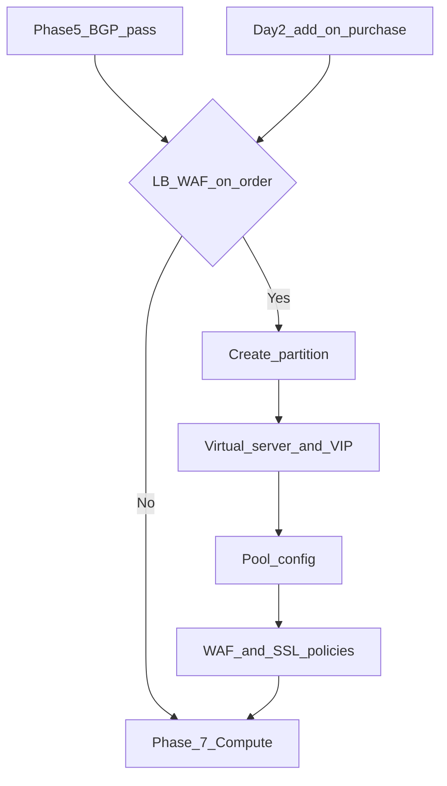

# Phase 6 — F5 BIG-IP (if plan includes LB / WAF)

**CMP posture:** **Custom** — F5 BIG-IP partition isolation, virtual server provisioning, and WAF/SSL policy application are not in CMP today.

This phase runs only when the order (or a Day-2 purchase) includes load balancing or WAF. **Recommend:** provision only after [Phase 5 — BGP gate](/engagements/datamount/phase-5-bgp-gate) passes.

**Prev:** [Phase 5 — BGP gate](/engagements/datamount/phase-5-bgp-gate) · **Next:** [Phase 7 — Compute](/engagements/datamount/phase-7-compute)

---

## Open architecture questions

Confirm before finalizing automation — see [Architecture — F5](/engagements/datamount/architecture#f5--open-architecture-questions):

| Question | Status |
|---|---|
| Physical BIG-IP vs Virtual Edition? | **Open** |
| Shared platform + per-tenant partitions vs dedicated appliance? | **Open** |
| Behind Palo Alto vs parallel placement? | **Open** |
| BGP/routing to NSX-T/Palo Alto vs pure L4–7 behind gateway? | **Open** |

---

## DataMount ideal

Pool members pointing at VMs are often finalized in [Phase 7](/engagements/datamount/phase-7-compute) after VM deploy — design idempotent updates keyed by Service ID.

---

## Steps

| # | System | Action | Detail | CMP posture |
|---|---|---|---|---|
| 6.1 | F5 | Create partition | Per-customer isolation — model **Discuss** | **Custom** |
| 6.2 | F5 | Virtual server / VIP | Bind to allocated public IP / DNAT target | **Custom** |
| 6.3 | F5 | Pool configuration | Initial pool; members wired after VMs exist | **Custom** |
| 6.4 | F5 | Health monitors | Per service | **Custom** |
| 6.5 | F5 | WAF policy | Per plan tier from [admin setup](/engagements/datamount/admin-setup) | **Custom** |
| 6.6 | F5 | SSL policy | Certs and policies; Day-2 change-approval | **Custom** |

:::note[VIP and DNAT]

Phase 3 DNAT may forward public IPs to the F5 VIP. Coordinate IPAM + NSX-T + F5 in one idempotent block keyed by Service ID.

:::

---

## VPN add-ons

IPSec / SSL VPN is provisioned on **Panorama** in [Phase 4](/engagements/datamount/phase-4-panorama), not F5. Mid-lifecycle VPN purchases re-enter Phase 4 VPN blocks with existing Service ID.

---

## Mid-lifecycle purchase

When a live customer buys LB/WAF later:

1. CMP billing captures charge / approval (**Available**)
2. Workflow re-enters Phase 6 with existing Service ID (**Custom**)
3. Skip Phases 1–5 unless new IPs/ASNs are required
4. Continue to [Phase 7](/engagements/datamount/phase-7-compute) smoke checks if VMs change

See [Day-2 and lifecycle](/engagements/datamount/day-2-and-lifecycle).

On success → [Phase 7 — Compute](/engagements/datamount/phase-7-compute).
