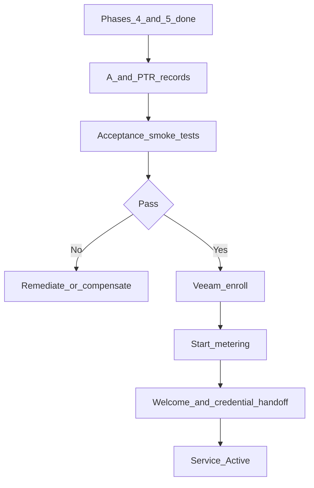

# Phase 6 — DNS, acceptance, and handoff

:::warning[Engagement-only — confidential]

Internal / vendor–client review. Not general product documentation.

:::

**CMP posture:** **Partial** — metering, notifications, and portal access are **Available**. PowerDNS record APIs are **Available** but **not** auto-wired from VM/IP create. Veeam subscription + dashboard are **Available**; VM add/manage for backup is **manual**. Acceptance smoke-test gate is **Custom**.

**Prev:** [Phase 5 — Add-ons](/engagements/datamount/phase-5-addons) · **Next:** [Day-2 and lifecycle](/engagements/datamount/day-2-and-lifecycle)

---

## DataMount ideal

After infrastructure and optional add-ons: create DNS, run smoke tests, enroll backup, start metering, and deliver secure access so the customer self-manages VMs in CMP.

---

## Steps

| # | System | Action | Detail | CMP posture |
|---|---|---|---|---|
| 6.1 | PowerDNS | A / PTR records | Create for public IPs / hostnames; delete on offboard | **Partial** — APIs Available; **no** auto from VM/IP provision today (**Discuss** automation depth) |
| 6.2 | CMP | Acceptance smoke tests | Probe DNAT, VPN, F5 VIP as ordered | **Custom** |
| 6.3 | Veeam | Enroll VMs / policy | Auto enroll on first boot per document | **Partial** — subscription + dashboard **Available**; VM add/manage **manual**; auto enroll **Custom** |
| 6.4 | CMP | Metering | Start vCPU, RAM, storage, IP, bandwidth meters | **Available** |
| 6.5 | CMP | Welcome / notifications | Portal access, status emails | **Available** — [Notifications](/platform-features/notifications) |
| 6.6 | CMP | Secure credential handoff | One-time secure link + VPN pack if ordered | **Partial / Discuss** — portal access Available |
| 6.7 | Customer / CMP | Self-service VMs | Deploy from catalog / VPC blueprint plane | VM path **Partial** (VCD mapping); blueprint plane **Custom** |

---

## DNS (CMP today)

| Capability | Status |
|---|---|
| PowerDNS as orchestrator | **Available** — [PowerDNS](/orchestrators/powerdns/) |
| Create / manage records via API | **Available** |
| Auto-create A/PTR when VM or IP is provisioned | **Not today** — operational or future workflow step |
| Auto-delete on offboarding | **Discuss** (should be part of [Offboarding](/engagements/datamount/offboarding) automation) |

---

## Veeam (CMP today)

| Capability | Status |
|---|---|
| Customer buys Veeam subscription | **Available** |
| Veeam dashboard access | **Available** |
| Add VMs / day-to-day backup management | **Manual** |
| Auto enroll / restore / DR orchestration | **Custom** |

Related product docs: [Veeam orchestrator](/orchestrators/veeam/) · [Veeam features](/orchestrator-features/veeam/).

---

## Smoke-test examples

| Probe | When |
|---|---|
| Public IP / DNAT reachability | Always if public IP allocated |
| F5 VIP HTTP/HTTPS health | If F5 add-on |
| IPSec / SSL VPN connect | If VPN add-on |
| Default deny east-west (negative test) | Optional micro-seg check |

Fail → remediate within workflow or compensate and alert (do not mark Active).

On success → service **Active**; lifecycle continues in [Day-2 and lifecycle](/engagements/datamount/day-2-and-lifecycle).
