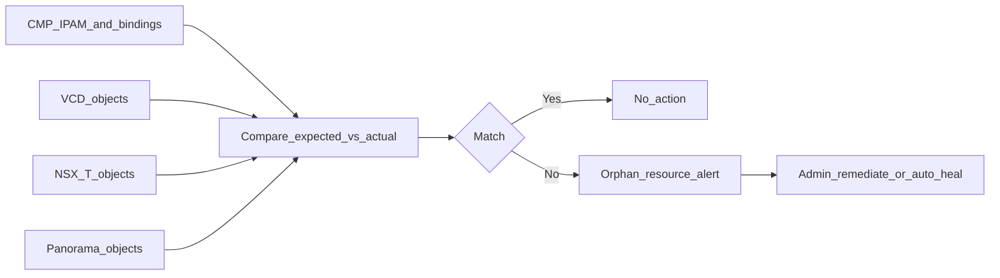

# Phase 8 — Reconciliation (ongoing)

**CMP posture:** **Custom** — periodic drift detection and orphan-resource alerting across CMP IPAM, VCD, NSX-T, and Panorama is not in product today.

This phase is **ongoing**, not per-order. It runs on a schedule and on demand after provisioning or offboarding.

**Prev:** [Phase 7 — Compute](/engagements/datamount/phase-7-compute) · **Next:** [Day-2 and lifecycle](/engagements/datamount/day-2-and-lifecycle)

---

## Purpose

Periodically compare CMP's IPAM and workflow state against VCD, NSX-T, and Palo Alto's actual state. A mismatch (for example, CMP shows an IP released but Palo Alto still has a NAT rule referencing it) should raise an **orphan resource alert**, not silently reuse the IP.

---

## Resource bindings (minimum schema)

| CMP resource ID | VCD object | NSX-T object | Palo Alto object |
|---|---|---|---|
| IP-1001 | IP Space allocation ID | — | Address object |
| PREFIX-1001 | Network ID | T1 / segment | — |
| VRF-1001 | Edge / provider gateway ref | T0 VRF | Virtual router |
| ASN-1001 | — | BGP config | BGP peer |

Every binding is keyed by **Service ID** for teardown in [Offboarding](/engagements/datamount/offboarding).

---

## Admin UX — state-visible list views

CloudStack does not need reconciliation because it owns BGP, VLAN, and subnet allocation end-to-end. DataMount **does** — which makes list-view design critical for manual orphan detection.

Borrow CloudStack's **Guest VLAN** table shape: **Allocation state** (Free/Allocated), **Taken** timestamp, **Account** / **Domain**, and linked network visible per row without opening a detail page. Apply the same columns to CMP `resource_bindings` and IPAM inventory (public IP, private prefix, ASN pair, VRF).

img/screenshots/datamount/cloudstack-guest-vlan.png

See [CloudStack reference patterns — state-visible list views](/engagements/datamount/cloudstack-reference-patterns#2-state-visible-list-views).

---

## Reconciliation checks

| Check | Action on drift |
|---|---|
| CMP IP released, PA NAT still references IP | Alert; block IP reuse until remediated |
| VCD network exists, no CMP subscription | Alert orphan tenant |
| NSX-T segment without Service ID tag | Alert; tag or remove per policy |
| Panorama VSYS without matching CMP record | Alert security isolation risk |
| F5 partition / VS without Service ID | Alert |

---

## Relationship to Day-2

[Day-2 workflow 9.8 — Drift reconciliation](/engagements/datamount/day-2-and-lifecycle) covers the same capability in lifecycle terms. Phase 8 defines the **ongoing operational model**; Day-2 covers triggers (plan changes, manual ops, failed partial offboards).

See [Integrations matrix — orchestration](/engagements/datamount/integrations-matrix#orchestration-capabilities).
