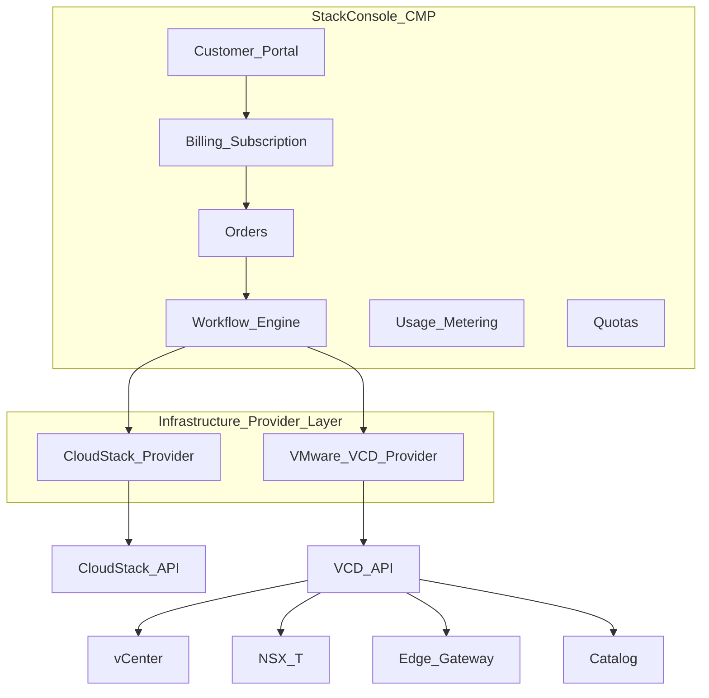

# Provider abstraction — VCD like CloudStack

:::warning[Engagement-only — confidential]

Internal / vendor–client review. Not general product documentation.

:::

**CMP posture:** **Discuss** / **Custom** — treat VMware Cloud Director as another **infrastructure provider**, not a separate product. Billing, portal, orders, quotas, and workflow stay in CMP. Today CMP has **vCenter** API integration; DataMount’s authoritative flow needs a **VCD** provider.

**Hub:** [DataMount Integration Review](/engagements/datamount/) · **Next:** [Registration and billing](/engagements/datamount/registration-and-billing)

---

## High-level architecture

Everything **above** the provider layer remains unchanged. Only the provider implementation differs.

---

## Provider interface (conceptual)

Illustrative operations a shared `InfrastructureProvider` would expose (same shape for CloudStack and VCD):

- Tenant: `createTenant` / `deleteTenant`
- Compute: `createVirtualMachine`, power ops, `resizeVm`, `consoleUrl`
- Images: `listTemplates`
- Network: `createNetwork`, `allocateIp`
- Storage: `createDisk`, attach/detach, snapshots
- Metering: `usage`, `quotas`

Implementations: `CloudStackProvider` (exists today) and `VmwareVcdProvider` (**Custom** for this engagement).

---

## Service mapping

| CloudStack | VMware Cloud Director |
|---|---|
| Domain | Organization |
| Account | Organization user |
| Project | Org VDC |
| Network | Org network |
| VPC | Edge Gateway + routed network |
| VM | Virtual machine |
| Template | Catalog template |
| ISO | Catalog ISO |
| Volume | Independent disk |
| Snapshot | VM snapshot |
| Public IP | Edge Gateway IP |
| Firewall / LB / VPN | NSX-T and/or external Panorama / F5 |

---

## What stays the same in CMP

| Module | Status |
|---|---|
| Billing, subscription, invoices, pricing | Unchanged |
| Usage, quotas, RBAC | Unchanged |
| Customer portal, orders, workflows, audit | Unchanged |

UI difference for customers: infrastructure choice (CloudStack vs VMware Cloud Director). Lists for VMs, snapshots, volumes, templates, billing, and usage stay familiar; backend calls change.

---

## Workflow comparison

| CloudStack path | DataMount VCD path |
|---|---|
| Customer → Billing → CloudStack API → VM | Customer → Billing → **Workflow engine** → network-first (NSX-T → Panorama → BGP gate) → Org → VDC → Edge → Network → then self-service VMs |

DataMount onboarding is explicitly **network-first**. See [Phase 1](/engagements/datamount/phase-1-nsx-t) through [Phase 4](/engagements/datamount/phase-4-vcd).

---

## Suggested VCD module surface (engineering sketch)

Not a committed SoW — orientation for scoping:

- Client: `VcdClient` / auth (token, refresh)
- Services: Organization, VDC, VM, Catalog, Network, Edge Gateway, Disk, Snapshot, Usage
- Persistence mirrors CloudStack-style tables: orgs, VDCs, edge gateways, networks, catalogs, vApps, VMs, disks, snapshots, tasks, usage, API logs

### Delivery phases (engineering, not DataMount onboarding phases)

| Eng phase | Focus |
|---|---|
| Foundation | Provider interface, VCD auth, Org, VDC |
| Compute | VM lifecycle, catalog, console, snapshots, disks |
| Networking | Org networks, Edge, NAT, firewall, IP |
| Billing & usage | Usage collection into existing CMP billing |
| Advanced | NSX-T orchestration, LB, VPN, backup, full automation workflows |

---

## Metering into existing billing

Collect CPU, RAM, storage, network, snapshots, public IPs, independent disks — same billing engine path used for CloudStack usage.
