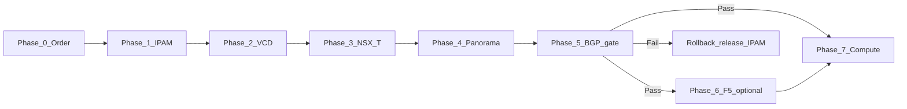

# DataMount — Statement of Work (SoW)

<div class="no-print">

**Hub:** [DataMount Integration Review](/engagements/datamount/) · **Architecture:** [Confirmed architecture](/engagements/datamount/architecture) · **Timeline:** [Milestones and timeline](/engagements/datamount/milestones-and-timeline)

</div>

This page defines **scope boundaries**, **required workflows**, and **deliverable workstreams** for the DataMount engagement. Workstreams show **where one body of work ends and another begins** — default is one integrated programme unless both parties agree to phased delivery.

:::important[How to use this document]

- **SoW boundaries** — what is in / out of scope for StackConsole delivery
- **Workstreams (WS-0 … WS-9)** — scope boundaries showing what each area delivers and depends on (not separate projects by default)
- **Phase workflow** — customer onboarding sequence with hard gates and rollback rules
- **Acceptance criteria** — sign-off tests per workstream

Detailed step tables live on each [phase page](/engagements/datamount/#workflow-map). This SoW does not duplicate them — it defines **what must be delivered** and **where one project ends and another begins**.

:::

---

## 1. Confirmed architecture (client sign-off)

These decisions are **locked** for SoW scoping. See [Confirmed architecture](/engagements/datamount/architecture) for full detail.

### 1.1 API integration strategy

| Item | Confirmed |
|---|---|
| **Primary integration** | **VCD API (OAuth 2.0)** — use for all tenant-level operations VCD supports |
| **Supplemental integration** | **Direct NSX-T Manager API (v4.2.0)** — only for operations **not exposed through VCD** |
| **Security perimeter** | **Physical Palo Alto** managed via **Panorama API** (REST + XML) — no VM-Series |
| **Overall pattern** | VCD API + direct NSX-T API (where required) + Panorama API |

**VCD handles** (via VCD API): Organization, VDC, NSX-T-backed Edge Gateway, VDC networks, VM lifecycle, catalog, IP Space implementation of CMP allocations.

**Direct NSX-T API required** for provider-level operations VCD does not expose:

| NSX-T operation (direct API) | Not available through VCD API |
|---|---|
| **T0 VRF provisioning** | Dedicated VRF per customer on shared T0; two ASNs for Active-Active BGP — provider infrastructure |
| **BGP configuration (NSX-T ↔ Palo Alto)** | T0 VRF BGP peering with Panorama-managed VSYS — configured on both sides |
| **BGP route validation gate** | Mandatory gate before compute: query NSX-T route table — T1 prefixes visible at T0, BGP sessions **Established** with Palo Alto |

### 1.2 API integration map (authoritative)

```
StackConsole CMP
├── VCD API (OAuth 2.0)
│    └── Org, VDC, NSX-T-backed Edge Gateway, VDC networks, VM lifecycle, catalog
├── NSX-T Manager API (v4.2.0)
│    └── T0 VRF, T1 Gateway, BGP, segments, NAT, route-table queries (BGP gate)
└── Palo Alto Panorama API
     └── Per-customer VSYS, zones, VR, BGP to T0 VRF, NAT, policies, IPSec/SSL VPN, commit-and-push
```

VCD manages **tenant-level** compute networking via **VCD API**. **Direct NSX-T Manager API** is used in parallel only for provider-level routing constructs that VCD does not expose.

### 1.3 IP management (no external IPAM)

| Item | Confirmed |
|---|---|
| External IPAM (Infoblox, NetBox, etc.) | **Not in scope** — not deployed at DataMount |
| System of record | **StackConsole Internal IP Manager** (CMP module) |
| Workflow references to “external IPAM” | Read as **StackConsole Internal IP Manager** — functional requirements unchanged |

**Required capabilities from StackConsole IP management:**

| # | Requirement | SoW owner |
|---|---|---|
| 1 | **Public IP pool management** — track allocations per tenant; release on offboarding | **WS-1** |
| 2 | **Private subnet allocation** — dedicated private subnet per customer from defined space; no overlap between tenants | **WS-1** |
| 3 | **Atomic reservation** — at order confirmation, reserve public IP(s), private subnet, and ASN pair in **one transaction** (no race on concurrent orders) | **WS-1** |
| 4 | **Release on offboarding** — return all IP/subnet allocations to pool immediately for reuse | **WS-1** + **WS-8** |

StackConsole confirms delivery of all four as **custom development** (not available in CMP product today). UX/object-model target: [CloudStack reference patterns](/engagements/datamount/cloudstack-reference-patterns).

---

## 2. Master provisioning workflow

Authoritative sequence for **customer onboarding**. Each phase is a bounded deliverable; failure triggers **compensating rollback** in reverse order.



| Phase | Name | Primary workstream | Hard gate |
|---|---|---|---|
| **0** | Customer order (portal) | WS-7 | — |
| **1** | Atomic IPAM reservation | **WS-1** | Must complete before any infra API calls |
| **2** | VCD Org / VDC / Edge / networks | **WS-2** | Implements CMP IPAM allocations in VCD IP Space |
| **3** | NSX-T T0 VRF, T1, BGP, NAT | **WS-3** | Direct NSX-T API only |
| **4** | Panorama VSYS, VR, BGP, NAT, policy | **WS-4** | Physical PA; commit-and-push serialization |
| **5** | BGP validation gate | **WS-5** | **Blocks Phase 7** until Established + routes visible |
| **6** | F5 LB / WAF (if ordered) | **WS-6** | After Phase 5 pass; optional add-on |
| **7** | VM deploy + handoff | **WS-2** + **WS-8** | Only after Phase 5 pass |
| **8** | Reconciliation (ongoing) | **WS-8** | Drift detection by Service ID |

**Rollback rule (on failure after Phase 1):**

```
Panorama → NSX-T → VCD → Release IPAM → Order = Failed → Billing refund/credit
```

Phase detail: [Phase 0](/engagements/datamount/phase-0-customer-order) through [Phase 8](/engagements/datamount/phase-8-reconciliation).

---

## 3. Workstream decomposition

Workstreams define **scope boundaries**: deliverables, dependencies, and phase mapping. **Default:** all workstreams are in scope as **one programme** (Package A). Optional packages B–E apply only if explicitly agreed.

| ID | Workstream | Depends on | Delivers | Phase / doc |
|---|---|---|---|---|
| **WS-0** | Orchestration foundation | — | Workflow engine, idempotency (Service ID / Workflow Instance ID), async poll pattern, audit, rollback framework | [Integrations matrix](/engagements/datamount/integrations-matrix) |
| **WS-1** | Internal IPAM & ASN | WS-0 (reservation hooks) | Public pools, private subnets, ASN pairs, atomic reserve/release, VRF-scoped overlap validation, admin UI | [Phase 1](/engagements/datamount/phase-1-ipam-reservation), [Admin §2.2](/engagements/datamount/admin-setup) |
| **WS-2** | VCD connector | WS-1 (allocations), WS-0 | VCD 10.6 OAuth connector: Org, VDC, Edge Gateway, networks, catalog, VM lifecycle | [Phase 2](/engagements/datamount/phase-2-vcd), [Phase 7](/engagements/datamount/phase-7-compute) |
| **WS-3** | NSX-T direct API | WS-1 (ASN/subnet metadata) | T0 VRF, T1, segments, BGP (NSX side), NAT, route-table queries | [Phase 3](/engagements/datamount/phase-3-nsx-t) |
| **WS-4** | Palo Alto Panorama | WS-1, WS-3 (BGP peers) | VSYS, zones, VR, BGP (PA side), NAT, policies, VPN, commit queue | [Phase 4](/engagements/datamount/phase-4-panorama) |
| **WS-5** | BGP validation gate | WS-3, WS-4 | Mandatory poll-and-validate gate; compensating saga on fail | [Phase 5](/engagements/datamount/phase-5-bgp-gate) |
| **WS-6** | F5 BIG-IP | WS-5 pass; architecture TBD | VS, pools, WAF, SSL; optional per order | [Phase 6](/engagements/datamount/phase-6-f5) |
| **WS-7** | CMP baseline (portal + billing) | — | Registration, KYC, packages, rate cards, payment, portal | [Registration](/engagements/datamount/registration-and-billing), [Phase 0](/engagements/datamount/phase-0-customer-order) |
| **WS-8** | Day-2, offboarding, reconciliation | WS-1–WS-4 minimum | VM lifecycle, teardown order, IP/ASN release, drift checks | [Day-2](/engagements/datamount/day-2-and-lifecycle), [Offboarding](/engagements/datamount/offboarding), [Phase 8](/engagements/datamount/phase-8-reconciliation) |
| **WS-9** | Ancillary integrations (optional) | WS-7 / WS-8 | Odoo outbound, Veeam automation, DNS A/PTR automation | [Integrations matrix](/engagements/datamount/integrations-matrix) |

:::tip[Example boundary — IPAM (WS-1)]

If parties choose **phased delivery**, IPAM is an **example** of a scope boundary that could be signed off before infra connectors — not a pre-declared separate project:

- Delivers admin UI, pool management, atomic reservation API, and release semantics before VCD, NSX-T, or Panorama connectors must be complete
- Other workstreams **consume** IPAM outputs (metadata pack from Phase 1) via WS-0 hooks
- Can UAT independently: concurrent order tests, overlap validation, offboarding release

Under **Package A (default)**, IPAM is part of the integrated programme.

Minimum scope if Package B is agreed: WS-0 (reservation hooks only) + **WS-1** + admin configuration ([Admin setup §2.2](/engagements/datamount/admin-setup)).

:::

---

## 4. In scope / out of scope

### 4.1 In scope (StackConsole delivery)

| Area | Boundary |
|---|---|
| **CMP orchestration** | End-to-end Phases 0–8 as documented; idempotent, auditable, compensating rollback |
| **Internal IPAM** | Four confirmed IP requirements (§1.3); no Infoblox/NetBox integration |
| **VCD 10.6 connector** | Org/VDC/Edge/network/VM — replaces vCenter-only path for DataMount |
| **NSX-T 4.2 direct API** | Provider-level T0 VRF, BGP, NAT, route queries — used where VCD API does not expose the operation |
| **Panorama (physical PA)** | REST + XML API; per-customer VSYS; commit-and-push with serialization |
| **BGP gate** | Mandatory before compute; direct NSX-T + Panorama validation |
| **Admin one-time setup** | Pools, ASNs, rate cards, provider credentials — [Admin setup](/engagements/datamount/admin-setup) |
| **Customer portal flows** | Order → provision → handoff (customer does not see VRF/BGP internals) |
| **Offboarding** | Reverse teardown + IPAM release + reconciliation |
| **E2E testing & UAT support** | Per [Milestones M12–M14](/engagements/datamount/milestones-and-timeline) |

### 4.2 Out of scope (DataMount / third-party responsibility)

| Area | Boundary |
|---|---|
| **Physical infrastructure** | Palo Alto hardware, Panorama deployment, NSX-T cluster, VCD installation, F5 appliances |
| **External IPAM** | Infoblox, NetBox, or any non-CMP IPAM — **explicitly excluded** |
| **NSX-T service insertion / VM-Series** | Not used — Palo Alto is physical via Panorama; NSX-T ops go through VCD API where supported, else direct NSX-T API |
| **Panorama → device push failures on PA hardware** | StackConsole handles CMP-side compensation; physical device remediation is operations |
| **Odoo ERP inbound triggers** | CMP → Odoo outbound only; Odoo never triggers provisioning |
| **Customer-operated DNS/registrar** | Unless WS-9 DNS automation is contracted |
| **VPC Plane 2 (declarative blueprint)** | A separate, advanced multi-tier blueprint/DAG engine — **not** the Phases 0–8 workflow in this SoW. That imperative workflow is **Plane 1** and is **in scope**. Plane 2 would add declarative multi-tier topologies, parallel VM fan-out, and self-healing; it is a **separate programme** unless explicitly added |
| **24×7 managed SOC on Palo Alto policies** | Policy content approval remains DataMount security team |

### 4.3 Contingent scope (requires confirmation before SoW lock)

This section is the **single source of truth** for F5 (WS-6) gating. Package A (§7) and [M10 timeline](/engagements/datamount/milestones-and-timeline) follow the same rule.

| Area | Blocker | Default if not confirmed by kickoff |
|---|---|---|
| **F5 (WS-6)** | [F5 architecture questions](/engagements/datamount/architecture#f5--open-architecture-questions) open | F5 stays listed in Package A's workstream table (§3) as a placeholder, but **no F5 build work starts** and **no F5 dates count on the critical path** (M10) until the questions are answered. If still unanswered at kickoff, F5 converts automatically to a **Package E** add-on, priced and scheduled separately |
| **Veeam auto-enroll / DR** | Veeam API + VCD backup model | Manual VM backup (CMP partial today) |
| **Odoo (WS-9)** | Odoo version + event schema | Excluded |
| **DNS automation (WS-9)** | Auto A/PTR on provision/offboard | PowerDNS manual / operational |

---

## 5. Required workflows (summary)

Full step tables are on each phase page. This section states **mandatory behaviour** for SoW acceptance.

### 5.1 Order → provision

| Step | Mandatory behaviour |
|---|---|
| Order confirmed | Workflow Instance ID + Service ID assigned; capacity pre-check (ASN, public IP, private subnet) |
| Phase 1 | **Single atomic transaction** — all three resource types reserved or none |
| Phases 2–4 | Async **request → task → poll → validate**; VCD IP Space implements CMP allocations only |
| Phase 5 | Query NSX-T routes + BGP state; **no Phase 7** until pass |
| Phase 7 | VM deploy only after gate pass (and optional F5 if ordered) |
| Odoo | Async outbound; never blocks provisioning |

### 5.2 Failure and rollback

| Failure point | Required compensation |
|---|---|
| Phase 1 fail | No charge; no downstream API calls |
| Phase 2–4 fail | Reverse created objects in reverse order; release IPAM |
| Phase 5 fail | Reverse Panorama → NSX-T → VCD (as needed); release IPAM; refund/credit |
| Panorama commit/push partial fail | Documented compensating actions — [open item](/engagements/datamount/architecture#open-items-before-final-sign-off) |

### 5.3 Offboard

| Step | Mandatory behaviour |
|---|---|
| Teardown order | VM → F5 → Panorama → NSX-T → VCD → **IPAM release** → ASN release |
| IPAM | Public IPs and private subnet **immediately available** for reuse |
| Reconciliation | No orphaned objects by Service ID — [Phase 8](/engagements/datamount/phase-8-reconciliation) |

---

## 6. Acceptance criteria (per workstream)

| Workstream | Acceptance tests (minimum) |
|---|---|
| **WS-1 IPAM** | (1) Admin defines public pool + private space + ASN ranges. (2) Two concurrent orders cannot double-allocate. (3) Atomic reserve returns metadata pack. (4) Offboard releases all resources to **AVAILABLE**. (5) VRF-scoped private subnet overlap rejected. |
| **WS-2 VCD** | Org/VDC/Edge created from Phase 1 metadata; IP Space matches CMP allocations; VM deploy after BGP gate. |
| **WS-3 NSX-T** | T0 VRF + T1 + BGP (NSX side) per customer; route table query API used by gate. |
| **WS-4 Panorama** | VSYS + VR + BGP (PA side) + commit-and-push; serialized commits under concurrent orders. |
| **WS-5 BGP gate** | Blocks compute when peer Down or routes missing; passes when Established + prefixes visible. |
| **WS-6 F5** | VS/pool/WAF per order (scope per confirmed F5 architecture). |
| **WS-7 Baseline** | Registration → KYC → package purchase → order record with correct entitlements. |
| **WS-8 Lifecycle** | Full offboard E2E; reconciliation report shows zero orphans. |
| **E2E programme** | Single happy-path order through all phases in staging; failure-injection tests per [M12](/engagements/datamount/milestones-and-timeline). |

---

## 7. Delivery packaging options

| Package | Workstreams included | When to use |
|---|---|---|
| **A — Full programme (default)** | WS-0 through WS-8, with **WS-6 (F5) gated per §4.3**; + E2E/UAT (WS-9 as agreed) | **Standard SoW** — single ~12-week integrated delivery — [Milestones](/engagements/datamount/milestones-and-timeline) |
| **B — IPAM first** | WS-0 (minimal) + **WS-1** + admin setup | **Optional phasing only** — if parties agree to deliver IPAM boundary first (see example in §3) |
| **C — Infra connectors** | WS-2 + WS-3 + WS-4 + WS-5 | **Optional phasing only** — after WS-1 is complete |
| **D — CMP baseline only** | WS-7 | **Optional phasing only** — portal/billing without multi-system provisioning |
| **E — Add-ons** | WS-6 (if not confirmed by kickoff — see §4.3), WS-9 items | Optional items when architecture/API confirmed |

Unless Package B, C, or D is explicitly selected and signed, **Package A applies** and all core workstreams are one integrated programme.

---

## 8. Open items (SoW blockers)

These remain **outside** the locked decisions in §1 and must close before final SoW signature:

| # | Item | Affects |
|---|---|---|
| 1 | [F5 architecture](/engagements/datamount/architecture#f5--open-architecture-questions) | WS-6 scope and timeline |
| 2 | Panorama commit/push partial-failure compensation design | WS-4 acceptance |
| 3 | Customer self-service zone boundaries within VSYS | WS-4 portal UX |
| 4 | Veeam / Odoo / DNS depth for WS-9 | Optional scope |
| 5 | VPC Plane 2 (declarative blueprint) | Explicit exclusion unless added |
| 6 | Timeline start-date anchor — reconcile [Milestones](/engagements/datamount/milestones-and-timeline) "Week 1" against the June 2026 reference date in DataMount's v1.4 source document | Confidence of all absolute dates in the timeline |

**Closed (no longer open for SoW):**

- Palo Alto deployment model (physical + Panorama, no VM-Series) — §1.1
- VCD API first; direct NSX-T Manager API where VCD does not expose the operation — §1.1
- Internal IPAM as system of record (four requirements) — §1.3

Workshop tracker: [Discovery questions](/engagements/datamount/discovery-questions).

---

## Related

- [DataMount hub](/engagements/datamount/)
- [Confirmed architecture](/engagements/datamount/architecture)
- [Milestones and timeline](/engagements/datamount/milestones-and-timeline)
- [Integrations matrix](/engagements/datamount/integrations-matrix)
- [Admin setup](/engagements/datamount/admin-setup)
