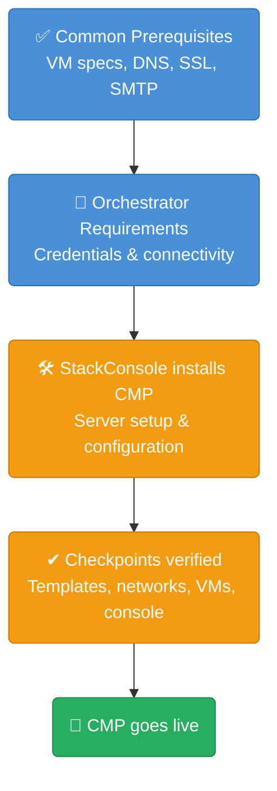

# Orchestrator Requirements Overview

After completing the [common prerequisites](/installation/prerequisites), you need to provide orchestrator-specific access and configuration details. Each orchestrator has its own credentials, connectivity, and setup checkpoints.

## Select Your Orchestrator

| Orchestrator | Credentials Required | Special Requirements |
|---|---|---|
| [Apache CloudStack](/installation/orchestrator-requirements/cloudstack) | DomainAdmin user | Templates, services enablement, KVM snapshots |
| [VMware vSphere](/installation/orchestrator-requirements/vmware) | Read-only + API user | vCenter folder structure, 31 specific permissions, ESXi console ports |
| [OpenStack](/installation/orchestrator-requirements/openstack) | Horizon admin | API service endpoints, project/domain IDs |
| [Proxmox VE](/installation/orchestrator-requirements/proxmox) | Root-level admin | OS templates as per Proxmox template requirements |
| [CEPH](/installation/orchestrator-requirements/ceph) | Admin user | S3 endpoint, zone configuration |
| [PowerDNS](/installation/orchestrator-requirements/powerdns) | API key | v4.8.3+, API + DNSSEC enabled |
| [Keycloak SSO](/installation/orchestrator-requirements/keycloak) | Admin credentials or client credentials | Realm setup, redirect URIs |

:::info
CEPH and PowerDNS are standalone integrations — they are not tied to any specific compute orchestrator and can be added alongside any of the above.
:::

## How This Works

## Related

- [Prerequisites & System Requirements](/installation/prerequisites)
- [CMP Server Installation](/installation/server-installation)
- [Initial Super Admin Setup](/installation/initial-setup)
