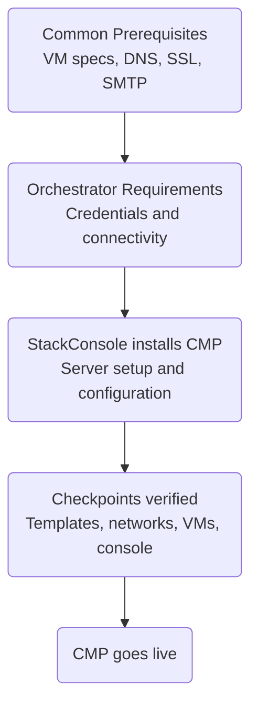

# Orchestrator Requirements Overview

After completing the [common prerequisites](/installation/prerequisites), provide orchestrator-specific access and configuration. Each orchestrator has its own credentials, connectivity, and setup checkpoints.

Shared install topics (VM sizing, DNS, SSL, SMTP, logos) live under prerequisites and domain/DNS — each orchestrator page links to those pages.

## Select your orchestrator

| Orchestrator | Credentials required | Special requirements |
|---|---|---|
| [Apache CloudStack](/installation/orchestrator-requirements/cloudstack) | DomainAdmin user | Templates (Featured + Public), services, CloudStack quotas |
| [VMware vSphere](/installation/orchestrator-requirements/vmware) | Read-only + API user | **vSphere 8.0.1.0+**; custom role; ESXi console ports |
| [OpenStack](/installation/orchestrator-requirements/openstack) | Horizon admin | API endpoints, project/domain IDs, AZ consistency |
| [Proxmox VE](/installation/orchestrator-requirements/proxmox) | API user + [permissions in Connecting](/orchestrators/proxmox/connecting#configure-proxmox-permissions) | Templates, public/private networks |
| [CEPH](/installation/orchestrator-requirements/ceph) | Admin user | Public S3 endpoint, ≥1 zone |
| [Veeam (VSPC)](/installation/orchestrator-requirements/veeam) | Company Administrator + REST API key | VSPC 9.1, public API + portal URLs |
| [PowerDNS](/installation/orchestrator-requirements/powerdns) | **API endpoint + API key + port**, and **NS list** (ns1, ns2, …) | v4.8.3+; prepare API/DNSSEC yourself — only those values are shared with StackConsole |
| [Keycloak SSO](/installation/orchestrator-requirements/keycloak) | Admin or client credentials | Realm, redirect URIs |
| [DIGIO KYC](/installation/orchestrator-requirements/digio) | DIGIO client credentials | India only; sandbox + workflows |

:::info

CEPH, Veeam (VSPC), and PowerDNS are standalone integrations — they are not tied to a specific compute orchestrator and can be added alongside any of the above.

:::

## How this works

```mermaid
flowchart TD
    A("Common Prerequisites\nVM specs, DNS, SSL, SMTP") --> B("Orchestrator Requirements\nCredentials and connectivity")
    B --> C("StackConsole installs CMP\nServer setup and configuration")
    C --> D("Checkpoints verified\nTemplates, networks, VMs, console")
    D --> E("CMP goes live")
```

## Related

- <a href="/installation/prerequisites" target="_blank" rel="noopener noreferrer">Prerequisites & System Requirements</a>
- <a href="/installation/hosting-topology" target="_blank" rel="noopener noreferrer">Choosing a Hosting Topology</a>
- <a href="/installation/prerequisites#domain-name--url" target="_blank" rel="noopener noreferrer">Domain Name / URL</a>
- [Payment Gateways](/billing/payment-gateways/)
