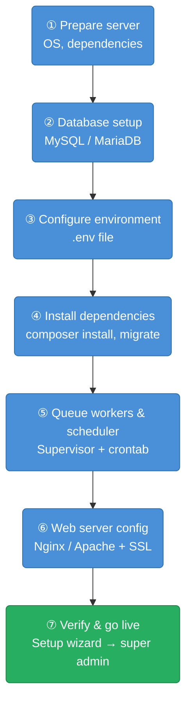

# CMP Server Installation

This page covers the server-side installation of CMP. Complete [Prerequisites & System Requirements](/installation/prerequisites) before proceeding.

## Installation Overview



---

## Step 1 — Prepare the Server

```bash
sudo apt update && sudo apt upgrade -y
sudo apt install -y nginx mysql-server redis-server php8.1-fpm \
  php8.1-mysql php8.1-redis php8.1-mbstring php8.1-xml \
  php8.1-curl php8.1-zip php8.1-bcmath composer nodejs npm
```

---

## Step 2 — Database Setup

```sql
CREATE DATABASE cmp_db CHARACTER SET utf8mb4 COLLATE utf8mb4_unicode_ci;
CREATE USER 'cmp_user'@'localhost' IDENTIFIED BY 'strong_password';
GRANT ALL PRIVILEGES ON cmp_db.* TO 'cmp_user'@'localhost';
FLUSH PRIVILEGES;
```

---

## Step 3 — Environment Configuration

Copy the example environment file and fill in your values:

```bash
cp .env.example .env
```

Key variables to configure:

| Variable | Description |
|---|---|
| `APP_URL` | Full URL of your CMP frontend (e.g. `https://portal.yourcompany.com`) |
| `API_URL` | Full URL of the API (same as `APP_URL` for single-domain, else separate) |
| `DB_HOST`, `DB_DATABASE`, `DB_USERNAME`, `DB_PASSWORD` | Database credentials |
| `REDIS_HOST` | Redis server host |
| `MAIL_*` | SMTP / mail configuration for notifications |
| `QUEUE_CONNECTION` | Set to `redis` for production |

See [Environment Variables Reference](/installation/env-variables) for the full list.

---

## Step 4 — Install Dependencies & Migrate

```bash
composer install --no-dev --optimize-autoloader
php artisan key:generate
php artisan migrate --force
php artisan db:seed --class=InitialDataSeeder
php artisan storage:link
```

---

## Step 5 — Queue Workers & Scheduler

**Add to crontab** (`crontab -e`):

```bash
* * * * * cd /var/www/cmp && php artisan schedule:run >> /dev/null 2>&1
```

**Set up Supervisor** for queue workers (`/etc/supervisor/conf.d/cmp-worker.conf`):

```ini
[program:cmp-worker]
command=php /var/www/cmp/artisan queue:work redis --sleep=3 --tries=3 --max-time=3600
autostart=true
autorestart=true
numprocs=2
```

Then reload Supervisor:

```bash
sudo supervisorctl reread
sudo supervisorctl update
sudo supervisorctl start cmp-worker:*
```

---

## Step 6 — Nginx Configuration

```nginx
server {
    listen 80;
    server_name portal.yourcompany.com;
    root /var/www/cmp/public;
    index index.php;

    location / {
        try_files $uri $uri/ /index.php?$query_string;
    }

    location ~ \.php$ {
        fastcgi_pass unix:/var/run/php/php8.1-fpm.sock;
        fastcgi_param SCRIPT_FILENAME $realpath_root$fastcgi_script_name;
        include fastcgi_params;
    }
}
```

:::info
After configuring Nginx, enable HTTPS — see [SSL / TLS Setup](/installation/ssl-tls).
:::

---

## Step 7 — Verify Installation

- Visit `https://portal.yourcompany.com` — the setup wizard or login page should appear
- Proceed to [Initial Super Admin Setup](/installation/initial-setup)

---

## Related

- [Domain & DNS Configuration](/installation/domain-dns)
- [SSL / TLS Setup](/installation/ssl-tls)
- [Initial Super Admin Setup](/installation/initial-setup)
- [Environment Variables Reference](/installation/env-variables)
