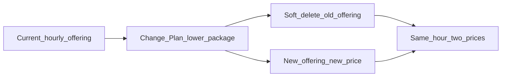

# VM Downgrade

**VM Downgrade** lets a customer move an existing VM to a **lower** compute plan (CPU / memory) through **Change Plan**.

**Applicable providers:** CloudStack, OpenStack

:::danger[Strict requirements]

VM Downgrade is available **only** when **all** of the following are true:

| Requirement | Required value |
|---|---|
| **Billing cycle** | **Hourly** only — not monthly or other cycles |
| **Enable Override Disk Offering** (Cloud Provider Setup) | **Yes** |
| **Enable Change Plan** (Cloud Provider Setup) | **Yes** |
| Global setting **`downgrade_vm`** | **`true`** |

If **override disk** is not enabled, or the VM is **not hourly**, or **`downgrade_vm`** is **`false`**, downgrade is **not applicable**.

:::

## Prerequisites (admin)

Update these settings before customers can downgrade.

### 1. Cloud Provider Setup — Enable Change Plan

**Path:** Cloud Provider setup / Provider Config for the CloudStack or OpenStack provider.

**Enable Change Plan**

*Required for downgrade.* Set to **Yes**.

| Value | Effect |
|---|---|
| **Yes** | Change Plan (including downgrade to a lower package) is available for this provider |
| **No** | Change Plan is not offered for this provider |

Related: [OpenStack — Enable Change Plan](/orchestrators/openstack/connecting#wizard-step-2--provider-config) · CloudStack Provider Config on [Connecting](/orchestrators/cloudstack/connecting)

### 2. Cloud Provider Setup — Enable Override Disk Offering

**Enable Override Disk Offering**

*Required for downgrade.* Set to **Yes**.

Downgrade is supported only when storage is **not** bundled inside the compute offering — compute-only packages with override disk. With override disk **No** (storage bundled in compute), VM downgrade is **not** supported.

Related: [CloudStack — override disk](/orchestrators/cloudstack/offering-sync-and-packages/virtual-machine#compute-only-with-override-disk-recommended) · [OpenStack — override disk](/orchestrators/openstack/offering-sync-and-packages/virtual-machine)

:::danger[Do not change Override Disk mid-lifecycle]

**Enable Override Disk Offering** is an infrastructure decision for the cloud provider setup. Do **not** turn it on or off later for a live environment — changing it in between can affect **existing customers and resources**.

- Decide **Yes** (compute-only + override disk) or **No** (storage bundled) during **initial** Cloud Provider Setup, before production packages and VMs.
- If this setting is currently **No** / **false** and you need VM Downgrade, **contact the StackConsole team** before making any change. Do not flip the flag yourself on a running deployment.

:::

### 3. Global settings — `downgrade_vm`

**Path:** CMP global settings

**`downgrade_vm`**

*Required.* Set to **`true`**.

| Value | Effect |
|---|---|
| **`true`** | Downgrade via Change Plan is allowed (subject to hourly + override disk + Enable Change Plan) |
| **`false`** | Downgrade VM is **not** applicable — even if Change Plan and override disk are enabled |

:::warning[`downgrade_vm` must be true]

If **`downgrade_vm`** is **`false`**, customers cannot downgrade. Enable Change Plan alone is not enough.

:::

## Applicable billing cycles

| Billing cycle | Downgrade |
|---|---|
| **Hourly** | Supported |
| Monthly / other cycles | **Not supported** |

Only VMs created (or billing) on an **hourly** cycle can use VM Downgrade.

## How it works

1. Customer opens the VM → **Overview → Settings → Change Plan**
2. Selects a **lower** plan than the current offering and confirms the update
3. CMP **soft-deletes** the current offering and creates a **new** offering with the new plan and billing
4. For the hour in which the change happens, the customer is billed at **two rates** for that single hour — old price until the change time, new price after

### Billing example (same hour, two prices)

Suppose the VM is on a plan priced **12** (hourly) and the customer downgrades to a plan priced **8**.

- Change time: **11:15**
- **11:00 → 11:15** — charged at **12** (previous offering)
- **11:15 → 12:00** — charged at **8** (new offering)

Example resources: a VM with **8 CPU** and **32 GB** memory can be moved to a lower CPU/RAM package through the same Change Plan path when all prerequisites above are met.

## Customer path

**Path:** VM details → **Overview → Settings → Change Plan** → select a lower plan → update

## Checklist

* [ ] Provider is **CloudStack** or **OpenStack**
* [ ] **Enable Change Plan** = **Yes** on the cloud provider setup
* [ ] **Enable Override Disk Offering** = **Yes** on the cloud provider setup
* [ ] Global **`downgrade_vm`** = **`true`**
* [ ] Target VM uses **hourly** billing
* [ ] Customer selects a **lower** plan via Change Plan

## Related

* [Virtual Machine](/orchestrator-features/cloudstack/virtual-machine/)
* [CloudStack — Virtual Machine packages](/orchestrators/cloudstack/offering-sync-and-packages/virtual-machine)
* [OpenStack — Virtual Machine packages](/orchestrators/openstack/offering-sync-and-packages/virtual-machine)
* [Billing cycles — Hourly](/billing/billing-cycles/hourly)
* [Stoppable services](/billing/stoppable-services) — also works best with override disk
