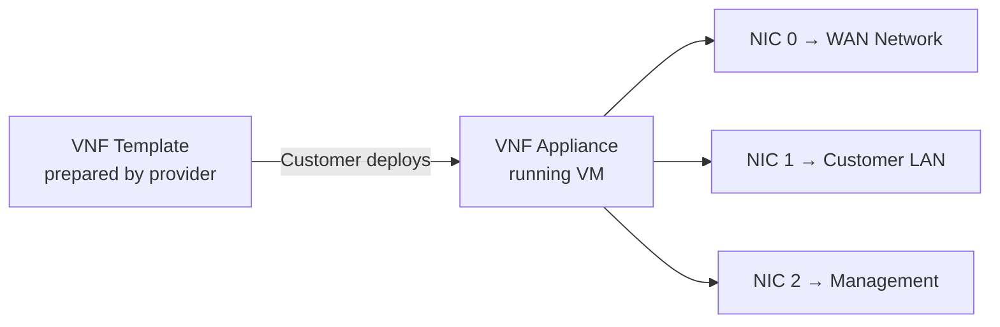
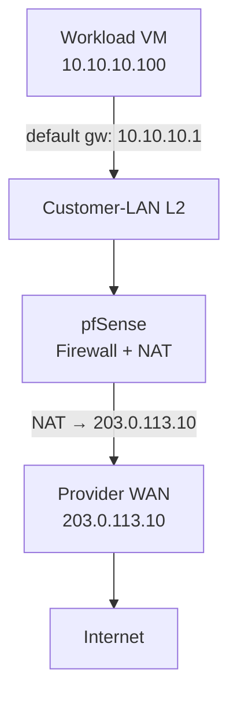
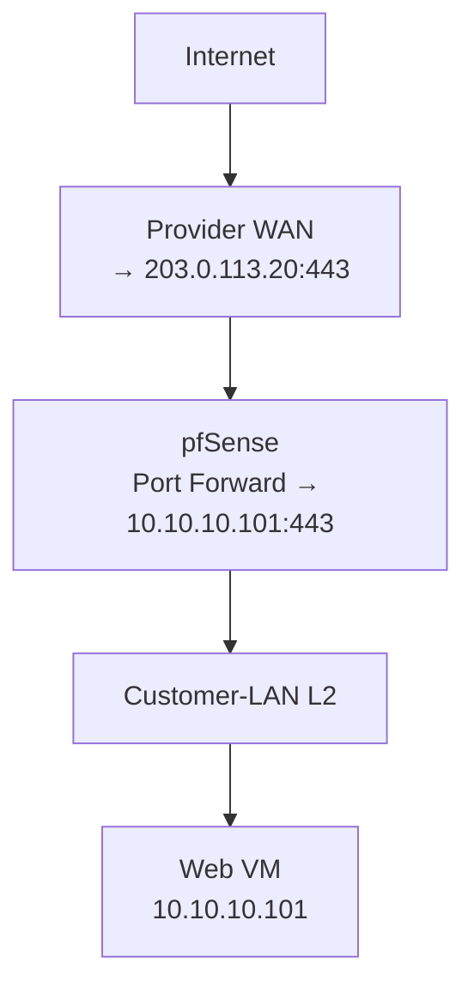

# VNF Appliances (Virtual Network Functions)

CloudStack 4.20+ supports **Virtual Network Functions (VNFs)** — virtualized network services such as routers, firewalls, and load balancers that run as specially configured VMs inside CloudStack.

This section covers how providers prepare VNF templates and how customers deploy and use VNF appliances through CMP.

:::important[Provider prepares — customer deploys]

The cloud provider configures the physical networks, VLANs, CloudStack network offerings, and the VNF template (including NIC role definitions). The customer then deploys the appliance, maps its interfaces to the available networks, and configures the VNF software itself (e.g. pfSense firewall rules, NAT, DHCP).

:::

---

## What is a VNF in CloudStack?

CloudStack represents a VNF using two distinct constructs:

| Construct | Description |
|---|---|
| **VNF Template** | A VM template enriched with VNF-specific metadata: NIC role definitions, device ordering, access methods, and vendor information. Created and managed by the provider. |
| **VNF Appliance** | The running VM instance deployed from a VNF Template. The customer deploys it, maps each NIC to a CloudStack network, and then configures the appliance software. |



### Key conceptual point — workload VMs do NOT "select" the VNF

CloudStack does **not** present a "Select pfSense as firewall" option when creating a regular VM. The relationship is established entirely through network topology:

1. The VNF LAN NIC is attached to a CloudStack network (e.g. `Customer-LAN`).
2. Workload VMs are also attached to that same `Customer-LAN`.
3. The workload VM's **gateway** is set to the VNF's LAN IP address.

Traffic flows through the VNF because the routing table points to it — not because CloudStack automatically inserts it.

```
                pfSense VNF
              LAN IP: 10.10.10.1
                      │
               Customer-LAN (L2)
                      │
          ┌───────────┴───────────┐
          │                       │
        VM1                      VM2
   10.10.10.100              10.10.10.101
   gw: 10.10.10.1            gw: 10.10.10.1
```

---

## Recommended initial architecture

The simplest and most clearly defined pfSense-as-firewall topology uses three CloudStack networks:

```
Internet
    │
Provider WAN Network  ← VLAN 100 / 203.0.113.0/24
    │
pfSense WAN NIC (203.0.113.10)
    │
┌───┴──────────────┐
│   pfSense VNF    │
│  Firewall + NAT  │
└───────────────┬──┘
                │
pfSense LAN NIC (10.10.10.1)
                │
Customer-LAN  ← VLAN 200 / 10.10.10.0/24
                │
    ┌───────────┼───────────┐
    │           │           │
   VM1         VM2         VM3
10.10.10.100  .101        .102
```

> **Note:** IP addresses and VLAN IDs above are examples only. Use your actual network plan.

### Network summary

| Network | Type | VLAN (example) | CIDR (example) | Purpose |
|---|---|---|---|---|
| `Provider-WAN` | Shared / L2 | 100 | 203.0.113.0/24 | pfSense upstream / internet uplink |
| `Customer-LAN` | **L2** | 200 | 10.10.10.0/24 | Workload VMs + pfSense LAN |
| `VNF-Management` | Isolated / Shared | 300 | 10.20.0.0/24 | Admin access to pfSense UI |

### Why L2 for Customer-LAN?

An **L2 Network** in CloudStack does **not** deploy a virtual router. This means:

- CloudStack does not automatically provide DHCP, NAT, or a gateway.
- pfSense becomes the sole gateway for VMs on that segment.
- There is no risk of a CloudStack Virtual Router "competing" with pfSense as the gateway.

:::warning[Isolated network gotcha]

If workload VMs are placed on a standard **Isolated Network**, CloudStack's Virtual Router automatically becomes the gateway. Traffic goes:

```
VM → CloudStack Virtual Router → Internet
```

…and pfSense is bypassed entirely. Use L2 for the Customer LAN when pfSense should be the gateway.

:::

---

## Network type comparison for VNF architectures

| Feature | **L2 Network** | **Isolated Network** | **Shared Network** | **VPC** |
|---|---|---|---|---|
| CloudStack Virtual Router | **No** | Yes | Optional | Yes |
| DHCP (CloudStack) | No — external | Yes | Yes | Yes |
| NAT (CloudStack) | No — external | Yes | No | Yes |
| Gateway (CloudStack) | No — external | Yes | No | Per tier |
| Suitable for pfSense-as-gateway | **Yes** | Requires deliberate routing | Depends | Advanced only |
| Complexity | Low | Medium | Medium | High |
| pfSense traffic bypass risk | None | High if misconfigured | Medium | High |

### VPC — advanced use case only

A CloudStack VPC already has its own virtual router providing gateway, NAT, and routing for each tier. Placing pfSense into a VPC requires service-chaining or explicit static routing to redirect traffic through the VNF. This is an advanced architecture and should be treated as a separate deployment profile from the basic WAN → pfSense → L2 LAN model.

---

## Traffic flows

### Outbound (VM → Internet)



### Inbound (Internet → published service)



---

## Responsibility matrix

| Task | Provider | Customer |
|---|---|---|
| Physical VLAN / switch config | ✅ | — |
| CloudStack physical networks | ✅ | — |
| CloudStack network offerings | ✅ | — |
| Provider-WAN / Customer-LAN / Management networks | ✅ | — |
| Persistent network (if applicable) | ✅ | — |
| VNF template upload | ✅ | — |
| VNF NIC definitions and ordering | ✅ | — |
| VNF metadata / access methods | ✅ | — |
| VNF template validation / testing | ✅ | — |
| Deploy VNF appliance | Platform | ✅ |
| Map VNF NICs to networks | Template guides | ✅ |
| pfSense WAN/LAN/DHCP configuration | — | ✅ |
| Firewall rules in pfSense | — | ✅ |
| NAT / port forwarding in pfSense | — | ✅ |
| Workload VM deployment | Platform | ✅ |
| Gateway setting on workload VM | Documentation | ✅ |
| Application-level configuration | — | ✅ |

---

## Do NOT assume

These are common misconceptions about CloudStack VNF behavior:

| Assumption | Reality |
|---|---|
| Deploying a VNF automatically inserts it into traffic | **False.** Network topology and VM gateway settings must route traffic through it. |
| Selecting a VNF template configures pfSense firewall rules | **False.** CloudStack deploys the VM; the customer configures the software. |
| A VM automatically uses pfSense as its gateway | **False.** The VM's gateway must explicitly point to the pfSense LAN IP. |
| L2 network automatically provides DHCP | **False.** An external DHCP server (pfSense, physical) must provide it. |
| VPC automatically sends traffic through pfSense | **False.** VPC has its own VR; explicit routing/service-chaining is required. |
| VNF metadata configures pfSense's internal policies | **False.** VNF details are for deployment/access discovery only. |
| Two NICs create routing automatically | **False.** IP forwarding and routing rules must be configured inside pfSense. |

---

## Pages in this section

| Page | Audience | Description |
|---|---|---|
| [Provider Guide](./provider-guide) | Admin / Provider | Prepare physical network, CloudStack networks, VNF template, NIC definitions, and validation checklist |
| [pfSense Deployment Guide](./pfsense-deployment) | Customer | Deploy pfSense VNF, configure WAN/LAN, attach workload VMs, test connectivity |

---

## Related

- [L2 Network](/orchestrator-features/cloudstack/networks/l2-network)
- [Isolated Network](/orchestrator-features/cloudstack/networks/isolated-network)
- [VPC Network](/orchestrator-features/cloudstack/networks/vpc-network)
- [Networks overview](/orchestrator-features/cloudstack/networks/)
- [CloudStack Features](/orchestrator-features/cloudstack/)
- [CloudStack 4.22 VNF documentation](https://docs.cloudstack.apache.org/en/4.22.0.0/adminguide/networking/vnf_templates_appliances.html)
