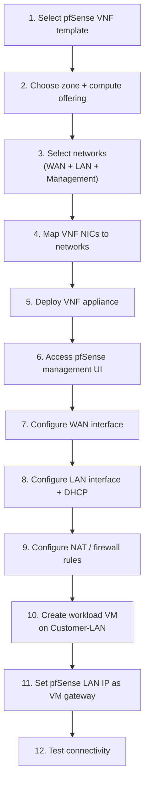

import ArchitectureDiagram from '@site/src/components/ArchitectureDiagram';

# pfSense Deployment Guide

This guide walks customers through deploying a pfSense VNF firewall in CloudStack and connecting workload VMs through it.

:::important[Audience]

This page is for **end customers** deploying pfSense as a firewall. Your cloud provider must have already published a pfSense VNF template and the required CloudStack networks before you begin. See the [Provider Guide](./provider-guide) for prerequisites.

:::

---

## Architecture you will build

```
                 Internet
                    │
          Provider WAN Network
          (203.0.113.0/24)
                    │
          pfSense WAN NIC
          203.0.113.10/24
                    │
          ┌─────────┴──────────┐
          │     pfSense VNF    │
          │  Firewall + NAT    │
          └─────────┬──────────┘
                    │
          pfSense LAN NIC
             10.10.10.1/24
                    │
           Customer-LAN (L2)
           10.10.10.0/24
                    │
        ┌───────────┼───────────┐
        │           │           │
      web01       app01       db01
  10.10.10.100  10.10.10.101 10.10.10.102
    gw:10.10.10.1  gw:10.10.10.1  gw:10.10.10.1
```

> IP addresses and VLAN IDs are examples. Your provider will supply the actual network names and CIDRs.

---

## Customer workflow



---

## Step 1 — Deploy the pfSense VNF appliance

Navigate to **Networking → VNF Appliances → Add VNF Appliance** in CMP (or CloudStack UI).

<ArchitectureDiagram
  src="/img/screenshots/cloudstack-vnf-add-appliance.png"
  alt="CloudStack — Add VNF Appliance page showing zone selection, template, compute offering, networks, and VNF NIC mapping"
/>

### 1.1 Select the VNF template

Select the pfSense VNF template published by your provider.

### 1.2 Select compute offering

Choose a compute offering appropriate for your workload. Minimum recommended:

| Resource | Minimum | Recommended |
|---|---|---|
| vCPU | 1 | 2 |
| RAM | 1 GB | 2 GB |
| Disk | 8 GB | 20 GB |

### 1.3 Select networks

Select the three networks required for a full pfSense deployment:

| Purpose | Network name (example) | Notes |
|---|---|---|
| WAN | `Provider-WAN` | Internet/upstream facing |
| Customer LAN | `Customer-LAN` | Your workload VMs attach here too |
| Management | `VNF-Management` | pfSense admin UI access |

:::tip

Your provider will tell you the exact names of these networks. Do not create your own networks unless the provider has documented that step.

:::

### 1.4 Map VNF NICs to networks

CloudStack presents the VNF NIC mapping screen. Map each NIC role to its corresponding network:

| VNF NIC | Role | Select this network |
|---|---|---|
| NIC 0 | WAN | `Provider-WAN` |
| NIC 1 | LAN | `Customer-LAN` |
| NIC 2 | MGMT | `VNF-Management` |

:::important[NIC mapping must match the template definition]

The template provider has defined the expected NIC roles. Map them exactly as documented — swapping WAN and LAN will cause pfSense to boot with incorrect interface assignments and internet traffic will not work.

:::

<ArchitectureDiagram
  src="/img/screenshots/cmp-vnf-create-server-nic-mapping.png"
  alt="CMP — Create a Server page showing network selection and VNF NIC mapping (Device ID, Name, Required, Management NIC, Network columns)"
/>

### 1.5 Deploy

Click **Deploy**. Wait for the appliance status to show **Running**.

---

## Step 2 — Access the pfSense management UI

Once deployed, CloudStack provides access information based on the management NIC's network type. Your provider will document the exact method. Common options:

| Management network type | How to reach pfSense UI |
|---|---|
| Isolated network | CloudStack acquires a public IP + creates firewall rules automatically. Use the provided URL. |
| Shared / L2 management network | Connect from within the management VLAN. Use the management NIC IP directly. |

Default pfSense access:

- **URL:** `https://<management-ip>/`
- **Default username:** `admin`
- **Default password:** `pfsense` (change immediately)

---

## Step 3 — Configure WAN interface

In pfSense, go to **Interfaces → WAN**.

| Setting | Example value | Notes |
|---|---|---|
| IPv4 Configuration Type | Static | Or DHCP if the provider's WAN network provides DHCP |
| IPv4 Address | `203.0.113.10` | Your WAN IP from the provider |
| Subnet Mask | `24` | |
| Upstream Gateway | `203.0.113.1` | Provider's gateway — confirm with your provider |

Click **Save → Apply Changes**.

Test WAN: In pfSense, go to **Diagnostics → Ping** and ping `8.8.8.8` from the WAN interface. If it replies, your upstream connectivity is working.

---

## Step 4 — Configure LAN interface

In pfSense, go to **Interfaces → LAN**.

| Setting | Example value |
|---|---|
| IPv4 Configuration Type | Static |
| IPv4 Address | `10.10.10.1` |
| Subnet Mask | `24` |

Click **Save → Apply Changes**.

### 4.1 Enable DHCP server on LAN (recommended for initial setup)

Go to **Services → DHCP Server → LAN**.

| Setting | Example value |
|---|---|
| Enable | ✅ Checked |
| Range — From | `10.10.10.100` |
| Range — To | `10.10.10.200` |
| Gateway | `10.10.10.1` |
| DNS Servers | `8.8.8.8`, `8.8.4.4` (or pfSense itself) |

Click **Save**.

---

## Step 5 — Configure NAT

pfSense uses **Automatic Outbound NAT** by default, which creates a NAT rule for your LAN subnet to go out through the WAN.

Verify: **Firewall → NAT → Outbound** — you should see an automatic rule for `10.10.10.0/24` → WAN address.

If not, switch to **Hybrid Outbound NAT** and add:

| Field | Value |
|---|---|
| Interface | WAN |
| Source | `10.10.10.0/24` |
| Translation | Interface address |

---

## Step 6 — Configure firewall rules

By default, pfSense's LAN interface allows all outbound traffic. Verify under **Firewall → Rules → LAN**:

- A default "allow LAN to any" rule exists.
- WAN rules: by default, inbound traffic from WAN is blocked (stateful firewall — return traffic for established connections is allowed automatically).

For the initial test, the defaults work. Tighten firewall rules based on your security requirements.

---

## Step 7 — Create workload VM

Create a normal VM in CMP/CloudStack.

### 7.1 Select network

On the network selection screen, select **`Customer-LAN`** — the same L2 network attached to pfSense's LAN NIC.

:::warning[Do NOT select an Isolated Network]

If you attach your workload VM to a regular Isolated Network (not `Customer-LAN`), CloudStack's Virtual Router will be the gateway — not pfSense. Traffic will bypass your firewall entirely.

:::

:::warning[VNF does not appear as a network option]

pfSense will **not** appear in the network selection list when creating a VM. That is expected and correct. Simply select `Customer-LAN` and the topology handles the routing relationship.

:::

### 7.2 IP configuration

If pfSense DHCP is enabled, the VM will receive:

| Setting | Value |
|---|---|
| IP | `10.10.10.100` (or next available) |
| Gateway | `10.10.10.1` (pfSense LAN IP) |
| DNS | As configured in pfSense DHCP |

If using static IPs, configure the VM OS:

```bash
# Example — Ubuntu (adjust interface name)
ip addr add 10.10.10.100/24 dev eth0
ip route add default via 10.10.10.1
echo "nameserver 8.8.8.8" >> /etc/resolv.conf
```

---

## Step 8 — Test connectivity

Run these tests in order:

### 8.1 VM → pfSense LAN

```bash
ping 10.10.10.1
```

✅ Expected: replies from pfSense LAN IP.

**If this fails:** Check that the VM is on `Customer-LAN`, that pfSense LAN interface is up, and that there are no Layer 2 issues on the network.

### 8.2 VM → pfSense WAN

```bash
ping 203.0.113.10
```

✅ Expected: replies (if pfSense firewall allows ICMP from LAN to WAN — may need to enable in pfSense).

### 8.3 VM → Internet

```bash
ping 8.8.8.8
curl https://google.com
```

✅ Expected: internet reachable through pfSense NAT.

**If ping works but curl fails:** Check DNS. Try `curl https://8.8.8.8` or add a DNS server in pfSense DHCP settings.

### 8.4 Check NAT is working

In pfSense: **Status → Traffic Graphs** or **Diagnostics → States** — you should see active states for your VM's outbound connections.

---

## Step 9 — Port forwarding (publish a service)

To expose a VM service on the internet:

**Example:** Expose `web01` (10.10.10.101) web server on TCP 443.

### 9.1 Ensure a public IP is reachable on pfSense WAN

Confirm with your provider that `203.0.113.20` (or another IP) routes to your pfSense WAN.

### 9.2 Add port forward rule in pfSense

Go to **Firewall → NAT → Port Forward → Add**:

| Field | Value |
|---|---|
| Interface | WAN |
| Protocol | TCP |
| Destination | WAN address (or specific IP) |
| Destination Port Range | 443 |
| Redirect Target IP | `10.10.10.101` |
| Redirect Target Port | 443 |
| Description | `web01 HTTPS` |

Click **Save → Apply Changes**.

pfSense automatically adds a matching firewall rule on WAN.

### 9.3 Traffic flow

```
Internet
    │
203.0.113.20:443
    │
pfSense WAN
    │  NAT/Port Forward
    │
10.10.10.101:443
    │
web01 VM
```

---

## Troubleshooting

### VM cannot ping pfSense LAN (10.10.10.1)

| Check | Action |
|---|---|
| VM is on correct network | Confirm VM is attached to `Customer-LAN` (not an Isolated Network) |
| pfSense LAN interface is up | pfSense UI → Status → Interfaces → LAN: Up? |
| NIC mapping is correct | pfSense may have WAN/LAN swapped — check Interfaces → Assignments |
| VLAN trunking | Confirm the hypervisor host trunks VLAN 200 to both the VM and pfSense |
| pfSense LAN IP | Interfaces → LAN should show `10.10.10.1` |

### VM can ping pfSense but cannot reach Internet

| Check | Action |
|---|---|
| pfSense WAN connectivity | Diagnostics → Ping → ping 8.8.8.8 from WAN interface |
| WAN gateway | Interfaces → WAN → Gateway configured and correct? |
| NAT rule | Firewall → NAT → Outbound — rule for LAN subnet exists? |
| Firewall rules | Firewall → Rules → LAN — allow LAN to any rule exists? |
| DNS | Try `ping 8.8.8.8` vs `ping google.com` to isolate DNS issues |

### pfSense management UI inaccessible

| Check | Action |
|---|---|
| Management NIC network | Is VNF-Management network reachable from your location? |
| CloudStack public IP | Did CloudStack assign and configure a public IP for the management NIC? |
| pfSense HTTPS service | Is the pfSense HTTPS service listening? Try from within pfSense console |
| Firewall / security groups | Check any CloudStack firewall or security group rules on the management network |
| HTTPS port | Default is 443 — provider may have set a different port in VNF metadata |

### Traffic bypasses pfSense

| Check | Action |
|---|---|
| VM default gateway | Is the VM gateway set to `10.10.10.1` (pfSense LAN IP), not some other IP? |
| CloudStack Virtual Router | Is the VM on an Isolated Network (VR is gateway) instead of `Customer-LAN` (L2)? |
| Routing table on VM | `ip route show` — what is the default route? |
| pfSense interface assignment | Are WAN/LAN swapped? pfSense → Interfaces → Assignments |

---

## What pfSense provides vs what CloudStack provides

| Function | Who provides it |
|---|---|
| VM deployment and NIC attachment | CloudStack |
| VNF template and NIC definitions | Provider |
| IP forwarding / routing | pfSense (must be enabled in the OS) |
| DHCP for Customer-LAN VMs | pfSense (configured by customer) |
| NAT / outbound internet | pfSense (Outbound NAT) |
| Firewall rules | pfSense |
| Port forwarding | pfSense |
| VPN (OpenVPN / IPSec / WireGuard) | pfSense |
| DNS resolver | pfSense (optional) |
| High availability / CARP | pfSense + provider network design |
| Public IP assignment | CloudStack + Provider routing |

---

## Related

- [VNF Appliances overview](/orchestrator-features/cloudstack/vnf/)
- [Provider Guide](./provider-guide)
- [L2 Network](/orchestrator-features/cloudstack/networks/l2-network)
- [Isolated Network](/orchestrator-features/cloudstack/networks/isolated-network)
- [VPC Network](/orchestrator-features/cloudstack/networks/vpc-network)
- [CloudStack 4.22 VNF documentation](https://docs.cloudstack.apache.org/en/4.22.0.0/adminguide/networking/vnf_templates_appliances.html)
