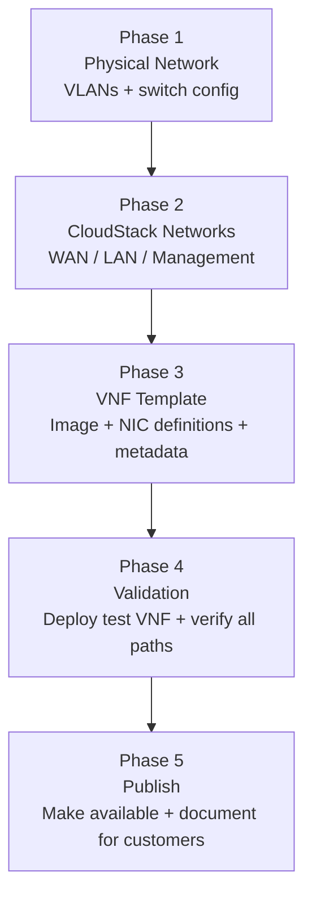

import ArchitectureDiagram from '@site/src/components/ArchitectureDiagram';

# Provider Guide — VNF Setup

This guide covers everything a cloud provider / CloudStack administrator must prepare before customers can deploy VNF appliances.

:::important[Audience]

This page is for **cloud providers and platform administrators**. If you are an end customer deploying pfSense, see the [pfSense Deployment Guide](./pfsense-deployment).

:::

---

## Provider workflow overview



---

## Phase 1 — Physical network preparation

CloudStack cannot make VNF networking work if the underlying physical infrastructure is not correctly prepared. This phase is entirely **outside CloudStack**.

### What must be in place

| Requirement | Details |
|---|---|
| VLANs defined on physical switches | At minimum: WAN VLAN, Customer LAN VLAN, Management VLAN |
| VLAN trunking to CloudStack hosts | All CloudStack hypervisor hosts that run VNF appliances must trunk the required VLANs |
| Upstream connectivity | WAN VLAN must route to upstream internet or datacenter edge |
| IP addressing plan | Provider defines CIDR ranges per VLAN |

### Example VLAN plan

| VLAN | Name | Example CIDR | Purpose |
|---|---|---|---|
| 100 | Provider-WAN | 203.0.113.0/24 | pfSense upstream / internet |
| 200 | Customer-LAN | 10.10.10.0/24 | Workload VMs + pfSense LAN |
| 300 | VNF-Management | 10.20.0.0/24 | pfSense admin UI access |

> **Note:** These are illustrative examples. Use your actual network plan. VLAN IDs and CIDRs are arbitrary — the critical requirement is that the hypervisor hosts carrying these VMs can actually pass this traffic.

### Separation of responsibilities by layer

```
Physical switch config       ← Network team / datacenter
Hypervisor VLAN trunking     ← CloudStack host config / admin
CloudStack physical network  ← CloudStack admin
CloudStack guest network     ← CloudStack admin (creates network offerings/networks)
pfSense configuration        ← Customer (after VNF is deployed)
```

---

## Phase 2 — CloudStack network creation

Create three CloudStack guest networks that map to the VLANs above.

### Network A — Provider-WAN

This is the upstream-facing network for pfSense's WAN NIC.

| Setting | Example value |
|---|---|
| Name | `Provider-WAN` |
| Type | Shared or L2 (provider decides based on topology) |
| VLAN | 100 |
| Purpose | Connect pfSense WAN to upstream / internet |
| Access | Provider-controlled; customers select it during VNF deployment |

### Network B — Customer-LAN

This is the workload network. Both the pfSense LAN NIC and workload VMs attach here.

| Setting | Example value |
|---|---|
| Name | `Customer-LAN` |
| Type | **L2** (recommended) |
| VLAN | 200 |
| Purpose | pfSense LAN + customer workload VMs |
| Gateway | None from CloudStack — pfSense provides it |

:::tip[Why L2 here?]

An L2 network does **not** deploy a CloudStack Virtual Router. This prevents the VR from becoming the gateway and bypassing pfSense. The customer configures pfSense to be the DHCP server and gateway for this segment.

:::

### Network C — VNF-Management

Provides administrative access to the pfSense UI.

| Setting | Example value |
|---|---|
| Name | `VNF-Management` |
| Type | Isolated (preferred) or Shared |
| VLAN | 300 |
| Purpose | Access pfSense HTTPS UI |
| Notes | CloudStack can automatically configure public IP + firewall rules if using Isolated network with the management NIC |

### Persistent networks

For VNF/firewall appliances, consider marking the Customer-LAN as a **persistent network**. A persistent network continues to exist even when no workload VMs are attached, which is important when the pfSense appliance should have a lifecycle independent of application VMs.

> CloudStack 4.22 documents persistent networks as networks that can be provisioned even when no instances are running and notes they are useful for physical devices and network appliances.

---

## Phase 3 — Prepare the pfSense VNF template

### Step 1 — Upload or identify the pfSense image

Upload a pfSense image compatible with your CloudStack hypervisor (KVM or VMware). The template must be:

- Registered in CloudStack as a standard VM template first
- Bootable and tested

### Step 2 — Register as a VNF template

In CloudStack, a VNF template is a regular VM template with additional VNF metadata. Use the CloudStack UI or API to:

1. Navigate to the template.
2. Enable the **VNF** option (CloudStack 4.20+).
3. Define VNF NICs.
4. Define VNF Details.

> Refer to the [CloudStack 4.22 VNF documentation](https://docs.cloudstack.apache.org/en/4.22.0.0/adminguide/networking/vnf_templates_appliances.html) for the exact UI path and API parameters.

### Step 3 — Define VNF NICs

VNF NICs define the role of each network interface on the appliance. CloudStack uses these during deployment to present the correct NIC-to-network mapping UI to the customer.

| Device ID | Name | Required | Management | Purpose |
|---|---|---|---|---|
| 0 | WAN | Yes | No | Internet / upstream network |
| 1 | LAN | Yes | No | Customer workload network |
| 2 | MGMT | Yes | Yes | pfSense administration UI |

:::important[NIC ordering is critical]

The `Device ID` determines which CloudStack-assigned network interface maps to which physical NIC inside the pfSense VM. If the order does not match what pfSense expects (e.g. `vtnet0` = WAN, `vtnet1` = LAN), pfSense may boot with WAN/LAN swapped. **Always validate NIC ordering in a test deployment before publishing the template.**

:::

**VNF NIC field reference:**

| Field | Description |
|---|---|
| **Device ID** | Sequential integer starting at 0. Must be consecutive. |
| **Name** | Human-readable label (WAN, LAN, MGMT, DMZ, etc.) |
| **Required** | If true, the customer must select a network for this NIC during deployment. |
| **Management** | If true, CloudStack may use this NIC for automated management access (public IP + firewall rules), depending on the network type. |

<ArchitectureDiagram
  src="/img/screenshots/cloudstack-vnf-add-nic-dialog.png"
  alt="CloudStack — Add VNF nic dialog showing Device ID, Name, Required toggle, and Management NIC toggle"
/>

### Step 4 — Define VNF Details (metadata)

VNF details provide deployment and access metadata.

| Key | Example value | Purpose |
|---|---|---|
| `VENDOR` | `pfSense` | Appliance vendor name |
| `VERSION` | `2.7.2` | Supported version |
| `MAINTAINER` | `YourCloudProvider` | Contact for template issues |
| `ACCESS_METHODS` | `https` | How to reach the management UI |
| `HTTPS_PORT` | `443` | HTTPS port |
| `HTTPS_PATH` | `/` | URL path to management UI |

:::warning[Do not hardcode production credentials]

Do not embed real production passwords in a publicly available VNF template. The template should contain only the metadata needed for deployment and access discovery. Credentials should be generated or provided securely at deployment time, then changed immediately by the customer.

:::

### Step 5 — Management NIC behavior

CloudStack's behavior for the management NIC access depends on the type of network the management NIC is attached to:

| Management NIC network type | CloudStack behavior |
|---|---|
| **Isolated network** | Can automatically acquire public IP + create static NAT + firewall rules for configured `ACCESS_METHODS` |
| **Shared with security groups** | Can create required security group rules |
| **L2 / VPC tier / Shared without security groups** | Does **not** automatically configure management access rules |

This means: if you want CloudStack to automatically expose the pfSense management UI, use an **Isolated network** for the management NIC.

---

## Phase 4 — Validation checklist

Before publishing the VNF template for customers, validate a complete test deployment.

### Template validation

- [ ] Correct OS image and architecture
- [ ] Template marked as VNF
- [ ] NIC Device IDs are consecutive (0, 1, 2)
- [ ] NIC ordering matches pfSense interface order (`vtnet0/em0` = WAN, etc.)
- [ ] Management NIC correctly marked
- [ ] Required NICs correctly marked
- [ ] VNF metadata (vendor, version, access methods) populated

### Network validation

- [ ] `Provider-WAN`: pfSense WAN NIC receives IP / connectivity confirmed
- [ ] `Customer-LAN`: pfSense LAN NIC up and reachable from test VM
- [ ] `VNF-Management`: pfSense HTTPS UI accessible
- [ ] VLAN trunking working on all relevant hosts
- [ ] Outbound NAT: test VM → Internet confirmed
- [ ] Inbound port forwarding: external → test VM confirmed

### Functional validation

- [ ] pfSense boots correctly after VNF deployment
- [ ] Correct interface assignment (WAN ≠ LAN, no swap)
- [ ] DHCP server active on LAN (if provider default config includes it)
- [ ] Routing working (test VM gets internet through pfSense)
- [ ] VM → pfSense LAN: ping ✅
- [ ] pfSense WAN → upstream: ping ✅
- [ ] Stop → start cycle: appliance recovers correctly
- [ ] Reboot: appliance recovers correctly

### Security validation

- [ ] Management UI is not publicly exposed without firewall rules
- [ ] Default credentials changed from template defaults
- [ ] No unnecessary public-facing ports open
- [ ] Logging/monitoring strategy defined

:::note[Two different validations]

"CloudStack VNF deploys successfully" ≠ "pfSense actually routes customer traffic."

Both must be validated separately. The first confirms the CloudStack/CMP deployment pipeline works. The second confirms the network topology is correct and traffic actually traverses pfSense.

:::

---

## Phase 5 — Define supported deployment profiles

Rather than allowing customers to map any arbitrary NIC combination, the provider should document and test specific **VNF deployment profiles**.

| Profile | NICs | Use case |
|---|---|---|
| **Profile 1 — Basic Firewall** | WAN + LAN | Simple internet gateway + firewall |
| **Profile 2 — Firewall + Management** | WAN + LAN + MGMT | Managed firewall with dedicated admin access |
| **Profile 3 — Firewall + DMZ** | WAN + LAN + DMZ + MGMT | Multi-segment with separate DMZ |
| **Profile 4 — HA Firewall** | WAN + LAN + SYNC + MGMT | Active-passive HA (see [Production architecture](#production-architecture)) |

Document each profile with:
- Expected NIC-to-network mapping
- Validated traffic paths
- Customer configuration instructions

---

## Production architecture

After validating the basic architecture, a production pfSense deployment typically includes:

### High availability

A real HA configuration requires careful network design. It is **not** simply "deploy two pfSense VMs."

```
              Internet
                 │
         ┌───────┴───────┐
         │               │
     pfSense-1       pfSense-2
     (Active)        (Passive)
         │               │
         └───────┬───────┘
                 │
          Customer-LAN
                 │
          Workload VMs
```

**Provider responsibilities for HA:**
- CARP/VRRP-capable networks (the sync NIC needs its own VLAN/network)
- Anti-affinity rules to place pfSense-1 and pfSense-2 on different hypervisor hosts
- CloudStack API: use VM placement (anti-affinity groups)

**pfSense responsibilities for HA:**
- CARP virtual IP configuration
- State synchronization (pfsync)
- Failover testing

| HA Component | Responsibility |
|---|---|
| Anti-affinity VM placement | CloudStack admin (anti-affinity groups) |
| SYNC network / VLAN | Provider |
| CARP / VRRP IP | Customer (pfSense config) |
| pfsync state sync | Customer (pfSense config) |
| Failover testing | Customer + Provider validation |

### Resource sizing guidance

| Component | Minimum | Recommended (production) |
|---|---|---|
| vCPU | 1 | 2–4 |
| RAM | 1 GB | 2–4 GB |
| Storage | 8 GB | 20 GB (logs + packages) |
| NICs | 2 (WAN + LAN) | 3 (+ Management) |

---

## CMP automation considerations

The above manual workflow can eventually be automated from CMP. Conceptually:

```
Customer clicks: "Deploy pfSense Firewall"
        │
CMP validates selected zone and network availability
        │
CMP calls CloudStack API: deployVirtualMachine (VNF template)
        │
CMP maps VNF NICs → provider-defined networks
        │
CloudStack provisions appliance
        │
CMP returns management URL and credentials to customer
        │
Customer configures pfSense (manual or CMP-assisted)
```

**What CloudStack API handles:** VM deployment, NIC attachment, public IP allocation (if applicable).

**What CMP must orchestrate:** Network validation, VNF profile selection, credential management, post-deploy guidance.

**What requires pfSense-specific integration:** Automated firewall rule creation, NAT configuration (requires pfSense API — not a CloudStack function).

---

## Related

- [VNF Appliances overview](/orchestrator-features/cloudstack/vnf/)
- [pfSense Deployment Guide](/orchestrator-features/cloudstack/vnf/pfsense-deployment)
- [L2 Network](/orchestrator-features/cloudstack/networks/l2-network)
- [CloudStack Features](/orchestrator-features/cloudstack/)
- [CloudStack 4.22 VNF documentation](https://docs.cloudstack.apache.org/en/4.22.0.0/adminguide/networking/vnf_templates_appliances.html)
