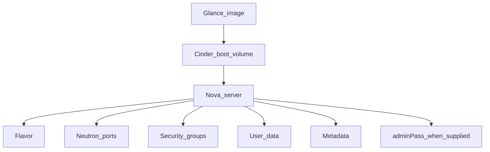
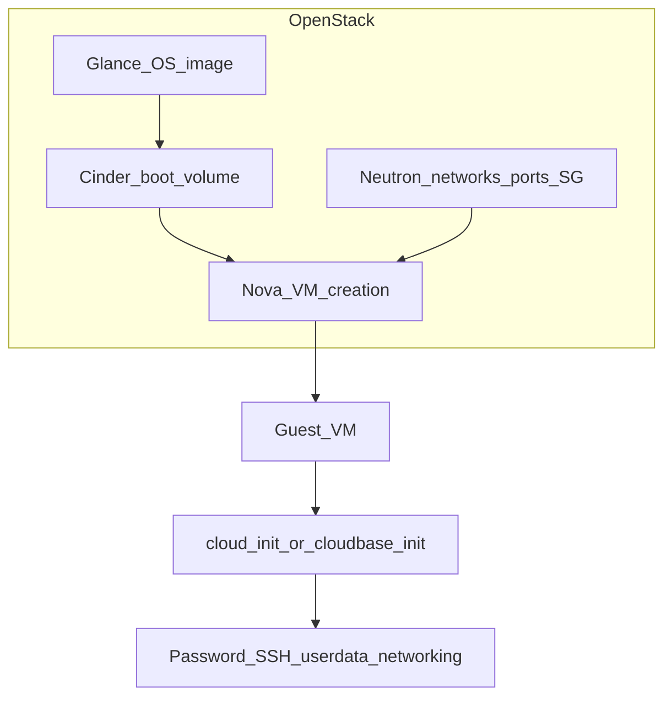
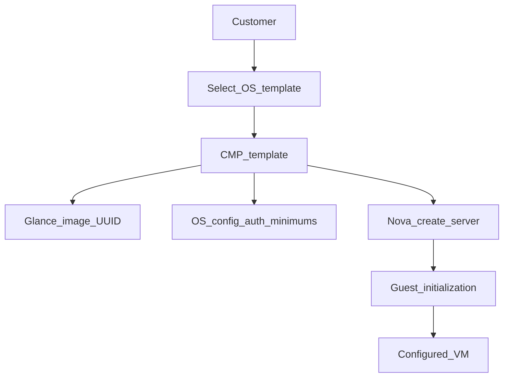

# Preparing CMP-compatible images

Before a Glance image can be used for virtual machine provisioning through StackConsole CMP, prepare it correctly in OpenStack and then [register it in CMP](/orchestrators/openstack/images/configuring-images-at-cmp).

This guide covers image-side requirements, OpenStack considerations, and CMP best practices for Upstream OpenStack, Red Hat OpenStack Platform (RHOSP), Canonical Charmed OpenStack, and Virtuozzo Hybrid Infrastructure (VHI).

The goal is reliable password management, SSH key injection, root disk sizing, startup scripts, Marketplace applications, networking, and guest customization when CMP provisions Nova servers.

:::info[OpenStack vs CloudStack]

CloudStack and OpenStack handle VM images and guest customization differently. CloudStack may rely on password-enabled templates, Public/Featured flags, and ACS UserData services. OpenStack does **not** use those ACS concepts.

CMP primarily relies on Glance images, Nova server creation, Neutron networking, **cloud-init** on Linux, **cloudbase-init** on Windows, the OpenStack metadata service and/or ConfigDrive, Nova `adminPass` where supported, and CMP-generated user-data.

For CloudStack, see [Preparing CMP-compatible templates](/orchestrators/cloudstack/templates/preparing-cmp-compatible-templates).

:::

## How CMP uses the image at provision time

1. Resolves the CMP template to the Glance image UUID (`template_id`)
2. Selects or creates the Nova flavor according to the VM package
3. Creates the server using a block device mapping when boot-from-volume is enabled
4. Creates or attaches Neutron ports from the selected networks/subnets
5. Applies security groups to the ports
6. Passes user-data to the instance
7. Optionally sends `adminPass` as part of the Nova server creation request
8. Boots the instance
9. cloud-init / cloudbase-init processes metadata and user-data inside the guest



## Image requirements summary

| Requirement | Required | Description |
|---|---|---|
| Glance status **active** | Yes | Image must be ready for provisioning |
| Bootable disk image | Yes | Compatible with the target OpenStack compute environment |
| cloud-init for Linux | Yes\* | Required for CMP Linux guest customization through user-data |
| cloudbase-init for Windows | Recommended / Required\* | Required for Windows guest customization through metadata/user-data |
| Metadata or ConfigDrive support | Yes\* | Required for guest initialization that consumes OpenStack metadata |
| Correct `disk_format` | Yes | Must be supported by the deployment / hypervisor |
| Correct firmware mode | Yes | BIOS/UEFI must match the deployment |
| Correct `min_disk` | Recommended | Minimum disk size required to boot |
| Correct `min_ram` | Recommended | Minimum memory required by the image |
| DHCP / network configuration | Recommended | When the guest obtains networking dynamically |
| SSH server | Required for SSH access | `sshd` installed and enabled if SSH is offered |
| VirtIO drivers | Required where applicable | Especially for KVM/QEMU and Windows images |
| Default OS user consistency | Recommended | Should match CMP OS configuration |
| qemu-guest-agent | Recommended | Guest operations and snapshot-related workflows where supported |

\*Required when the corresponding CMP feature depends on guest customization.

## Supported image types

Prefer distribution-provided **cloud images** over installer ISOs:

- Ubuntu, Debian, Rocky Linux, AlmaLinux, CentOS, RHEL cloud images
- Other vendor-provided OpenStack/KVM cloud images

For KVM/QEMU, distributions commonly provide **qcow2** images. Do **not** expose installer ISOs as normal CMP OS templates unless the deployment explicitly supports an install workflow.

## Glance image properties

| Property | Description |
|---|---|
| `id` | Unique UUID of the image |
| `name` | Image name |
| `status` | Current image state |
| `visibility` | Controls image access |
| `disk_format` | Format of the image |
| `container_format` | Image container format |
| `min_disk` | Minimum disk size required to boot |
| `min_ram` | Minimum RAM required to boot |
| `virtual_size` | Virtual disk size, when available |
| `os_distro` | Operating system distribution |
| `os_version` | Operating system version |
| `architecture` | CPU architecture |
| `protected` | Whether deletion protection is enabled |
| `tags` | Operator-defined image tags |

Recommended additional properties where applicable: `os_distro`, `os_version`, `architecture`, `hw_firmware_type`, `hw_machine_type`, `hw_scsi_model`, `hw_rng_model`, `hw_qemu_guest_agent`, `hw_disk_bus`, `hw_scsi_model`. Exact properties depend on the OpenStack deployment, Nova, hypervisor, and image.

### Example: Glance image overview (Horizon)

Horizon **Admin → Compute → Images** shows the UUID, status, format, visibility, and custom properties you need when mapping the image in CMP.


:::tip[What to capture for CMP]

Note the Glance **ID** (UUID), **Status** (`Active`), **Disk Format**, **min_disk** / **min_ram**, visibility, and useful custom properties (for example `hw_qemu_guest_agent`, `os_distro`, `os_version`). CMP stores the UUID — if the image is deleted and recreated, remap the template.

:::

### Image format

Common formats include `qcow2`, `raw`, `vmdk`, `vhd`, `vhdx`, `vdi`, and `iso`. Supported formats depend on the deployment and hypervisor. For KVM/QEMU, **qcow2** and **raw** are common.

### Image status

The image must be **active** before production use. Do not expose an image that is still uploading or importing as a CMP template.

### Image visibility

| Visibility | Description |
|---|---|
| **public** | Available to all projects/users subject to cloud policy |
| **private** | Available only to the owner |
| **shared** | Available to explicitly authorized image members |
| **community** | Readable by users but not always in every default image list |

For provider-managed catalogue images, prefer **public** or appropriately configured **shared** images. CMP should only expose images intentionally mapped into the CMP catalogue.

## cloud-init for Linux

For Linux images, **cloud-init** is the recommended mechanism for consuming OpenStack user-data and metadata:

- cloud-init installed and enabled
- Configured for the target distribution
- Access to OpenStack metadata and/or ConfigDrive
- Ability to create/configure users, install SSH authorized keys, execute user-data
- Functioning network configuration

Example cloud-config (illustrative):

```yaml
#cloud-config

users:
  - name: <username>
    gecos: New User
    sudo: ALL=(ALL) NOPASSWD:ALL
    shell: /bin/bash
    groups: sudo
    lock_passwd: false
    ssh_authorized_keys:
      - <public_key>

chpasswd:
  list: |
    <username>:<password>
  expire: False

ssh_pwauth: true
```

## Metadata service and ConfigDrive

OpenStack provides instance-specific configuration through the **Metadata Service** and **ConfigDrive**. cloud-init can consume:

- Instance metadata
- User-data
- SSH key information
- Vendor data

The metadata service is commonly at the link-local address `169.254.169.254`. ConfigDrive presents metadata through an attached virtual drive when the deployment requires it or when the metadata service is unavailable.

:::important[CMP image requirement]

The image should support at least one metadata delivery mechanism used by your OpenStack deployment. Test with the provider’s actual metadata / ConfigDrive configuration.

:::

## Password injection

### Provider-level authentication policy

| Value | Linux | Windows |
|---|---|---|
| `only_password` | Password required | Password required |
| `only_ssh` | SSH key required | Password-oriented flow |
| `both_required` | Password + SSH key | Password required |
| `any_one_required` | Password or SSH key | Password required |
| `none_required` | Both optional | Both optional |

Exact behaviour follows CMP authentication validation rules. Password complexity is a **CMP** requirement, not a Glance requirement.

### adminPass vs guest password

Nova supports an `adminPass` field on server create. That alone does **not** guarantee the Linux guest password changes — behaviour depends on the deployment, image, guest init, and configuration.

For Linux cloud images, do **not** rely exclusively on `adminPass`. Prefer cloud-init user-data:

```text
CMP password
      │
      ├── Nova adminPass
      │
      └── cloud-init user-data
              │
              ▼
       Guest OS password
```

CMP may also set instance metadata such as `admin_pass`. That is CMP-specific metadata — do not confuse it with a standard OpenStack password mechanism.

### Password method in CMP

| CMP field | Recommended value |
|---|---|
| **How Password will be set?** | **Using Startup Script** |
| **Is Template Password Enabled?** | `true` when password login is offered |
| **Does template support SSH Key using startup script?** | `true` when SSH key injection is offered |

Recommended Linux flow: customer password → CMP → generated cloud-config → Nova user-data → metadata/ConfigDrive → cloud-init → Linux user password.

## Default operating system user

| Operating system | Typical cloud user |
|---|---|
| Ubuntu | `ubuntu` |
| Debian | `debian` |
| Rocky Linux | `rocky` |
| AlmaLinux | `almalinux` |
| RHEL | `cloud-user` |
| CentOS | `centos` |
| openSUSE | `opensuse` |

These are examples — the account must match the image. Username resolution order is typically: username supplied during VM creation (if allowed) → template-level default → Operating System catalogue default.

## SSH key injection

CMP may accept an SSH key from the customer, register it as a Nova keypair when required, and include the public key in CMP-generated cloud-init user-data.

Requirements:

- OpenSSH server installed; SSH service enabled
- cloud-init able to process SSH keys
- Correct user home directory and permissions
- Security groups allowing TCP/22 where required

### SSH password authentication

Many official Linux cloud images disable SSH password authentication by default. If CMP offers password-based SSH login, verify `ssh_pwauth` and guest SSH configuration. Setting a password through Nova or cloud-init does **not** automatically enable SSH password login.

## Root disk and volume sizing

| Concept | Meaning |
|---|---|
| Image size | Actual image data size |
| `virtual_size` | Virtual disk size when available |
| `min_disk` | Minimum disk size required to boot |
| `min_ram` | Minimum RAM required to boot |
| CMP Minimum Storage | CMP-side minimum root disk |
| Root package size | Size of the boot volume created by CMP |
| Flavor disk | Flavor-defined root disk; may be `0` when boot-from-volume is used |

Keep cloud images as small as practical, set `min_disk` correctly, know the virtual disk size, configure CMP **Minimum Storage** accordingly, and test filesystem expansion when using a larger Cinder boot volume.

### Flavor disk and boot-from-volume

When CMP uses `destinationType = volume`, the root disk comes from the Cinder boot volume. CMP may use a flavor whose disk value is `0`. That is a CMP provisioning choice, not a universal OpenStack requirement.

## Networking requirements

CMP creates or attaches Neutron ports for the VM. The guest must bring up its NIC correctly:

- Support DHCP for standard dynamic networking
- Use the distribution’s supported network manager
- Do not hard-code interface names unless stable
- Remove stale MAC-address-specific network configuration
- Include required virtual NIC drivers

## VirtIO drivers

For KVM/QEMU, Linux images normally include VirtIO support (network, block, SCSI where applicable). Windows images require VirtIO drivers **before** capture.

## Firmware: BIOS and UEFI

Image firmware must match the VM configuration. A mismatch (bootloader/partitioning vs firmware) can leave a successfully created VM that does not boot.

## Guest agent: qemu-guest-agent

Install **qemu-guest-agent** on Linux and Windows images on QEMU/KVM where supported. Benefits can include guest interaction, shutdown/reboot, guest information exchange, and filesystem freeze for workflows that use it. Exact behaviour depends on the compute driver and deployment.

## Startup scripts and Marketplace applications

CMP can combine password configuration, SSH keys, template startup scripts, customer startup scripts, Marketplace application scripts, and monitoring scripts into Nova user-data.

For Linux, the guest must process user-data. Scripts should use a valid shebang (for example `#!/bin/bash`) or valid cloud-config. Keep generated user-data within the OpenStack deployment’s request / user-data size limits.

See [Marketplace Apps](/platform-features/marketplace-apps/).

## Windows images

- cloudbase-init installed
- VirtIO drivers installed
- Windows OpenSSH only if intentionally supported
- Metadata / ConfigDrive access
- Password, network, and RDP tested where applicable

CMP treats Windows as a **password-oriented** authentication workflow unless Windows-specific SSH support is explicitly implemented. Do not assume the Linux cloud-init SSH-key workflow works on Windows.

## Image security

Do **not** store in the golden image:

- Hard-coded customer credentials or temporary administrator passwords
- Private SSH keys or cloud provider API credentials
- Customer-specific certificates and configuration
- Persistent MAC address configuration
- Stale cloud-init instance identity

### Cloud-init state before image capture

If you capture from an existing VM, clean cloud-init state using the distribution’s image-building procedure so the next boot initializes as a **new** instance.

## Image replacement and UUIDs

CMP stores the Glance image UUID. Deleting and recreating an image produces a **new** UUID — update the CMP template. Renaming an image does **not** change its UUID.

See [Configuring images in CMP](/orchestrators/openstack/images/configuring-images-at-cmp#manual-configuration-no-auto-sync).

## Test boot checklist

### Basic image validation

- [ ] Image status is **active**
- [ ] Valid disk format; image boots successfully
- [ ] Expected architecture; BIOS/UEFI correct
- [ ] `min_disk` / `min_ram` correct
- [ ] Expected OS metadata

### Linux validation

- [ ] cloud-init installed and enabled
- [ ] Metadata service tested; ConfigDrive tested if used
- [ ] User-data, SSH key, and password tested
- [ ] SSH server enabled; DHCP/network tested
- [ ] VirtIO and qemu-guest-agent tested where required
- [ ] Filesystem expansion tested
- [ ] No hard-coded MAC address
- [ ] Cloud-init state cleaned before final capture

### Windows validation

- [ ] cloudbase-init installed
- [ ] Metadata/ConfigDrive, password, network, VirtIO, RDP tested where applicable

### CMP validation

- [ ] Image mapped to correct zone; template active
- [ ] Correct OS family/version and default username
- [ ] Password method and password-enabled / SSH startup-script options correct
- [ ] Minimum Storage / Memory / CPU configured
- [ ] `vm_auth_requirement` matches supported authentication
- [ ] Security groups allow required access
- [ ] Startup scripts and Marketplace apps tested
- [ ] Console access and end-to-end CMP provisioning tested

## Recommended golden image

A production-ready Linux CMP image should approximately contain:

```text
Operating System
      │
      ├── cloud-init
      ├── OpenSSH server
      ├── VirtIO drivers
      ├── qemu-guest-agent
      ├── Correct network configuration
      ├── Correct bootloader
      ├── Correct BIOS/UEFI configuration
      └── Clean cloud-init state
```

Do **not** include customer passwords, private SSH keys, API credentials, hard-coded MACs, customer-specific configuration, or stale instance identity.

## CMP template user config

| Goal | Password method | Password enabled | SSH via startup script | Recommendation |
|---|---|---|---|---|
| Linux password + optional SSH | Using Startup Script | Yes | Yes | Recommended |
| Linux SSH-only | Using Startup Script | No | Yes | Recommended for SSH-only templates |
| Linux password-only | Using Startup Script | Yes | No | Supported |
| Windows password | As supported by CMP | Yes | No | Use cloudbase-init |
| Marketplace Linux image | Using Startup Script | As required | As required | cloud-init required |

## Best practices

- Prefer official distribution cloud images
- Use cloud-init (Linux) and cloudbase-init (Windows)
- Support metadata service and/or ConfigDrive per deployment
- Set accurate `min_disk` and `min_ram`; test filesystem expansion on larger Cinder volumes
- Remove hard-coded MAC/network configuration; install VirtIO and consider qemu-guest-agent
- Verify BIOS/UEFI compatibility; use a consistent default username per OS family
- Test password and SSH if both are offered; do not rely solely on Nova `adminPass`
- Use CMP **Using Startup Script** password method for Linux cloud images
- Keep Marketplace/startup scripts within user-data limits
- Clean cloud-init state before capturing a reusable golden image; never store secrets
- Remap the CMP template when the Glance UUID changes
- Keep `vm_auth_requirement` consistent with template authentication options
- Validate the full workflow through CMP, not only Horizon

## Common problems

| Symptom | Check |
|---|---|
| VM boots but password does not work | cloud-init, user-data, `ssh_pwauth`, guest username, sshd, Nova `adminPass` behaviour |
| SSH key does not work | cloud-init status, metadata/ConfigDrive, `authorized_keys`, username, sshd, security group TCP/22 |
| VM has no IP address | Neutron port, subnet DHCP, guest network manager, cloud-init networking, VirtIO NIC, security groups |
| VM does not boot after flavor change | CPU architecture, RAM, firmware, VirtIO, disk bus, image properties |
| Fails when root disk smaller than image | Glance `min_disk`, `virtual_size`, CMP Minimum Storage, Cinder volume size |
| Startup script does not execute | cloud-init installed/enabled, metadata/config-drive, user-data received, multipart MIME, shebang, `cloud-init` logs / `cloud-init status --wait` / `journalctl -u cloud-init` |

## Reference architecture



### CMP provisioning model



## Important distinction

| OpenStack concepts | StackConsole CMP concepts |
|---|---|
| Glance image, Nova server, Cinder volume, Neutron network/port, security group, metadata service, ConfigDrive, user-data, `adminPass`, cloud-init / cloudbase-init | CMP template, Operating System catalogue, User Config, Password Method, Template Password Enabled, SSH Key using Startup Script, Minimum Storage/Memory/CPU, `vm_auth_requirement`, Marketplace pipeline, image-to-zone mapping |

Keep these separate when troubleshooting. A CMP template misconfiguration is not automatically an OpenStack image issue, and vice versa.

## Related

* [Configuring images in CMP](/orchestrators/openstack/images/configuring-images-at-cmp)
* [Images overview](/orchestrators/openstack/images/)
* [Connecting CMP to OpenStack](/orchestrators/openstack/connecting)
* [Virtual Machine packages](/orchestrators/openstack/offering-sync-and-packages/virtual-machine)
* [Console access](/orchestrators/openstack/console)
* [OpenStack requirements](/installation/orchestrator-requirements/openstack)
* [Preparing CMP-compatible templates (CloudStack)](/orchestrators/cloudstack/templates/preparing-cmp-compatible-templates) — CloudStack/ACS only

### OpenStack references

* [OpenStack Virtual Machine Image Guide](https://docs.openstack.org/image-guide/)
* [OpenStack Image API v2](https://docs.openstack.org/api-ref/image/v2/index.html)
* [OpenStack Nova Compute API](https://docs.openstack.org/api-ref/compute/)
* [OpenStack Metadata Service](https://docs.openstack.org/nova/latest/admin/metadata-service.html)
