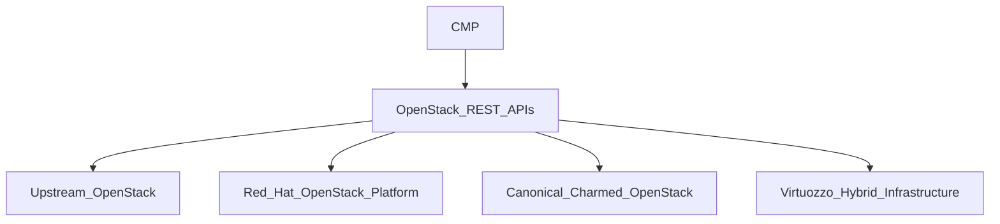

# OpenStack

OpenStack is a supported compute orchestrator in CMP. This section covers **setup** — connecting CMP to OpenStack through packages, quotas, storage, and related configuration.

For customer/admin **feature** docs after setup — including **supported features** and the **roadmap** — see [OpenStack Features](/orchestrator-features/openstack/).

:::danger[Documentation in progress]

Setup pages below are **scaffolded** so content can be filled one by one. Confirm details with the StackConsole team before relying on them for production configuration.

:::

## Supported platforms

CMP uses a **single OpenStack adapter** that talks to the standard **OpenStack REST APIs** (Keystone, Nova, Neutron, Cinder, Glance, Placement, and related services such as Octavia or Magnum when present). That one integration works across community and enterprise OpenStack-based clouds — including Upstream, RHOSP, Canonical Charmed OpenStack, and VHI — rather than separate adapters per distribution.

| Cloud platform | Integration method |
|---|---|
| **Upstream OpenStack** (2025.1 / Epoxy and compatible) | OpenStack REST APIs |
| **Red Hat OpenStack Platform (RHOSP)** | OpenStack REST APIs |
| **Canonical Charmed OpenStack** | OpenStack REST APIs |
| **Virtuozzo Hybrid Infrastructure (VHI)** | OpenStack-compatible REST APIs (Keystone auth and OpenStack CLI/API surface) |

### Upstream OpenStack (reference)

| Field | Value |
|---|---|
| **Cloud platform** | OpenStack |
| **Distribution** | Upstream OpenStack |
| **Release** | **2025.1 (Epoxy)** and compatible later releases |
| **API** | OpenStack REST APIs |
| **API reference** | [OpenStack 2025.1 API references](https://docs.openstack.org/2025.1/api/) |

### Compatibility notes

* **RHOSP** and **Canonical Charmed OpenStack** are enterprise distributions of upstream OpenStack. They implement the same core REST APIs, so CMP works with them when the required services and API versions are available on the deployment. Canonical tracks upstream releases closely and supports the standard OpenStack services.
* **VHI** exposes OpenStack-compatible APIs for cloud services (including standard Keystone authentication). CMP uses the same OpenStack adapter against VHI.
* At **CMP configuration** time, some fields or extra steps can differ by distribution (for example VHI Domain Admin extras). Those differences are documented on [Connecting CMP to OpenStack](/orchestrators/openstack/connecting) as that page is filled in.

## Prerequisites

Complete [OpenStack Requirements](/installation/orchestrator-requirements/openstack) (Horizon or equivalent UI access, API endpoints, AZ consistency, config values) before connecting. Requirements apply to Upstream, RHOSP, Canonical Charmed OpenStack, and VHI unless a distribution-specific note says otherwise.

## Pages in this section

| Page | Purpose | Status |
|---|---|---|
| [Connecting CMP to OpenStack](/orchestrators/openstack/connecting) | Horizon prep + CMP wizard Steps 1–4 (Upstream / RHOSP / Canonical) | Partial |
| [Projects & Credentials](/orchestrators/openstack/projects-and-credentials) | Admin connector vs customer user/password | Partial |
| [Regions & Availability Zones](/orchestrators/openstack/regions) | Add Zone: Region, AZ, Coming Soon, Status | Ready |
| [Images](/orchestrators/openstack/images/) | [Prepare CMP-compatible images](/orchestrators/openstack/images/preparing-cmp-compatible-images) + [configure in CMP](/orchestrators/openstack/images/configuring-images-at-cmp) | Available |
| [OpenStack Packages](/orchestrators/openstack/offering-sync-and-packages/) | Map flavors and services to rate card packages | Stub |
| [Client Registration Flow](/orchestrators/openstack/client-registration) | Register user/project via admin; then customer APIs | Partial |
| [Console Access](/orchestrators/openstack/console) | noVNC / console proxy requirements | Stub |
| [Quota Management](/orchestrators/openstack/quota-management) | OpenStack and CMP quota alignment | Stub |
| [Storage Settings](/orchestrators/openstack/storage-settings) | Volume types / storage categories | Stub |
| [Snapshot & Backup](/orchestrators/openstack/snapshot-backup) | Cinder / backup setup notes | Stub |

## Suggested order

1. Connect OpenStack in CMP  
2. Confirm projects and credentials  
3. Map regions / availability zones  
4. Configure images  
5. Configure packages (flavors, networks, volumes, …)  
6. Quotas, storage settings, console, client registration  
7. Snapshot / backup

## Related

* [OpenStack Requirements](/installation/orchestrator-requirements/openstack)
* [OpenStack Features](/orchestrator-features/openstack/)
* [Supported Orchestrators](/overview/supported-orchestrators)
* [CloudStack Setup](/orchestrators/cloudstack/) — reference structure for this section
* [Architecture Overview](/overview/architecture-overview)
