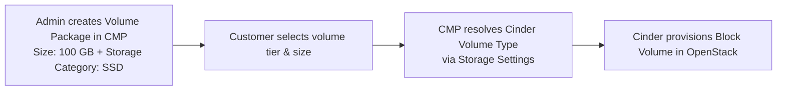

# OpenStack Volume Packages

Volume Packages define CMP block-storage tiers for OpenStack Cinder. They are used when customers select a root-disk size during VM creation, purchase additional block-storage volumes, and select boot/root storage for Kubernetes nodes when disk override is enabled.

Unlike compute packages that map directly to Nova flavors, an OpenStack Volume Package does not require predefined storage offerings from OpenStack. In OpenStack, Cinder provides storage types (volume types) and storage pools; the administrator defines packages in CMP with custom commercial sizes and maps them to a **Storage Category**. CMP then automatically resolves the appropriate Cinder volume type at provisioning time.

**CMP path:** **Settings → Billing Setup → Rate Cards → Default → Packages → Block Storage** (or **Volumes**)

---

## Before You Begin

Ensure the following prerequisites are met before creating and activating volume packages:

* **OpenStack Connection:** The [Cloud Provider Setup](/orchestrators/openstack/connecting) is connected and Block Storage (Cinder) is operational in the target region.
* **Zones Mapped:** Regions and availability zones are correctly mapped in [Regions & Availability Zones](/orchestrators/openstack/regions).
* **Cinder Volume Types:** Target storage types (e.g. `SSD Storage Pool`, `NVMe Storage Pool`, `__DEFAULT__`) exist in OpenStack Cinder for the target zone.
* **Storage Settings:** Storage Categories (e.g. `SSD Storage (NVMe)`, `HDD`) are mapped to Cinder volume types under [Storage Settings](/orchestrators/openstack/storage-settings).
* **Disk Override Enabled:** [Enable Override Disk Offering](/orchestrators/openstack/connecting#wizard-step-2--provider-config) is set to **Yes** in Provider Config so volume packages control VM root disk selection.
* **Glance Images:** Target Glance images have [Minimum Storage](/orchestrators/openstack/images/configuring-images-at-cmp#user-config) aligned so smaller volume packages are filtered out appropriately.
* **Cinder Quotas:** [Quota Management](/orchestrators/openstack/quota-management) ensures sufficient volume count and gigabyte quotas are assigned to tenant projects.

---

## How Volumes Work in CMP and OpenStack

CMP decouples compute and storage. VM packages define CPU and RAM through Nova flavors, while Volume Packages define storage capacity, storage tier, and pricing.

| Use Case | When It Applies | Provisioning Action |
|---|---|---|
| **Root Disk at VM Creation** | When `Enable Override Disk Offering` is set to **Yes** during instance creation. | CMP creates/boots the instance using the selected storage tier and volume size. |
| **Additional Data Volume** | When a customer creates a volume from the Customer Portal under **Block Storage** and attaches it to an instance. | CMP provisions an independent Cinder volume and attaches it to the VM via Cinder API. |
| **Kubernetes Boot Disk** | When deploying a Kubernetes cluster with disk override enabled. | CMP provisions the cluster node boot disks according to the selected volume plan. |



---

## Volume Type Resolution

The OpenStack Volume Package form does not expose a raw Cinder Volume Type dropdown. Instead, the **end customer selects a storage tier** — such as SSD, NVMe, or HDD — through the package they choose in the Customer Portal. CMP then resolves the correct Cinder volume type automatically at provisioning time.

### How it works end-to-end

```
Customer Portal                   CMP                          OpenStack Cinder
──────────────                    ───                          ────────────────
Customer selects               Package has                    Storage Settings
"SSD 100 GB" package  ──────►  Storage Category: SSD  ──────► resolves to:
                               + Zone: us-east-1              SSD Storage Pool
                                                               (volume type)
```

1. **Admin** creates a Volume Package and sets the **Storage Category** (e.g. `SSD Storage (NVMe)`) and **Zone**.
2. **Customer** sees named packages like `SSD 100 GB` or `NVMe 500 GB` — no raw Cinder details are exposed.
3. **CMP** resolves the Cinder volume type at provisioning time using the following priority:

| Priority | Source | Behaviour |
|---|---|---|
| **1 — Primary** | **Storage Settings** (`storage_policy_id`) | Matches the package's **Storage Category** + **Zone** to the configured Cinder volume type policy. |
| **2 — Fallback** | **Default Storage Policy** (`open_stack_default_storage_policy`) | Cloud Provider Setup fallback policy used when no category-specific entry exists for the zone. |

:::tip[Customer experience]
Customers always choose by **storage tier and size** (e.g. *SSD 100 GB* or *NVMe 500 GB*). The underlying Cinder volume type is resolved transparently — customers never see raw OpenStack infrastructure details.
:::


## Configure Volume Packages in CMP

1. Navigate to **Settings → Billing Setup → Rate Cards → Default → Packages → Volumes** (or **Block Storage**).
2. Click **Add Package** (form title: **Create Volumes Package**).
3. Complete each field below in the order shown on the form.
4. Set **Status** to **Active** once validated.
5. Click **Save**.


Each field below matches the **Create Volumes Package** form:

**Package Name**

*Required.* Customer-facing display label that clearly describes the storage tier and capacity — for example, `SSD 80 GB`, `SSD 100 GB`, `NVMe 500 GB`, or `HDD 1 TB`.

**Cloud Provider**

*Required.* Select **OpenStack** (or your specific OpenStack driver, e.g. `OpenStack(alto)`).

**Cloud Provider Setup**

*Required.* Select the connected OpenStack environment to which this package belongs.

**Zone**

*Required.* Select the target OpenStack region/zone where this package is sold. Selecting a zone dynamically populates the available Storage Categories configured for that setup and zone.

Create a separate package entry for each zone even when the storage category and capacity are the same.

**Size (In GB)**

*Required.* Predefined storage size in gigabytes — for example, `80`, `100`, or `500`.

For OpenStack, this value is entered directly on the Volume Package form. There is no predefined disk offering required to populate the size.

**Storage Category**

*Required.* Select the CMP storage tier — for example, `SSD Storage (NVMe)`, `SSD Storage (SSD)`, or `Standard HDD`.

Must match a configured [Storage Settings](/orchestrators/openstack/storage-settings) entry for this zone. This links the package to the correct Cinder volume type at provisioning time.

:::tip[Multiple tiers for the same size]

If you offer the same capacity on different physical storage backends, create distinct packages:
* `100 GB SSD` → Size: `100`, Storage Category: `SSD Storage (SSD)`
* `100 GB NVMe` → Size: `100`, Storage Category: `SSD Storage (NVMe)`

:::

**Tag**

*Optional.* Label used within CMP for internal filtering, reporting, or promotional grouping.

:::note[CMP Label Only]

Tags on this field are CMP-level labels used for presentation and filtering. They do not map to OpenStack Cinder volume type extra specs.

:::

**Status**

*Required.* Controls package visibility to customers:

| Status | Behaviour |
|---|---|
| **Active** | Package appears on Create Instance (root disk) and Create Volume pages |
| **Inactive** | Hidden from customer selection — use while configuring pricing or testing |

**Enable Free Trial**

*Optional.* When enabled, eligible customers can provision volumes under this package within CMP's automated free-trial policy.

**Billing cycle and pricing**

*Required.* Define pricing across your supported currencies and billing models:

| Cycle | Description |
|---|---|
| **Hourly** | Rate charged per hour for running or attached volumes. |
| **Monthly** | Standard monthly recurring price. *(Recommended hourly formula: Monthly ÷ (30.5 × 24))*. |
| **Yearly** | Annual billing price. |
| **Tri-Annually** | Three-year commitment rate (set to `0` if unsupported). |

*Note: If a specific billing frequency is not offered, set its value to `0`.*

---

## Best Practices & Validation Checklist

Before releasing volume packages to production:

- [ ] **Storage Settings Configured:** Verify each Storage Category in the zone maps to an existing Cinder volume type.
- [ ] **Disk Override Enabled:** Ensure `Enable Override Disk Offering` = **Yes** on the Cloud Provider Setup so root disks decouple cleanly from compute flavors.
- [ ] **Sufficient Cinder Quota:** Check that customer project quotas in OpenStack permit sufficient volume count and total gigabytes (`gigabytes` quota).
- [ ] **Image Sizing Alignment:** Ensure the minimum root package sizes meet or exceed the virtual disk sizes of your public Glance images.
- [ ] **Test Provisioning:** Verify that a customer can deploy a VM with the package and attach an additional block volume from the Customer Portal before setting the package to **Active**.

---

## Related

 * [OpenStack Packages Overview](/orchestrators/openstack/offering-sync-and-packages/)
 * [OpenStack Storage Settings](/orchestrators/openstack/storage-settings)
 * [OpenStack Virtual Machine Packages](/orchestrators/openstack/offering-sync-and-packages/virtual-machine)
 * [OpenStack Volumes Snapshot](/orchestrators/openstack/offering-sync-and-packages/volumes-snapshot)
 * [Configuring Images in CMP (Glance)](/orchestrators/openstack/images/configuring-images-at-cmp) — Minimum Storage filtering
 * [Connecting CMP to OpenStack](/orchestrators/openstack/connecting)
 * [Stoppable Services](/billing/stoppable-services)
 * [OpenStack Quota Management](/orchestrators/openstack/quota-management)
 * [OpenStack Public Networks](/orchestrator-features/openstack/public-networks)
 * [OpenStack IP Address Packages](/orchestrators/openstack/offering-sync-and-packages/ip-address)
 * [Rate Cards & Pricing Formulas](/billing/rate-cards/pricing-formulas)
 * [CloudStack Volume Packages](/orchestrators/cloudstack/offering-sync-and-packages/volumes) — reference implementation
