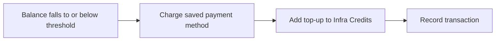

# Auto Pay

**Auto Pay** automatically purchases **infra credits** when an account’s available balance falls to or below a configured threshold. That helps prepaid customers keep services running without manually topping up every time the wallet runs low.

Auto Pay helps customers:

* Prevent service interruption due to low balance
* Automatically recharge infra credits
* Avoid manual payment every time the balance becomes low
* Maintain continuous billing for cloud resources

:::important[Prepaid only]

Auto Pay works **only for prepaid** accounts that use an infra-credit wallet. Postpaid and manual payment modes do not use Auto Pay.

:::

**Customer path:** **Billing → Auto Pay**

---

## Global setting

Enable or disable the Auto Pay feature for the platform in **Admin Panel → Global Settings**.

| Setting | Value | Category |
|---|---|---|
| **Flag name** | `autopay` | **Billing** |
| **Typical values** | `true` / `false` |
| **Purpose** | Enable or disable the Auto Pay feature |

| Value | Behaviour |
|---|---|
| **`true`** | Auto Pay is available to eligible prepaid customers under **Billing → Auto Pay** |
| **`false`** | Auto Pay is disabled platform-wide |

---

## Who can use this feature?

| Account type | Supported? |
|---|---|
| **Prepaid** customer accounts | Yes |
| Postpaid | No |
| Manual | No |

---

## Prerequisites

Before a customer can enable Auto Pay:

* The global setting `autopay` must be **`true`**
* The account must be **prepaid** and **active**
* The user must have permission to manage billing
* A **valid, active payment method** must be added
* The payment gateway must support **off-session** payments (save a payment method and charge a variable amount later)

:::warning[Payment method required]

Auto Pay **cannot** be enabled without adding a payment method. The Auto Pay tab shows a warning until a method is saved:

*You cannot set up Auto-Pay without a payment method. Add a payment method first to continue.*

:::

---

## Add a payment method

1. Go to **Billing → Auto Pay**
2. Select **Add Payment Method**
3. In the **Payment Gateway** popup, choose a provider and select **Proceed**
4. Complete the provider flow to save a secure payment method
5. Confirm the method appears in the payment methods list (for example as **Primary**)

### Payment Gateway popup

The **Payment Gateway** popup lets the customer select the provider used to add a payment method for Auto Pay.

Purpose of this step:

* Select a payment gateway
* Proceed to the payment provider
* Add a secure payment method
* Continue Auto Pay configuration

:::info[Supported gateway (current)]

In the current implementation, **Stripe** is available as the supported payment gateway for Auto Pay. Only gateways that support off-session / saved-method charging can power Auto Pay.

See [Stripe](/billing/payment-gateways/stripe) for provider configuration.

:::

---

## Configure Auto-Pay policy

After a payment method is saved, configure the Auto-Pay policy on **Billing → Auto Pay**.

**Balance Threshold**

*Required.* Available balance amount that triggers Auto Pay. Auto Pay runs when the balance **matches or falls below** this amount.

Example: `$50.00`

**Top-Up Amount**

*Required.* Amount charged to the saved payment method each time Auto Pay triggers. That amount is added to the customer’s infra credits.

Example: `$100.00`

**Add Policy**

Saves the threshold and top-up amount for the account.

The policy summary updates as values change — for example: when balance drops below the threshold, Auto Pay charges the authorized payment method the top-up amount in infra credits.

:::tip[Choose a sensible top-up]

Set the top-up amount high enough relative to hourly usage. A very low top-up can cause repeated charges if the balance drops below the threshold often. See [Future improvements](#future-improvements).

:::

---

## How Auto Pay works

Example policy:

| Setting | Value |
|---|---|
| Balance Threshold | `$50.00` |
| Top-Up Amount | `$100.00` |

Typical flow:

1. Customer adds a payment method (for example via Stripe) and enables Auto Pay
2. Customer sets **Balance Threshold** and **Top-Up Amount**
3. As cloud resources are consumed, infra credit balance decreases
4. When balance reaches **$50.00 or below**, the Auto Pay policy is triggered
5. CMP charges the saved payment method **$100.00**
6. **$100.00** is added to the customer’s Infra Credits
7. The Auto Pay transaction is recorded under **Billing → Transactions**

---

## Limitations

* Auto Pay is **prepaid-only**
* A valid payment method must be added before policy setup
* Only payment gateways that support **off-session** charging (saved method + variable amount) support Auto Pay
* Currently documented customer gateway for this flow: **Stripe**

---

## Future improvements

Planned behaviour when a very low top-up is hit repeatedly (for example every hour):

* Limit Auto Pay charges to **2 transactions in 24 hours**
* On a **third** threshold hit within that window, notify the **admin** and the **customer** to raise the threshold / top-up amount

Until that lands, advise customers to set threshold and top-up values that match expected daily usage.

---

## Related

* [Prepaid payment mode](/billing/payment-modes/prepaid)
* [Low Infra Credit Notifications](/billing/low-infra-credit-notifications) — alert-only; does not charge a card
* [Stripe](/billing/payment-gateways/stripe)
* [Payment Gateways](/billing/payment-gateways/)
* [Billing Overview](/billing/overview)
* [Platform Features](/platform-features/)
