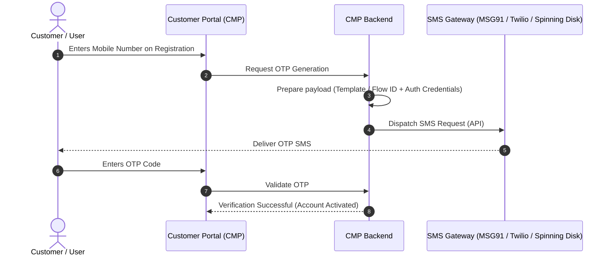

# SMS Gateways & Verification

CMP supports sending transactional SMS messages — including one-time passwords (OTP) for **mobile verification during customer registration** — through external SMS service providers.

---

## Overview

When customer mobile verification is enabled, users entering their mobile number during signup must verify ownership via an OTP SMS before completing registration or accessing services.

CMP delegates SMS transmission to dedicated third-party SMS gateways.

### Supported Providers

| Provider | Status | Primary Route / Region | DLT Support (India) | Configuration Page |
|---|---|---|---|---|
| **MSG91** | Supported | Global / India | Yes (Flow ID & Approved Sender ID) | [MSG91 Integration](/platform-features/sms-gateways/msg91) |
| **Twilio** | Supported | Global / International | Standard Carrier Compliance | [Twilio Integration](/platform-features/sms-gateways/twilio) |
| **Spinning Disk** | Supported | Enterprise / India | Yes (Entity ID & Template ID) | [Spinning Disk Integration](/platform-features/sms-gateways/spinning-disk) |

---

## How Configuration Works

### 1. Backend Gateway Credentials (.env)

CMP maintains SMS provider credentials in application `.env` files:
1. Review the required parameters for your chosen provider below.
2. Provide the credentials to the **StackConsole Deployment & Support team**.
3. The StackConsole team updates the backend environment files on your CMP application servers.

*(Self-service UI settings for SMS gateway management will be introduced in an upcoming release).*

### 2. Admin Global Settings Flags

Once gateway credentials are configured in `.env`, manage feature activation and enforcement under **Admin Panel → Global Settings**:

| Global Setting | Values | Default | Purpose |
|---|---|---|---|
| **[`enable_phone_input`](/platform-features/global-settings/enable-phone-input)** | `true` / `false` | `false` | Enables phone number input fields across the platform. Must be set to `true`. |
| **[`enable_mobile_verification`](/platform-features/global-settings/enable-mobile-verification)** | `true` / `false` | `false` | Activates OTP SMS dispatch for registration and profile mobile changes. |
| **[`enforce_mobile_verification`](/platform-features/global-settings/enforce-mobile-verification)** | `true` / `false` | `false` | Makes mobile verification **compulsory** (`true`) or **optional** (`false`) during registration. |

---

## Customer User Experience

### Registration Flow (Step 1 — Verify Email & Mobile No)

When `enable_mobile_verification` is active, customers see side-by-side verification panels on the registration screen. If `enforce_mobile_verification` is `true`, customers cannot proceed to the next registration step until their mobile number is verified.

### Profile Update (Change Mobile Number)

Customers can update their mobile number from **Personal Details → Mobile Number → Change**. Clicking **Send OTP** sends a verification code to the new phone number before the profile record is updated.

---

## General Verification Flow

---

## Providers in this Section

* **[MSG91](/platform-features/sms-gateways/msg91)** — Flow ID, Auth Key, and Sender ID configuration for India DLT and global messaging.
* **[Twilio](/platform-features/sms-gateways/twilio)** — Account SID, Auth Token, and E.164 From Number for global reach.
* **[Spinning Disk](/platform-features/sms-gateways/spinning-disk)** — Auth Key, Sender ID, Entity ID, and Template ID mapping for enterprise routes.

---

## Related

* [Global Settings — enable_phone_input](/platform-features/global-settings/enable-phone-input)
* [Prerequisites & System Requirements](/installation/prerequisites)
* [CAPTCHA Settings](/platform-features/captcha/)
* [Security Overview](/platform-features/security/)
