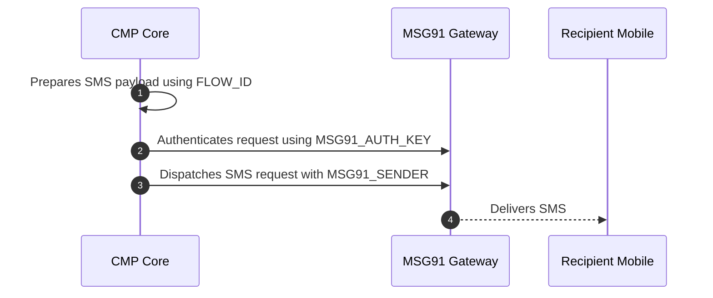

# MSG91 SMS Integration

This document lists the mandatory configuration details required to enable CMP to send transactional SMS messages (such as registration verification OTPs) via **MSG91**.

---

## Purpose

To enable CMP to authenticate and deliver transactional SMS notifications and registration verification codes through the MSG91 API gateway.

---

## Configuration Method

:::info[Setup via Environment (.env)]

Configuration for MSG91 is maintained in backend environment files. Provide the parameters below to the **StackConsole Deployment Team** during setup or onboarding.

:::

---

## Required Configuration Details

| Parameter / Variable | Type | Mandatory | Description & Source |
|---|---|---|---|
| `MSG91_AUTH_KEY` | String | **Yes** | API authentication key generated in the MSG91 dashboard. |
| `MSG91_FLOW_ID` | String | **Yes** | Flow ID of the approved SMS template. Required for Indian DLT compliance and template delivery. |
| `MSG91_SENDER` | String | **Yes** | 6-character alphanumeric Sender ID approved in MSG91 (e.g. `STKCON`). |

### Configuration Details

**1. MSG91_AUTH_KEY**

*Required.* The secret API key used to authenticate requests made from CMP to MSG91 API endpoints. Obtained from the **MSG91 Dashboard → Authkey**.

**2. MSG91_FLOW_ID**

*Required.* The template flow identifier representing the transactional/OTP message structure. In India, message content must be pre-approved on a DLT portal and mapped as a Flow in MSG91.

**3. MSG91_SENDER**

*Required.* The 6-character alphanumeric sender header displayed to recipients (e.g., `CMPNOT`). Must be registered and approved in your MSG91 account.

---

## Message Sending Flow

1. CMP prepares the SMS content according to the configured `MSG91_FLOW_ID`.
2. CMP authenticates the API request using `MSG91_AUTH_KEY`.
3. CMP sends the SMS using the approved `MSG91_SENDER` ID.
4. MSG91 delivers the SMS to the recipient mobile network.

---

## Mandatory Checklist

Before requesting activation from the StackConsole team, verify that:

- [ ] Your MSG91 account is active with sufficient SMS credits.
- [ ] `MSG91_AUTH_KEY` is generated and copied from the dashboard.
- [ ] DLT registration is complete (for India traffic).
- [ ] `MSG91_FLOW_ID` is created and approved.
- [ ] `MSG91_SENDER` (6-character ID) is approved.

---

## Related

* [SMS Gateways & Verification Overview](/platform-features/sms-gateways/)
* [Twilio SMS Integration](/platform-features/sms-gateways/twilio)
* [Spinning Disk SMS Integration](/platform-features/sms-gateways/spinning-disk)
* [Global Settings — enable_phone_input](/platform-features/global-settings/enable-phone-input)
