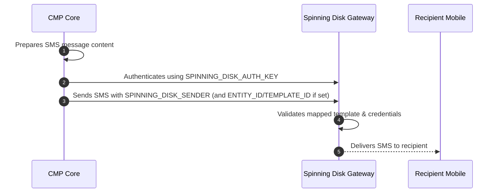

# Spinning Disk SMS Integration

This document describes the configuration parameters required to enable transactional SMS delivery and mobile verification in CMP using the **Spinning Disk SMS Gateway**.

---

## Purpose

To enable CMP to send transactional notifications and registration OTPs through the Spinning Disk SMS Gateway.

---

## Configuration Method

:::info[Setup via Environment (.env)]

Configuration for Spinning Disk is maintained in backend environment files. Provide the parameters below to the **StackConsole Deployment Team** during setup or onboarding.

:::

---

## Required & Optional Configuration Details

| Parameter / Variable | Type | Mandatory | Description & Source |
|---|---|---|---|
| `SPINNING_DISK_AUTH_KEY` | String | **Yes** | API key used to authenticate SMS requests via the Spinning Disk Gateway. |
| `SPINNING_DISK_SENDER` | String | **Yes** | 6-character alphanumeric approved Sender ID. |
| `SPINNING_DISK_ENTITY_ID` | String | **Optional** | DLT Principal Entity ID registered with telecom operators (used when DLT enforcement is required). |
| `SPINNING_DISK_TEMPLATE_ID` | String | **Optional** | DLT-approved template ID mapped in the Spinning Disk portal. |

### Configuration Details

**1. SPINNING_DISK_AUTH_KEY**

*Required.* API key generated in the Spinning Disk SMS Gateway dashboard used by CMP to authenticate API calls.

**2. SPINNING_DISK_SENDER**

*Required.* The approved 6-character alphanumeric Sender ID (header) used to deliver the message (e.g. `STKCON`).

**3. SPINNING_DISK_ENTITY_ID**

*Optional.* The business/organization DLT Entity ID assigned during Indian regulatory registration. Required only when DLT enforcement is active on the gateway route.

**4. SPINNING_DISK_TEMPLATE_ID**

*Optional.* The DLT template identifier for template-based transactional message delivery.

:::important[Template Mapping in Portal]

* It is **mandatory** for the DLT-approved template to be added and mapped directly in the **Spinning Disk portal** for successful delivery.
* Once the template is mapped in the portal, SMS will be delivered **even if the Template ID is not passed** in the API request.
* Failure to map the approved template in the portal will result in delivery failures, even if all other credentials are valid.

:::

---

## Message Sending Flow

1. CMP prepares the SMS content (e.g. registration OTP).
2. CMP authenticates the request using `SPINNING_DISK_AUTH_KEY`.
3. CMP sends the SMS using the configured `SPINNING_DISK_SENDER`.
4. If configured, `SPINNING_DISK_ENTITY_ID` and `SPINNING_DISK_TEMPLATE_ID` are attached to the API payload.
5. The Spinning Disk gateway processes and delivers the SMS.

---

## Mandatory Checklist

Before requesting activation from the StackConsole team, verify that:

- [ ] Spinning Disk SMS account is active and funded.
- [ ] `SPINNING_DISK_AUTH_KEY` is generated and configured.
- [ ] `SPINNING_DISK_SENDER` (Sender ID) is approved.
- [ ] DLT-approved template is **added and mapped in the Spinning Disk portal**.
- [ ] *(Optional)* `SPINNING_DISK_ENTITY_ID` configured if DLT enforcement is enabled.
- [ ] *(Optional)* `SPINNING_DISK_TEMPLATE_ID` configured if required by your assigned route.

---

## Notes & Compliance

* **DLT Enforcement:** For India routes, DLT compliance depends on gateway configuration and operator enforcement.
* **Template ID Flexibility:** CMP supports SMS delivery with or without passing the Template ID in the API request, provided the template is approved and mapped within the Spinning Disk portal.
* **Failure Warning:** Failure to map the approved template in the portal will cause delivery rejection from the telecom operators.

---

## Related

* [SMS Gateways & Verification Overview](/platform-features/sms-gateways/)
* [MSG91 SMS Integration](/platform-features/sms-gateways/msg91)
* [Twilio SMS Integration](/platform-features/sms-gateways/twilio)
* [Global Settings — enable_phone_input](/platform-features/global-settings/enable-phone-input)
