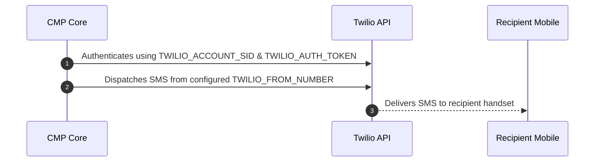

# Twilio SMS Integration

This document lists the mandatory configuration details required to enable CMP to send transactional SMS messages (including registration verification OTPs) globally via **Twilio**.

---

## Purpose

To enable CMP to authenticate and deliver transactional SMS notifications and verification messages through Twilio's Programmable Messaging API.

---

## Configuration Method

:::info[Setup via Environment (.env)]

Configuration for Twilio is maintained in backend environment files. Provide the parameters below to the **StackConsole Deployment Team** during setup or onboarding.

:::

---

## Required Configuration Details

| Parameter / Variable | Type | Mandatory | Description & Source |
|---|---|---|---|
| `TWILIO_ACCOUNT_SID` | String | **Yes** | Unique identifier for your Twilio account, available in the Twilio Console. |
| `TWILIO_AUTH_TOKEN` | String | **Yes** | Secret authentication token associated with the Account SID. |
| `TWILIO_FROM_NUMBER` | String | **Yes** | SMS-enabled Twilio phone number formatted in E.164 (e.g., `+12025550143`). |

### Configuration Details

**1. TWILIO_ACCOUNT_SID**

*Required.* The unique Account Security Identifier for your Twilio project. Located in the **Twilio Console Dashboard**.

**2. TWILIO_AUTH_TOKEN**

*Required.* The primary secret token used alongside `TWILIO_ACCOUNT_SID` to authenticate API calls made by CMP. Kept confidential and located in the **Twilio Console Dashboard**.

**3. TWILIO_FROM_NUMBER**

*Required.* A Twilio-purchased or verified phone number with SMS delivery capabilities. Must include country code in standard E.164 format (e.g. `+1234567890`).

---

## Message Sending Flow

1. CMP prepares the SMS message body.
2. CMP authenticates with the Twilio API using `TWILIO_ACCOUNT_SID` and `TWILIO_AUTH_TOKEN`.
3. CMP sends the SMS payload from the configured `TWILIO_FROM_NUMBER`.
4. Twilio processes carrier routing and delivers the SMS to the recipient.

---

## Mandatory Checklist

Before requesting activation from the StackConsole team, verify that:

- [ ] Twilio account is active and upgraded (trial accounts may restrict unverified numbers).
- [ ] Sufficient balance/credits exist in your Twilio account.
- [ ] `TWILIO_ACCOUNT_SID` is retrieved from the Twilio Console.
- [ ] `TWILIO_AUTH_TOKEN` is retrieved from the Twilio Console.
- [ ] `TWILIO_FROM_NUMBER` is SMS-enabled and active.
- [ ] Geo-permissions for destination countries are enabled in Twilio Console.

---

## Related

* [SMS Gateways & Verification Overview](/platform-features/sms-gateways/)
* [MSG91 SMS Integration](/platform-features/sms-gateways/msg91)
* [Spinning Disk SMS Integration](/platform-features/sms-gateways/spinning-disk)
* [Global Settings — enable_phone_input](/platform-features/global-settings/enable-phone-input)
